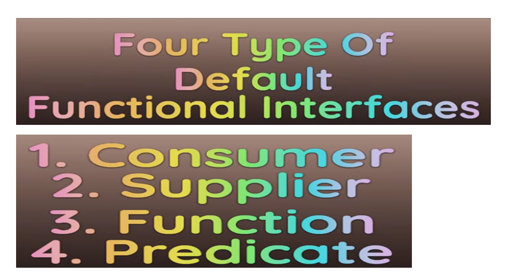
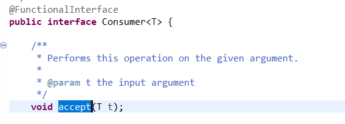
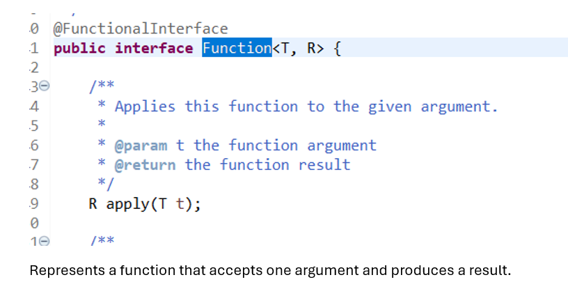
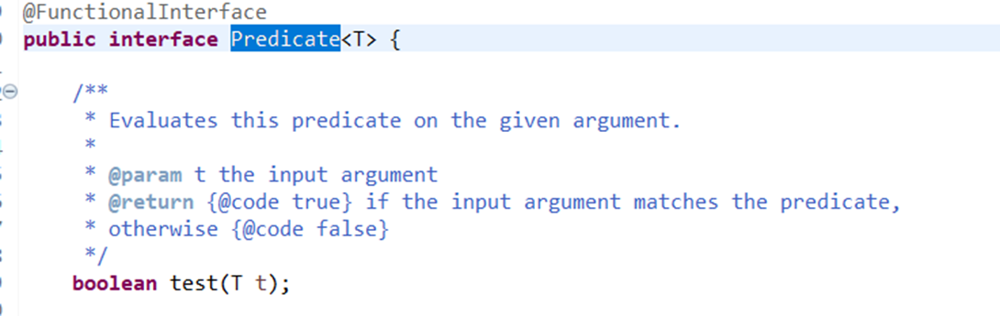
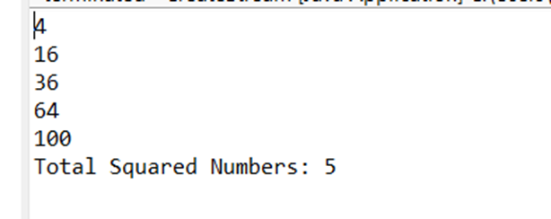
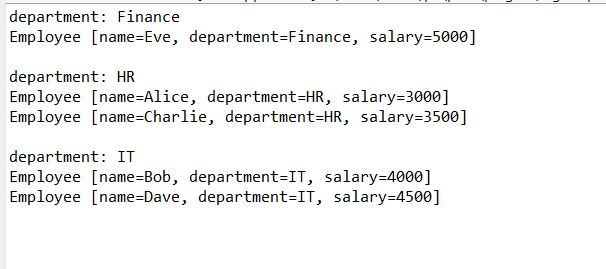
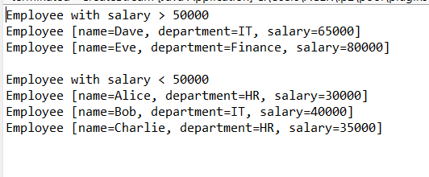

# About Functional Interface

## Consumer

- Consumer take an argument and return no result.
- Consumer consumes sth and return nothing.

```java
package com.example.stream;

import java.util.function.Consumer;

public class CreateStream {

	public static void main(String arg[]) {

		// Represents an operation that accepts a single input argument and returns no result.
		
		//Initializing the consumer(what it should do)
		Consumer<String> printer = message -> System.out.println(message); //Consumer will take message and print it.
		
		printer.accept("Hello World!");
		
	}

}
```
## Supplier

- Supplier supplies sth. 
```java
package com.example.stream;

import java.util.function.Supplier;

public class CreateStream {

	public static void main(String arg[]) {

	//Initilaizing the supplier to get the random number
	Supplier<Double> randomNumberSupplier = () -> Math.random();
	
	Double randomNumber = randomNumberSupplier.get();
	
	System.out.println("Random Number: "+randomNumber);
		
	}

}
```
## Function

```java
package com.example.stream;

import java.util.function.Function;

public class CreateStream {

	public static void main(String arg[]) {
		
		//In function we give argument and it return us something
		
		//Here i am initializing the function and asking it to convert into String
		Function<Integer, String> intToStringConvertor = integer -> "Number: "+integer;
		
		String result = intToStringConvertor.apply(42);
		
		System.out.println(result); //Number: 42
	}

}
```
## Predicate:

```java
package com.example.stream;

import java.util.function.Predicate;

public class CreateStream {

	public static void main(String arg[]) {
		
		//Predicate is kind of boolean value function
		//It will predict something; if we give something it will tell us that is true or false.
		
		Predicate<String> isNullOrEmpty = str -> str==null || str.isEmpty();
		
		System.out.println("Is null or Empty: "+ isNullOrEmpty.test(null)); //true
		System.out.println("Is null or Empty: "+ isNullOrEmpty.test(""));  //true
		System.out.println("Is null or Empty: "+ isNullOrEmpty.test("hello")); //false
	}

}
```
## Eg
```java
package com.example.stream;

import java.util.Arrays;
import java.util.List;
import java.util.function.Consumer;
import java.util.function.Function;
import java.util.function.Predicate;
import java.util.function.Supplier;

public class CreateStream {

	public static void main(String arg[]) {
	
		List<Integer> numbers = Arrays.asList(1,2,3,4,5,6,7,8,9,10);
		
		//Predicate to filter even number
		Predicate<Integer> isEven = num -> num%2 == 0;
		
		//Function to square a number
		Function<Integer, Integer> squareFunction = num -> num*num;
		
		//Consumer to print each Square number
		Consumer<Integer> printSquareNumber = System.out::println;
		
		//Supplier to count total Square numbers
		Supplier<Integer> countSupplier = () -> 0;
		
		//Apply Stream operations
		Integer totalSquaredNumber = numbers.stream()
										.filter(isEven)  //filter even number
										.map(squareFunction)  //Map each number to its square
										.peek(printSquareNumber) //Print each squared number -- peek perform opertaion we provide it
										.reduce(countSupplier.get(),(count,num)-> count + 1); //count total square number
		//reduce will take initial value and then for each count and num will increment count by 1 
		
		System.out.println("Total Squared Numbers: "+totalSquaredNumber); //Total Squared Numbers: 5
		
		
	}
}
```
## Output

# Grouping By and Partiontining By

```java
package com.example.stream;

public class Employee {

	private String name;
	private String department;
	private Integer salary;

	public Employee(String name, String department, Integer salary) {
		super();
		this.name = name;
		this.department = department;
		this.salary = salary;
	}

	public String getName() {
		return name;
	}

	public void setName(String name) {
		this.name = name;
	}

	public String getDepartment() {
		return department;
	}

	public void setDepartment(String department) {
		this.department = department;
	}

	public Integer getSalary() {
		return salary;
	}

	public void setSalary(Integer salary) {
		this.salary = salary;
	}

	@Override
	public String toString() {
		return "Employee [name=" + name + ", department=" + department + ", salary=" + salary + "]";
	}

}
```
## Main class
```java
package com.example.stream;

import java.util.Arrays;
import java.util.List;
import java.util.Map;
import java.util.stream.Collectors;

public class CreateStream {

	public static void main(String arg[]) {	

		List<Employee> employees = Arrays.asList(
				 new Employee("Alice", "HR", 3000),
				 new Employee("Bob", "IT", 4000),
				 new Employee("Charlie", "HR", 3500),
				 new Employee("Dave", "IT", 4500),
				 new Employee("Eve", "Finance", 5000)
				);
		
		Map<String, List<Employee>> employeesByDept = employees.stream()
							.collect(Collectors.groupingBy(Employee::getDepartment));
		
		
		employeesByDept.forEach(
				(dept,list) -> {
					System.out.println("department: "+dept);
					list.forEach(System.out::println);
					System.out.println();
				}
				);
	}
}
```
## Output:

# Partitioning By 

```java
package com.example.stream;

import java.util.Arrays;
import java.util.List;
import java.util.Map;
import java.util.stream.Collectors;

public class CreateStream {

	public static void main(String arg[]) {	


		List<Employee> employees = Arrays.asList(
				 new Employee("Alice", "HR", 30000),
				 new Employee("Bob", "IT", 40000),
				 new Employee("Charlie", "HR", 35000),
				 new Employee("Dave", "IT", 65000),
				 new Employee("Eve", "Finance", 80000)
				);
		
		
		//partitioningBy take Predicate as input 
		Map<Boolean, List<Employee>> partitionedBySal = employees.stream()
	             	.collect(Collectors.partitioningBy(emp-> emp.getSalary() > 50000));
		
		System.out.println("Employee with salary > 50000");
		partitionedBySal.get(true).forEach(System.out::println);
		
		System.out.println();
		System.out.println("Employee with salary < 50000");
		partitionedBySal.get(false).forEach(System.out::println);
	}
}
```
## Output:



