# Cloneable Interface
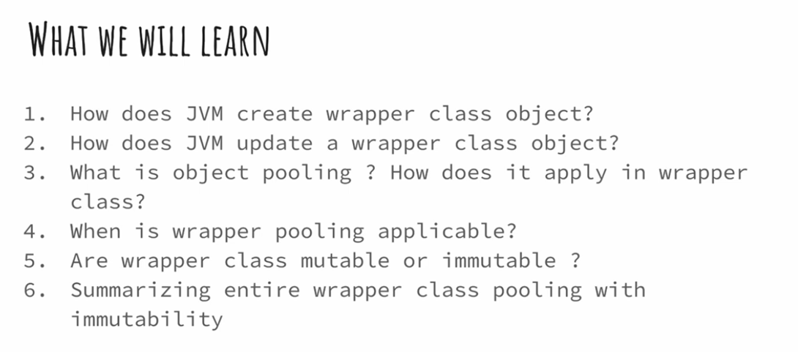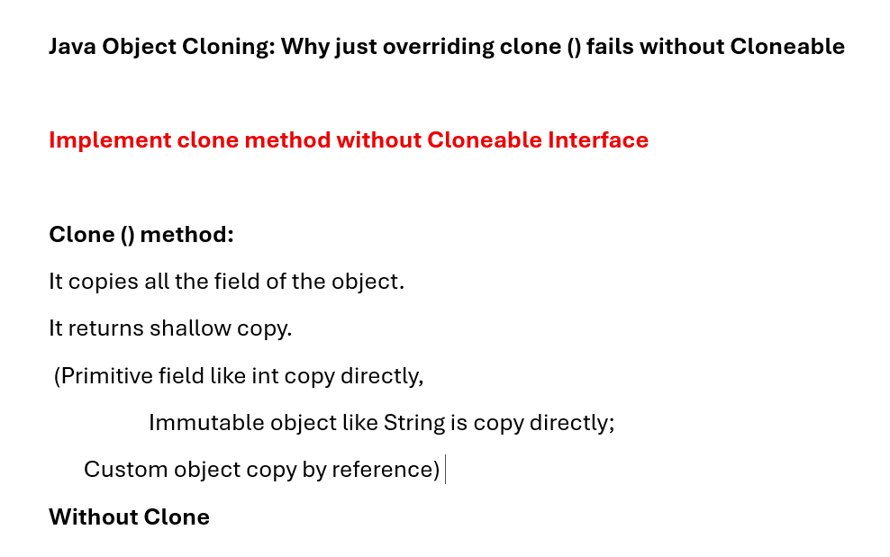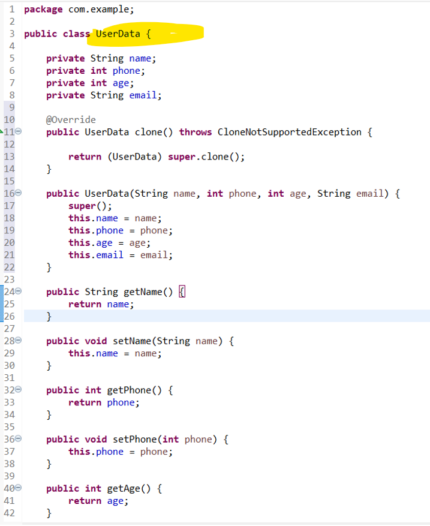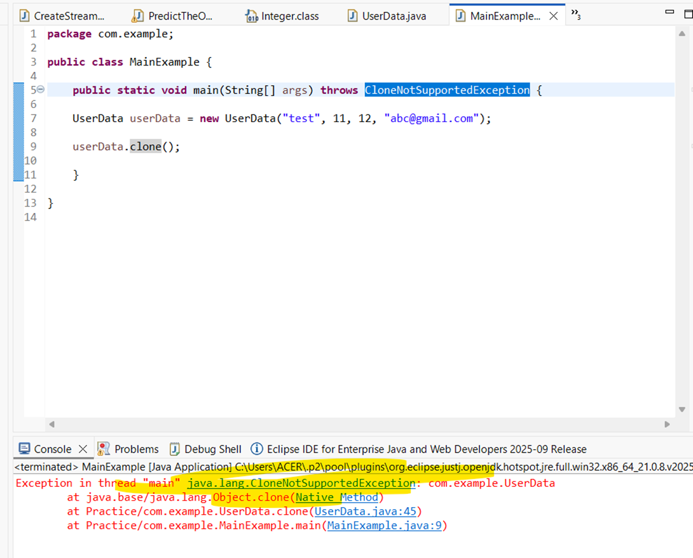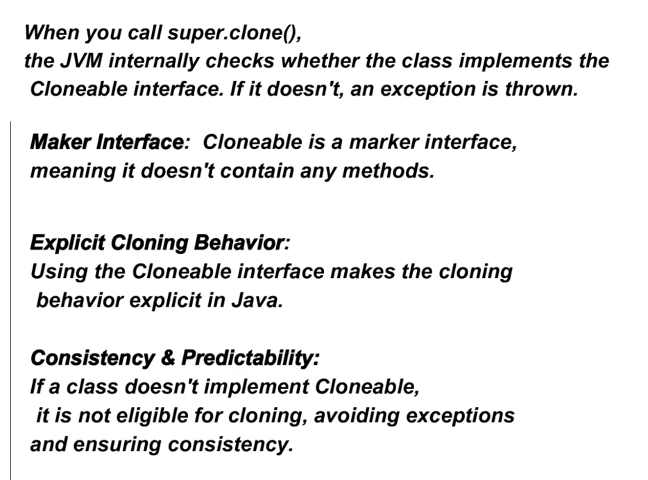
# Normal working of clone() method with implementing Cloneble interface
## Cloneable with Primitive Datatype
```java
package com.example;

public class UserData implements Cloneable{

	private String name;
	private int phone;
	private int age;
	private String email;
	
	@Override
	public UserData clone() throws CloneNotSupportedException {

		return (UserData) super.clone();
	}

	public UserData(String name, int phone, int age, String email) {
		super();
		this.name = name;
		this.phone = phone;
		this.age = age;
		this.email = email;
	}

	public String getName() {
		return name;
	}

	public void setName(String name) {
		this.name = name;
	}

	public int getPhone() {
		return phone;
	}

	public void setPhone(int phone) {
		this.phone = phone;
	}

	public int getAge() {
		return age;
	}

	public void setAge(int age) {
		this.age = age;
	}

	public String getEmail() {
		return email;
	}

	public void setEmail(String email) {
		this.email = email;
	}

	@Override
	public String toString() {
		return "UserData [name=" + name + ", phone=" + phone + ", age=" + age + ", email=" + email + "]";
	}
}
```
## 
```java
package com.example;

public class MainExample {

	public static void main(String[] args) throws CloneNotSupportedException {

	UserData userData = new UserData("test", 11, 12, "abc@gmail.com");
	
	UserData userData2 = userData.clone();
	
	System.out.println(userData2); //UserData [name=test, phone=11, age=12, email=abc@gmail.com]
	
	System.out.println(userData.hashCode()); //772777427
	System.out.println(userData2.hashCode()); //83954662 
	
	//Hashcode is diff so clone method works

	}
}
```
# Chnaging primitive datatype  of clone object
# UserData Pojo as it is
## Main eg

```java
package com.example;

import java.util.HashMap;

public class MainExample {

	public static void main(String[] args) throws CloneNotSupportedException {	
	
	UserData userData = new UserData("test", 11, 12, "abc@gmail.com"); 
	
	System.out.println("Original Object = "+userData); //Original Object = UserData [name=test, phone=11, age=12, email=abc@gmail.com, extraData={key1=value1}]
	
	System.out.println("Perform cloning");
	UserData userData2 = userData.clone(); // Perform cloning
	
	System.out.println("clone object = " +userData2); //clone object = UserData [name=test, phone=11, age=12, email=abc@gmail.com, extraData={key1=value1}]
	
	System.out.println("See diff hashcode");
	System.out.println(userData.hashCode()); //777874839
	System.out.println(userData2.hashCode()); //596512129
	
	System.out.println("Change primitive datatype");
	//Change primitive type
	userData2.setAge(32);
	System.out.println("clone object = " +userData2);//clone object = UserData [name=test, phone=11, age=32, email=abc@gmail.com]
	
	System.out.println("Original Object = "+userData); //Original Object = UserData [name=test, phone=11, age=12, email=abc@gmail.com]

	}
}
```

## Observation: Shallow copy is cloned via Cloneable Interface.
## primitive data as it is copy
# Let's add customizable object and check its clone mehtod
## Introduce Mutable object
```java
package com.example;

import java.util.HashMap;

public class UserData implements Cloneable {

	private String name;
	private int phone;
	private int age;
	private String email;
	private HashMap<String, String> extraData; // Mutable object

	@Override
	public UserData clone() throws CloneNotSupportedException {

		UserData clone = (UserData) super.clone();
		
		return clone;
	}

	public UserData(String name, int phone, int age, String email, HashMap<String, String> extraData) {
		super();
		this.name = name;
		this.phone = phone;
		this.age = age;
		this.email = email;
		this.extraData = extraData;
	}

	public HashMap<String, String> getExtraData() {
		return extraData;
	}

	public void setExtraData(HashMap<String, String> extraData) {
		this.extraData = extraData;
	}

	public String getName() {
		return name;
	}

	public void setName(String name) {
		this.name = name;
	}

	public int getPhone() {
		return phone;
	}

	public void setPhone(int phone) {
		this.phone = phone;
	}

	public int getAge() {
		return age;
	}

	public void setAge(int age) {
		this.age = age;
	}

	public String getEmail() {
		return email;
	}

	public void setEmail(String email) {
		this.email = email;
	}

	@Override
	public String toString() {
		return "UserData [name=" + name + ", phone=" + phone + ", age=" + age + ", email=" + email + ", extraData="
				+ extraData + "]";
	}
}
```
## Change mutable object and see how clone works
```java
package com.example;

import java.util.HashMap;

public class MainExample {

	public static void main(String[] args) throws CloneNotSupportedException {
		
	

	HashMap<String, String> extraMap = new HashMap();
	extraMap.put("key1", "value1");
	
	UserData userData = new UserData("test", 11, 12, "abc@gmail.com",extraMap); 
	
	System.out.println("Original Object = "+userData); //Original Object = UserData [name=test, phone=11, age=12, email=abc@gmail.com, extraData={key1=value1}]
	
	UserData userData2 = userData.clone(); // Perform cloning
	
	System.out.println("clone object = " +userData2); //clone object = UserData [name=test, phone=11, age=12, email=abc@gmail.com, extraData={key1=value1}]
	
	System.out.println(userData.hashCode()); //777874839
	System.out.println(userData2.hashCode()); //596512129
	
	//Change primitive type
	userData2.setAge(32);
	
	System.out.println("If you change mutable object of  userData2 i.e. clone object then");
	
	userData2.getExtraData().put("key2", "value2");
	
	System.out.println("clone object = " +userData2);//clone object = UserData [name=test, phone=11, age=32, email=abc@gmail.com, extraData={key1=value1, key2=value2}]
	System.out.println("Original Object = "+userData);//Original Object = UserData [name=test, phone=11, age=12, email=abc@gmail.com, extraData={key1=value1, key2=value2}]

	}

}
```
# Observation:
- when you change primitive data type of clone object; clone object data type is change(expected) and original object data type wont change (good)
- see age datatype.
- But when you change mutable object then the original object is also getting change.
- This is happen due to shallow copy.
- And you are changing reference of mutable object therefore this issue happens.
# Perform deep copy
# Check clone method
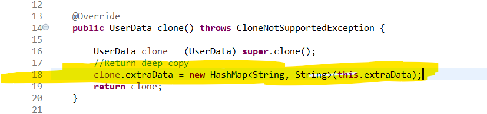
```java
package com.example;

import java.util.HashMap;

public class UserData implements Cloneable {

	private String name;
	private int phone;
	private int age;
	private String email;
	private HashMap<String, String> extraData; // Mutable object

	@Override
	public UserData clone() throws CloneNotSupportedException {

		UserData clone = (UserData) super.clone();
		//Return deep copy
		clone.extraData = new HashMap<String, String>(this.extraData);
		return clone;
	}

	public UserData(String name, int phone, int age, String email, HashMap<String, String> extraData) {
		super();
		this.name = name;
		this.phone = phone;
		this.age = age;
		this.email = email;
		this.extraData = extraData;
	}

	public HashMap<String, String> getExtraData() {
		return extraData;
	}

	public void setExtraData(HashMap<String, String> extraData) {
		this.extraData = extraData;
	}

	public String getName() {
		return name;
	}

	public void setName(String name) {
		this.name = name;
	}

	public int getPhone() {
		return phone;
	}

	public void setPhone(int phone) {
		this.phone = phone;
	}

	public int getAge() {
		return age;
	}

	public void setAge(int age) {
		this.age = age;
	}

	public String getEmail() {
		return email;
	}

	public void setEmail(String email) {
		this.email = email;
	}

	@Override
	public String toString() {
		return "UserData [name=" + name + ", phone=" + phone + ", age=" + age + ", email=" + email + ", extraData="
				+ extraData + "]";
	}
}
```
# After deep copy in Mutable object
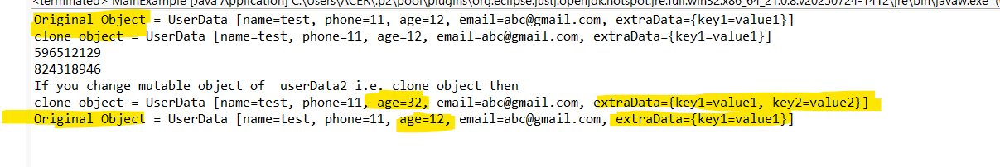
```java
package com.example;

import java.util.HashMap;

public class MainExample {

	public static void main(String[] args) throws CloneNotSupportedException {
		
	

	HashMap<String, String> extraMap = new HashMap();
	extraMap.put("key1", "value1");
	
	UserData userData = new UserData("test", 11, 12, "abc@gmail.com",extraMap); 
	
	System.out.println("Original Object = "+userData); //Original Object = UserData [name=test, phone=11, age=12, email=abc@gmail.com, extraData={key1=value1}]
	
	UserData userData2 = userData.clone(); // Perform cloning
	
	System.out.println("clone object = " +userData2); //clone object = UserData [name=test, phone=11, age=12, email=abc@gmail.com, extraData={key1=value1}]
	
	System.out.println(userData.hashCode()); //777874839
	System.out.println(userData2.hashCode()); //596512129
	
	//Change primitive type
	userData2.setAge(32);
	
	System.out.println("If you change mutable object of  userData2 i.e. clone object then");
	
	userData2.getExtraData().put("key2", "value2");
	
	System.out.println("clone object = " +userData2);//clone object = UserData [name=test, phone=11, age=32, email=abc@gmail.com, extraData={key1=value1, key2=value2}]
	System.out.println("Original Object = "+userData);//Original Object = UserData [name=test, phone=11, age=12, email=abc@gmail.com, extraData={key1=value1}]

	}

}
```
# 2. Primitive type vs Wrapper class
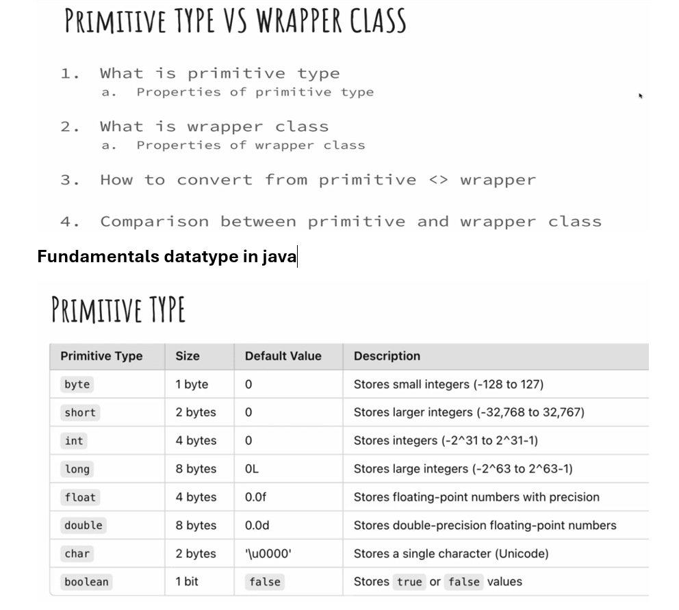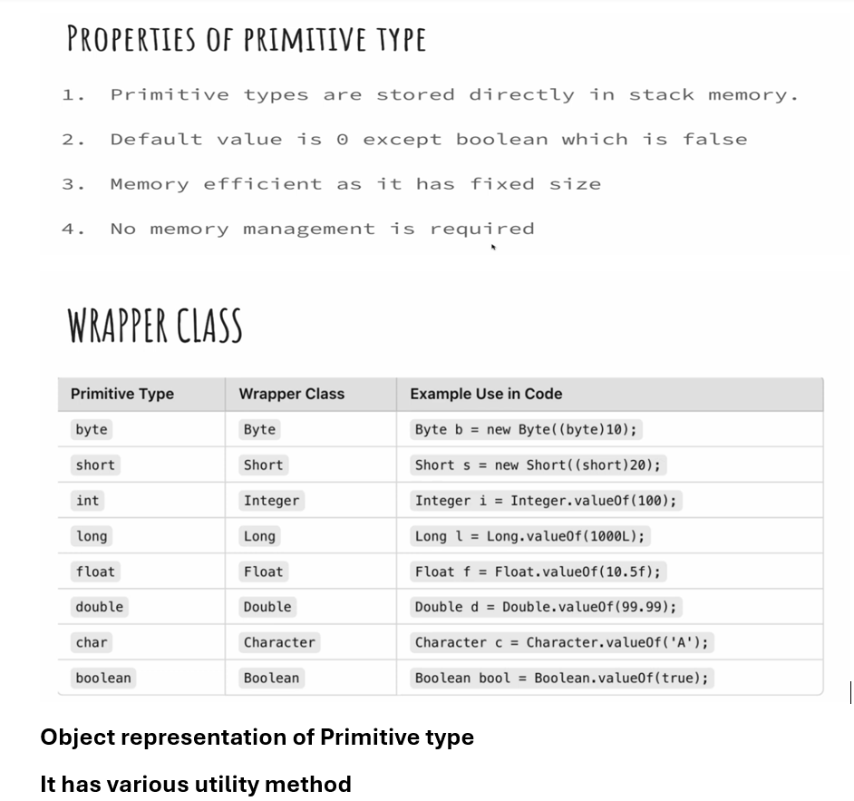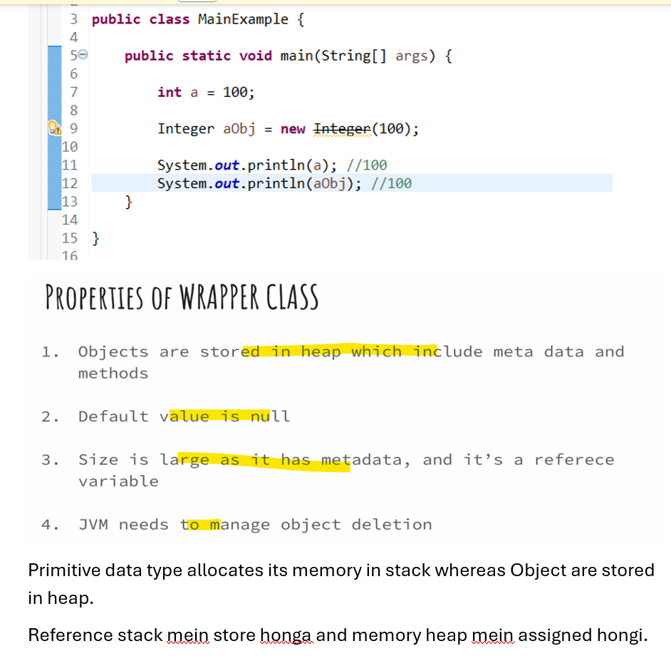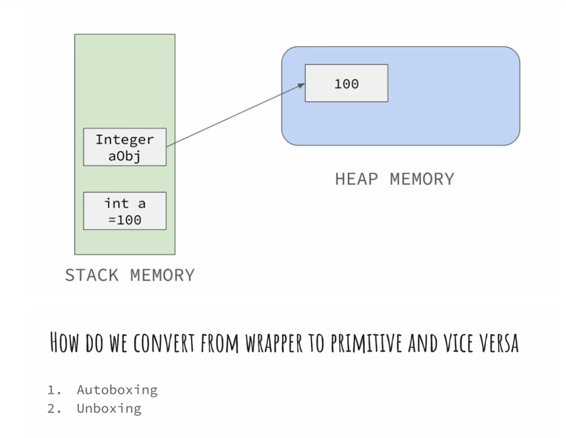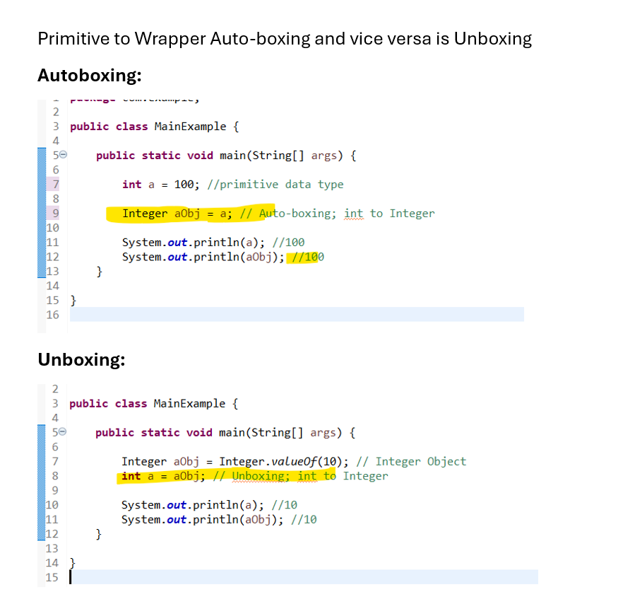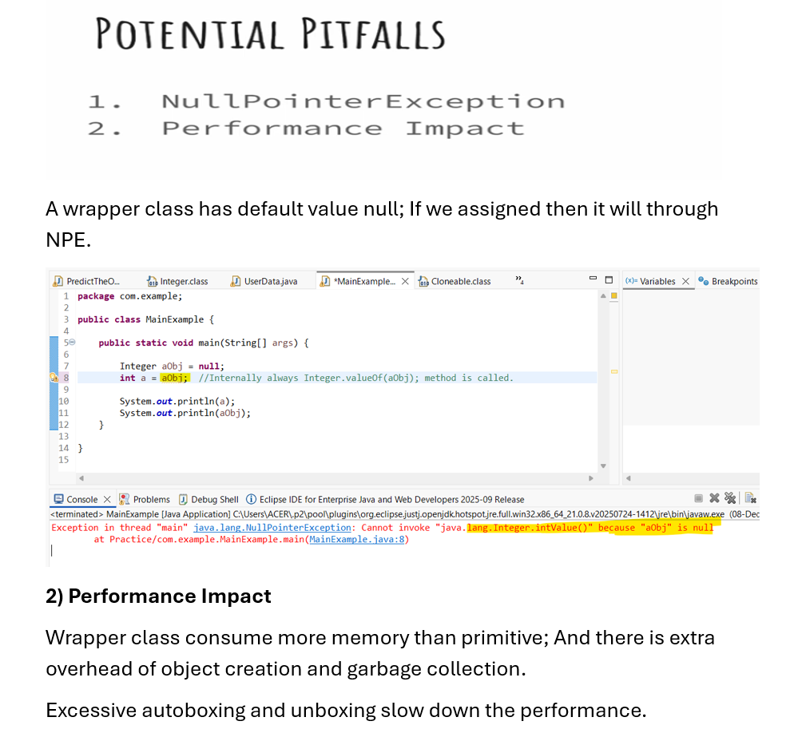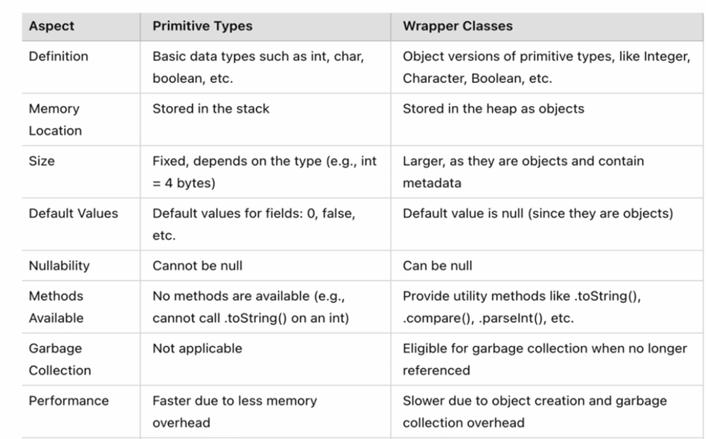
