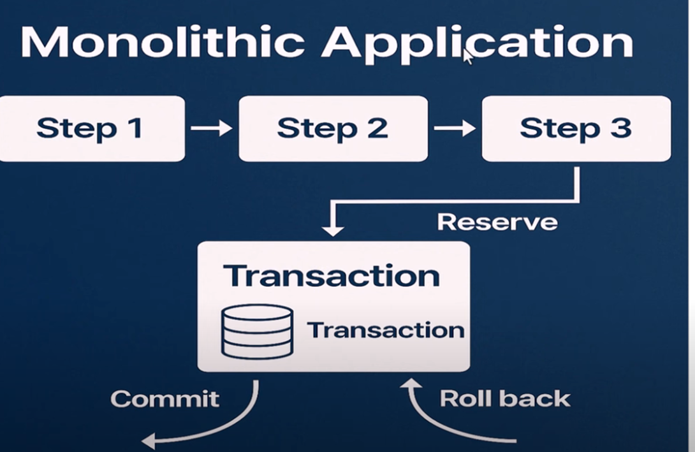
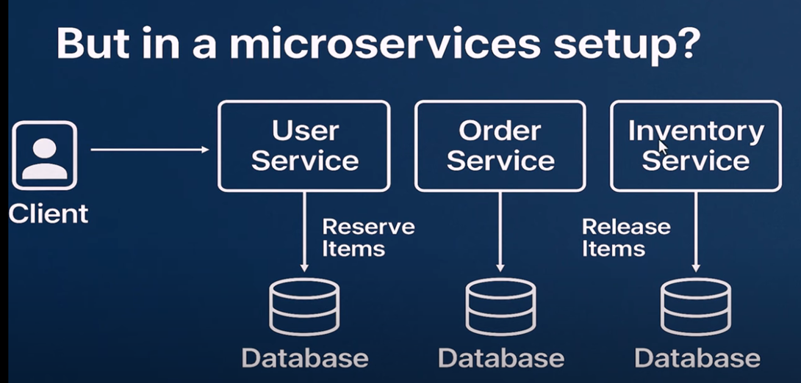
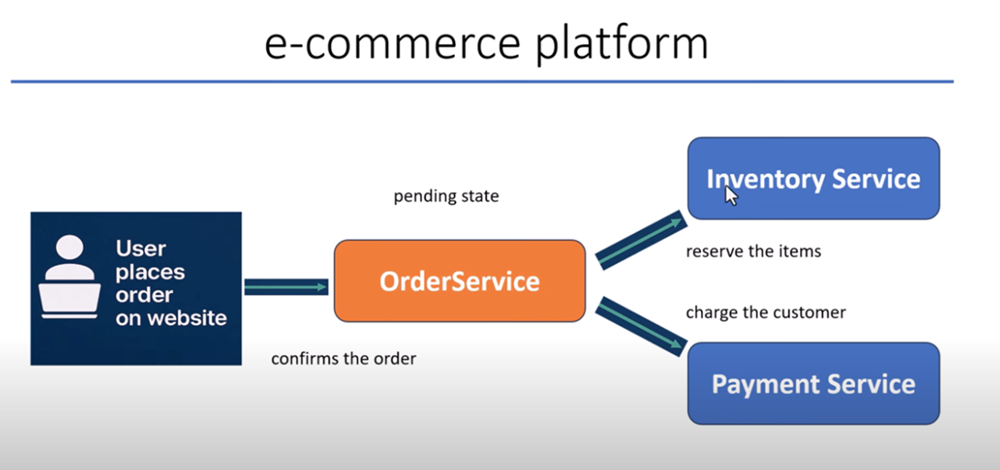
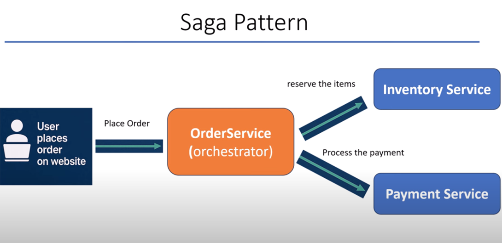
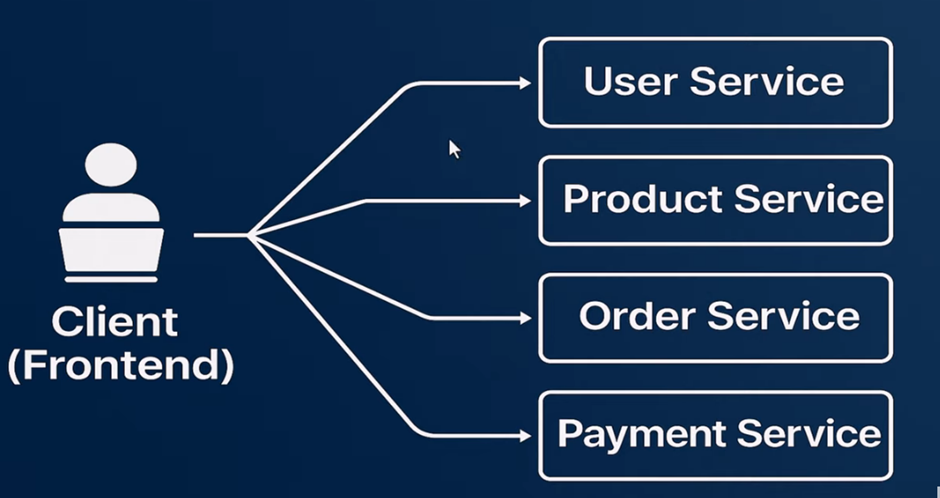
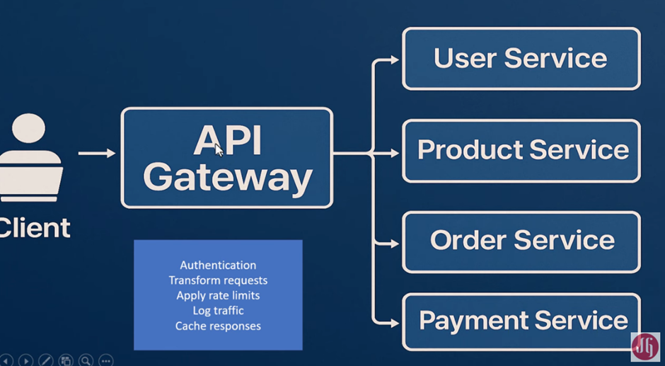
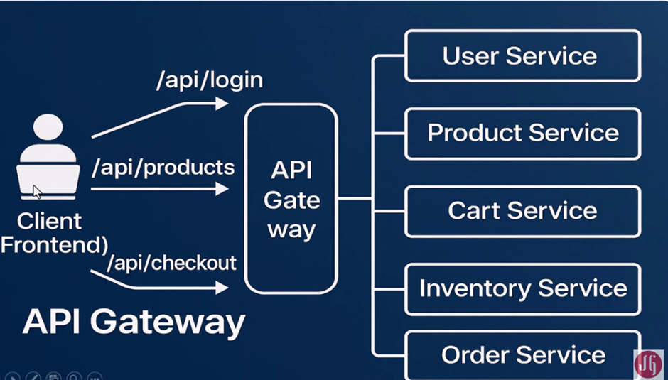

# SAGA Design patern - Rough version
## About Transaction
- Transaction ki sari steps complete hue to **completed transaction** aur koyi 1 step bhi fail hue to **incomplete transaction**.
- **Complete transaction** ye db mein commit kiya jata hia.
- And **incomplete transaction** ye db se rollback kiya jata hia.
## Monolith Application

- Monolith app mein 1 hi db  hai toh   transaction commit aur rollback karna aasan hai.
## About Microservices App

- But distributed system mein transaction spread across multiple services. 
- Aur har service ka individual db  hai.
- So track a complete transaction is difficult job.
## Real World eg

- Customer place order – 
- order service ke pass aaya – inventory service ko bheja (ki particular inventory hai kya) success milne par 
- order service ne payment service call kari.
- Agar sari step sahi rahi tab transaction **complete rahenga**.
- Yadi 1 step bhi fail hue to transaction **incomplete rahenga.**
## SAGA Intro
- To solve the problem SAGA comes into picture and use the concept of **Orchestrator.**
## Moto:
- Break down single transaction into set of local transaction. And communicate  via command or event.
## SAGA Pattern

- Customer ne order place kiya..
- **Order Serivice** ke pass order aaya . Ab ye **Orchestrator** ka kaam karnege.
- **Order service** pehle behjenga **Inventory service** ko – ki inventory hai kya .. yadi hai to hold karke rakhe.. db se minus karle
- **Order service** call karnege **payment service** ko.

- Yadi **payment service fail hue**.. tab **order service ye inventory service** ko command bhejena ki undo the previous transaction. 
- So aapka transaction ye rollback ho gaya. Otherwise commit karnge.
### EG
- Spring boot with msg broker (kafka or rabbit mq use this)
---------------
---------------
# API Gateway Pattern

- U are building Ecommerce application
- aur Ecommerce mein multiple MS hoti hia.
## Disadvantage
- Without gateway yadi aap directly call karte ho MS ko.
    - 1)	Tight coupling
    - 2)	All info update rakhna honga (port number, multiple URl’s yaad rakhna, yadi change hua to usko yaad rakhna)
    - 3)	Authentication token se deal karna.
## With API Gateway

- Gateway ye centralized layer of control provide karta
## Advantage
- 1)	Gateway sara kuch yaad rakhnga
- 2)	Log laga lenga
- 3)	Response cache kar lenga
- 4)	Rate limit – kitne baar call karna hai MS sab dekh lenga
## Actual implementaion in ecommerce app

- User ne /api/login call kiya – API gateway use User service ke paas direct karke.. login credential validate karva ke.. auth token generate Karenga
- Client ne call kara /api/product --- Gateway auth token rakhke.. wo req Product Service ko bhejena aur uska response bhejena client ko
- User /api/checkout call Karenga – checkout hone mein multiple services ko call jata hai.. API Gateway ye khud karlenga.. aya aise kiye ko call karlenga jo ye kara de. Client sirf ek call kar raha hai.. but api gateway multiple call..
## Advantage
- Aap security Gateway par laga do… har jagah lag gyi
- Gateway routing ke liye use hota. Don’t write business logic.

