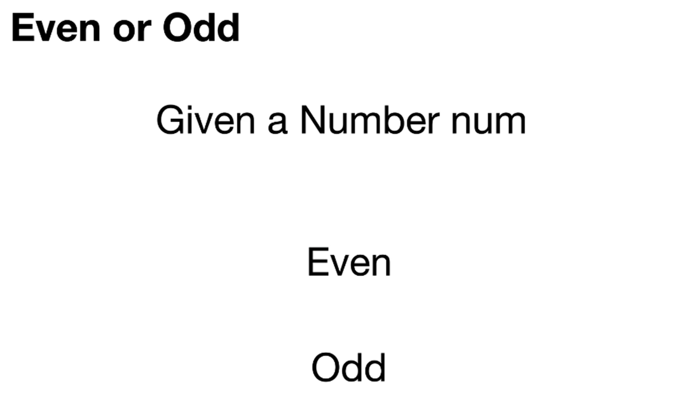
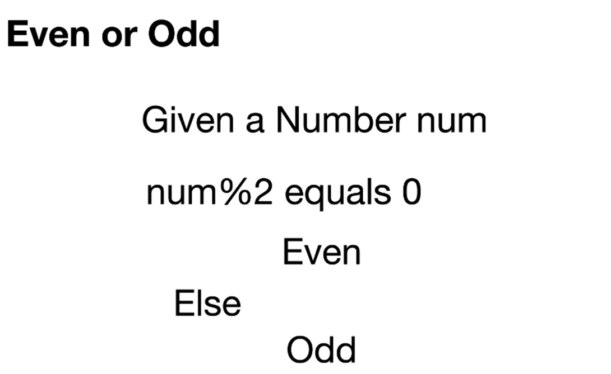
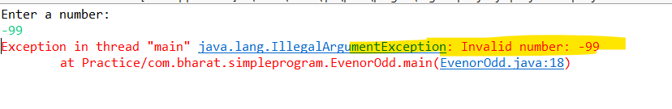

# 5. Even or odd

```java
package com.bharat.simpleprogram;

import java.util.Scanner;

public class EvenorOdd {

	public static void main(String[] args) {

		System.out.println("Enter a number: "); // ask user to enter a number in console.

		// use scanner for java util package
		// which will point to System.in

		// Scanner can read data from input Stream.
		// and input Stream is System.in
		// from console it will read the input.
		
		//try with resource- don't worry for closing of the scanner
		try (Scanner scanner = new Scanner(System.in)) {

			int num = scanner.nextInt(); // Scanner will start reading

			if (num <= 0) {
				System.out.println("Invalid number: " + num);
			} else {
				// Its a valid number. Now the logic begins
				if (num % 2 == 0) {
					System.out.println("Even");
				} else {
					System.out.println("Odd");
				}
			}
		}
	}

}
```
## Constraint are handled in real time
```java
package com.bharat.simpleprogram;

import java.util.Scanner;

public class EvenorOdd {

	public static void main(String[] args) {

		System.out.println("Enter a number: ");

		
		try (Scanner scanner = new Scanner(System.in)) {

			int num = scanner.nextInt(); 

			if (num <= 0) {
//				System.out.println("Invalid number: " + num);
				throw new IllegalArgumentException("Invalid number: " + num);
			} else {
				if (num % 2 == 0) {
					System.out.println("Even");
				} else {
					System.out.println("Odd");
				}
			}
		}
	}

}
```
## Output

# 6. Leap Year Checker

