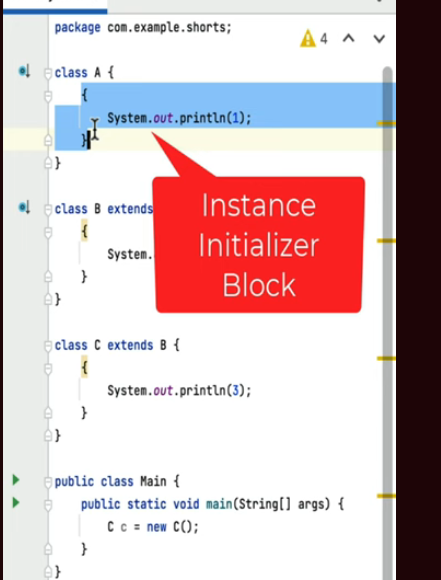

# 1. Example of Method Overloading / Compile time polymorphism
## 
```java
package com.bharat.simpleprogram;

public class OopConcept {
	
	public void print(Integer i) {
		System.out.println("Integer");
	}
	
	public void print(int i) {
		System.out.println("int");
	}
	
	public void print(long i) {
		System.out.println("long");
	}
	
	// int... represent and array of int i.e int[]
    //varible argument
	public void print(int... i) {
		System.out.println("int...");
	}	
		
	public static void main(String arg[]) {
			new OopConcept().print(10);	//Output- int
	}
}
```
### Explain
```text
This Java class contain 4 overloaded print method

which print() method it call - 
  order is 
    int (primitive type), long (primitive type), Integer (Wrapper class), int... (variable argument)

Java compiler choose appropirate method at compile time 
  based on argument passed during method invokecation.
```
### 2)
```java
package com.bharat.simpleprogram;

public class OopConcept {

	public void print(Integer i) {
		System.out.println("Integer");
	}

	public void print(long i) {
		System.out.println("long");
	}

	// int... represent and array of int i.e int[]
	public void print(int... i) {
		System.out.println("int...");
	}

	public static void main(String arg[]) {
		new OopConcept().print(10); //Output: long
	}
}
```
### 3)
```java
package com.bharat.simpleprogram;

public class OopConcept {

	public void print(Integer i) {
		System.out.println("Integer");
	}
	
	// int... represent and array of int i.e int[]
	public void print(int... i) {
		System.out.println("int...");
	}

	public static void main(String arg[]) {
		new OopConcept().print(10); //Output: Integer
	}
}
```
### 4)
```java
package com.bharat.simpleprogram;

public class OopConcept {

	//variable argument
	public void print(int... i) {
		System.out.println("int...");
	}

	public static void main(String arg[]) {
		new OopConcept().print(10); //Output: int...
	}
}
```
# 2. Order of execition in static block
```java
package com.bharat.simpleprogram;

public class OopConcept {

	static {
		System.out.println(1);
	}
	static {
		System.out.println(2);
	}
	static {
		System.out.println(3);
	}

	public static void main(String arg[]) {
		OopConcept concept;
	}
}
```
## Explain
```txt
Here this program contain 3 static block. 


When this class is  loaded by JVM.
 Then this static block will be executed.

And Each static block is executed in order in which they appear in class.

 Output:
  1
  2
  3
```
# 3. Intance initializer block

```java
package com.bharat.simpleprogram;

class A{
	{
		System.out.println(1);
	}
}
class B extends A{
	{
		System.out.println(2);
	}
}
class C extends B{
	{
		System.out.println(3);
	}
}
public class OopConcept {
	
	public static void main(String arg[]) {
		C c = new C();
	}
}
```
## Explain
```text
Contain 3 classes
 contain instance initializer block 
 
 This block is called whenever get the object of it's class.
 This is not static block.
 
 This is an inheritance hierarchy
  In Main class
    object of child class is created.
	 
Whenever you create the object of child class.
 parent class constructor is automatically called
 
 So According to inheritance hierarchy 
   first object of A is created and it called its intance initializer block.
  and so on so forth
  
So Output:
  1
  2
  3
```
# 4. Static block
```java
package com.bharat.simpleprogram;

class A{
	static {
		System.out.println("A");
	}
}
class B extends A{
	static {
		System.out.println("B");
	}
}
class C extends B{
	static {
		System.out.println("C");
	}
}
public class OopConcept {
	
	public static void main(String arg[]) {
		C c = new C();
	}
}
```
## Explain
```text


3 classes 
 and each contain static block.
 
Static block is used to initialized static variable or static mehtod

In Java
 Whenever the class is loaded its static initializer block will be 
   executed.
   
 And here the order of execution of static block is determined by 
   its class hierarchy... 
   
So Output:
   A
   B
   C
```
# 5.  Order of Execution of Static/instance/constructor
```java
package com.bharat.simpleprogram;

class ParentClass {
	
	static {
		System.out.println("A");    //static initializer block
	}
	
	{
		System.out.println("B");    //Instance Initializer block
	}
	
	ParentClass(){
		System.out.println("C");
	}
}

class ChildClass extends ParentClass {
	
	static {
		System.out.println("D");    //static initializer block
	}
	
	{
		System.out.println("E");    //Instance Initializer block
	}
	
	ChildClass(){
		System.out.println("F");
	}
}


public class OopConcept {

	public static void main(String arg[]) {
		
		ChildClass childClass = new ChildClass();
	}
}
```
### Explain
```
So we see inheritance hierarchy
 we have static block;
         instance block;
		 constructor;
		 
In main class ie. Entry point 
  we create instance of ChildClass. 

1)  
So According to inheritance first ParentClass is loaded in memory.
  static block will execute first
  
  Also child Class is loaded then 
    static block of child class will execute

2)	
When Object of ChildClass is created 
  then first Parent class object is created.
   Instance block will execute 
   then ParentClass Constructor is called.
   
So Output:
   A
   D
   B
   C
   E
   F 
   

Here we check order of execution of Static block, instance block and constructor in inheritance.
```

 
  
  


