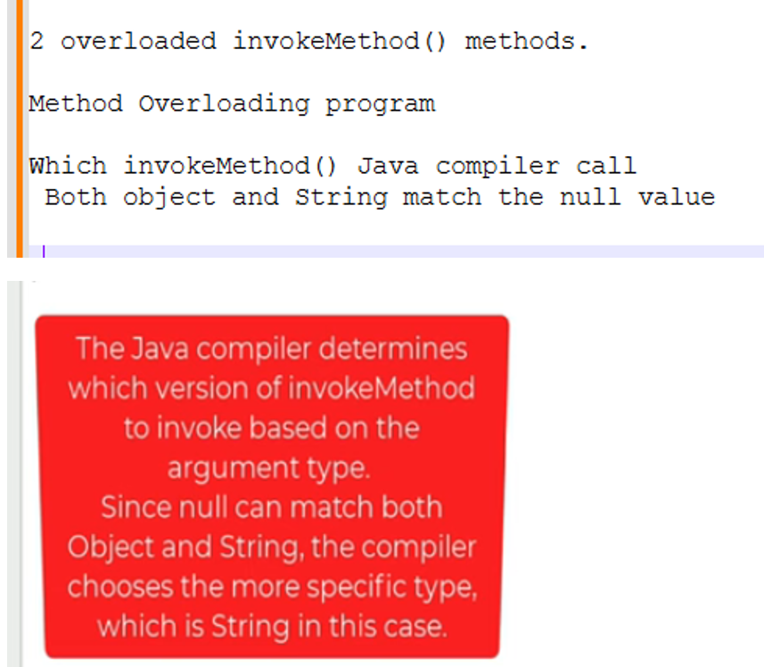
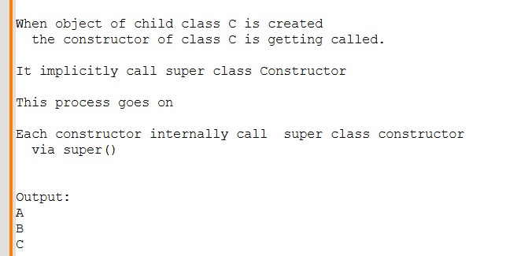
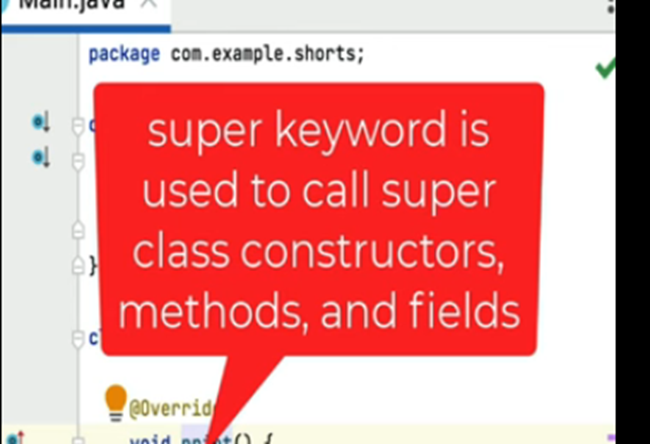
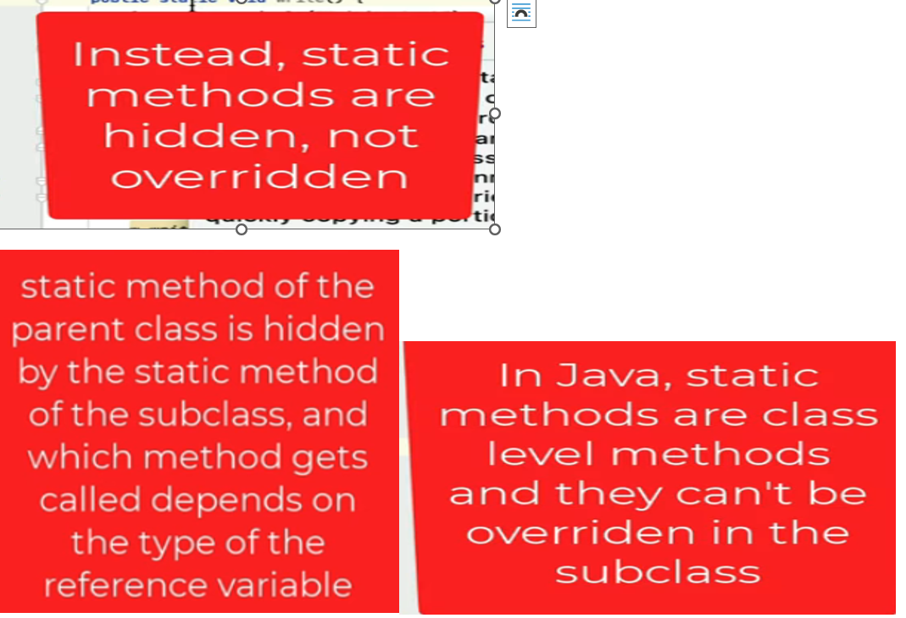

# 1. Which print() method is getting called
```java
package com.bharat.simpleprogram;

class Parent {
	
	private void print() {
		System.out.println("Parent");
	}
	
	public void display() {
		print();
	}
}

class Child extends Parent {
	
	public void print() {
		System.out.println("Child");
	}	
}


public class OopConcept {

	public static void main(String arg[]) {
		
		Child child = new Child();
		child.display();
	}
}
```
## Explain
```
In Inheritance
 Child can inherit instance method from Parent class 
                   that also can be overrided(if requires)


In Inheritance				   
We cannot override private method of Parent class.

so Output:
  Parent
```
# 2 Which method is getting called
```java
package com.bharat.simpleprogram;

public class OopConcept {

	public static void main(String arg[]) { //Entry point
		
		invokeMethod(null);  //Output: String method
	}
	
	public static void invokeMethod(Object obj) {
		System.out.println("Object method");
	}
	
	public static void invokeMethod(String str) {
		System.out.println("String method");
	}
}
```
## Explanation

# 3. Predict Output
```java
package com.bharat.simpleprogram;

class A {
	public A() {
		System.out.println("A");
	}
}

class B extends A {
	public B() {
		System.out.println("B");
	}
}

class C extends B {
	public C() {
		System.out.println("C");
	}
}

public class OopConcept {

	public static void main(String arg[]) { // Entry point

		B b = new C();

	}

}
```
## Explain

# 4. About super keyword
```java
package com.bharat.simpleprogram;

class Base {
	void print() {
		System.out.println("Base method");
	}
}

class Derived extends Base {

	@Override
	void print() {
		super.print(); //super keyword is used to call super class method - valid
		System.out.println("Derived method");
	}
}

public class OopConcept {

	public static void main(String arg[]) { // Entry point

		Derived obj = new Derived();
		obj.print(); 
		  /* Output:
		   *   Base method
		   *   Derived Method
		   */
		             
	}

}
```
## Explain

# 5.. Concept
```java
package com.bharat.simpleprogram;

abstract class Writter {
	public static void write() {
		System.out.println("Writing....");
	}
}

class Author extends Writter {

	public static void write() {
		System.out.println("Writing Book");
	}
}

class Programmer extends Writter {

	public static void write() {
		System.out.println("Writing Code");
	}
}

public class OopConcept {

	public static void main(String arg[]) { // Entry point

		Writter w = new Programmer();
		w.write(); //Writing....

	}

}
```
## Explain


  
 


  

