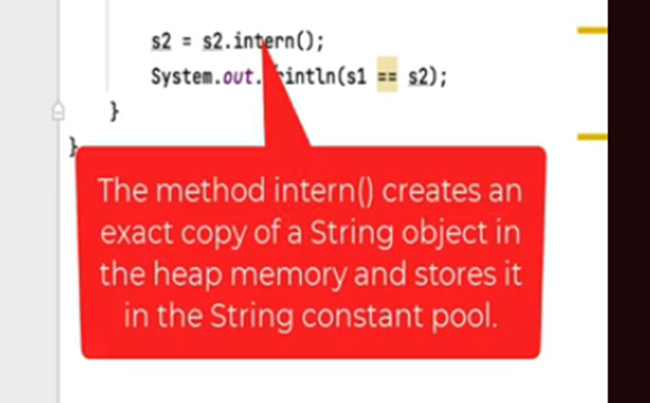
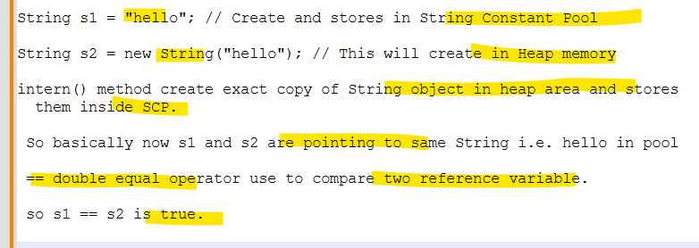
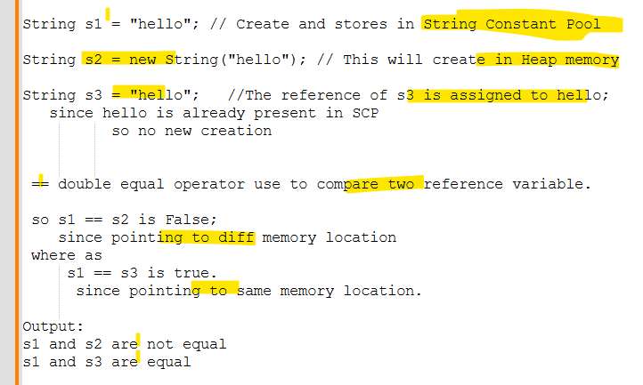
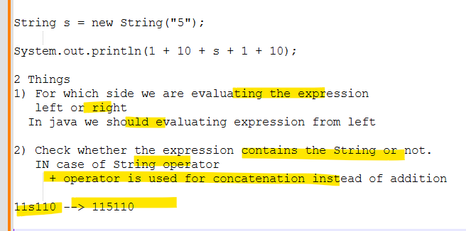

# String Handling
# 1.
```java
package com.bharat.simpleprogram;

public class StringHandlings {

	public static void main(String[] args) {
		
		String s1 = "hello";
		String s2 = new String("hello");
		
		s2 = s2.intern();
		
		System.out.println(s1==s2); //true
	}

}
```
## Explain

# 2.
```java
package com.bharat.simpleprogram;

public class StringHandlings {

	public static void main(String[] args) {
		
		String s1 = "hello";
		String s2 = new String("hello");
		String s3 = "hello";
		
		if(s1 == s2) {
			System.out.println("s1 and s2 are equal");
		} else {
			System.out.println("s1 and s2 are not equal");
		}
		
		if(s1 == s3) {
			System.out.println("s1 and s3 are equal");
		} else {
			System.out.println("s1 and s3 are not equal");
		}
	}

}
```
## Explain

# 3.
```java
package com.bharat.simpleprogram;

public class StringHandlings {

	public static void main(String[] args) {
		
		String s = new String("5");
		
		System.out.println(1 + 10 + s + 1 + 10); //115110
		
	}

}
```
## Explaination

# 4. 
```java
package com.bharat.simpleprogram;

public class StringHandlings {

	public static void main(String[] args) {
		
		String s1 = "ONE"; //It is assigned to literal value
		
		s1.concat("TWO"); // Here concatenation happens but it is not assigned back to s1
		s1.concat("THREE");//same here
		
		System.out.println(s1); //ONE

        //In java Strting are immutable 
         // and also the value is not assigned
          // and hence the value is not modified
		
	}

}
```


