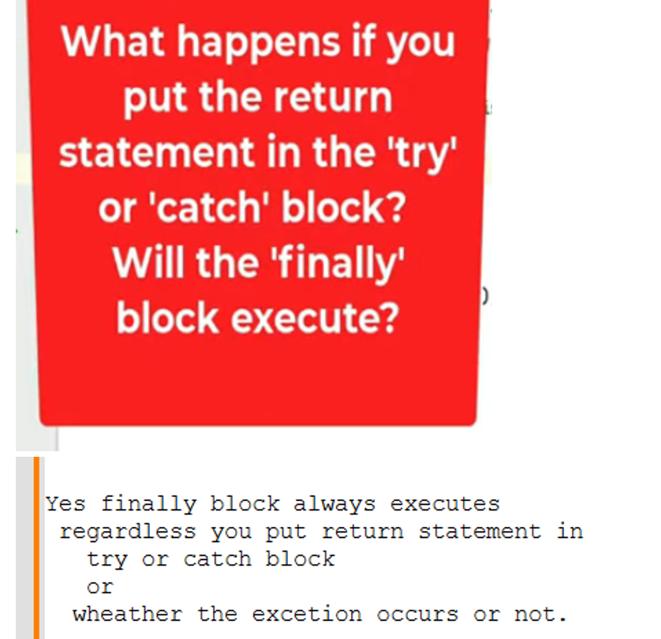
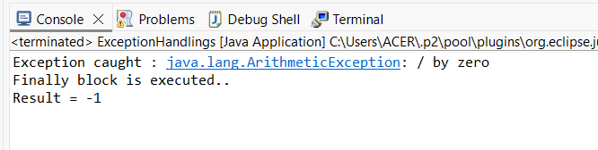
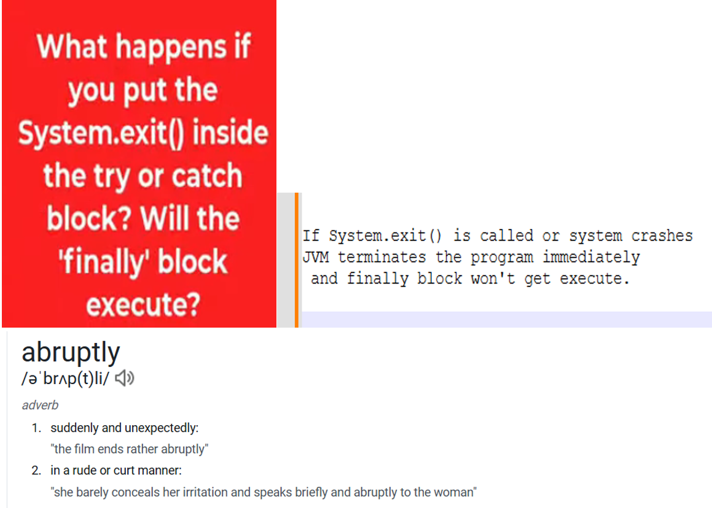
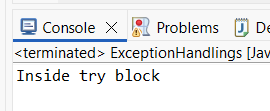
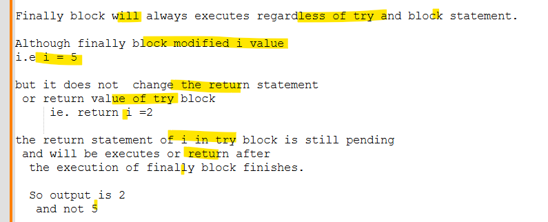

# Exception Handling
# 1.
```java
package com.bharat.simpleprogram;

public class ExceptionHandlings {

	public static void main(String[] args) {
	
		int i = 1;
		
		try {
			i++; // i++ ==> i= i+1 = 1+1 = 2
		}catch (Exception e) {
			//No exception thrown so this catch block won't executes
			i++; 
		}
		finally {
			//finally block always executes regardless of exception occurs or not
			i++; //i =i+1 = 2 +1 =3
		}
		
		System.out.println(i); //3
	}

}
```
# 2.

```java
package com.bharat.simpleprogram;

public class ExceptionHandlings {

	public static int divide(int a, int b) {
		try {
			return a / b; //This gives AE 
			
		} catch (ArithmeticException e) {
			
			 //catch handles and return -1
			System.out.println("Exception caught : " + e);
			
			return -1; //before return -1 the finally block executes
		} finally {
			  
			System.out.println("Finally block is executed..");
		}
	}

	public static void main(String[] args) {

		int result = divide(10, 0);
		System.out.println("Result = " + result);

	}

}
```
## Output:

# 3.

```java
package com.bharat.simpleprogram;

public class ExceptionHandlings {

	public static void main(String[] args) {

		try {
			System.out.println("Inside try block");

			System.exit(0); //Here JVM will terminate program immediately/abruptly

		} catch (Exception e) {
			
			System.out.println("Exception caught : " + e);
		} finally {
			
			System.out.println("Finally block is execute");
		}
	}

}
```
## Output:

# 4.
```java
package com.bharat.simpleprogram;

public class ExceptionHandlings {

	static int anyMethod() {
		
		try {
			
			return 10;
			
		} catch (Exception e) {
			
			return 20;
			
		} finally {
		//if finally block contains return statemnet
			 // then it override any return statement 
			 //comes from try or catch block
			return 30;
		}
	}

	public static void main(String[] args) {

		System.out.println(anyMethod()); //30
 
	}

}
```
# 5
```java
package com.bharat.simpleprogram;

public class ExceptionHandlings {

	static int anyMethod() {
		
		int i = 1;
		try {
			
			i = i + 1; // i = 2
			return i; //return i
			
		} catch (Exception e) {
			
			i = i + 2;
			
		} finally {
			//finally block will always executes
			i = i + 3; //i = 5		
			
		}
		
		return i;
	}

	public static void main(String[] args) {

		System.out.println(anyMethod()); // 2
 
	}

}
```
## Explaination
