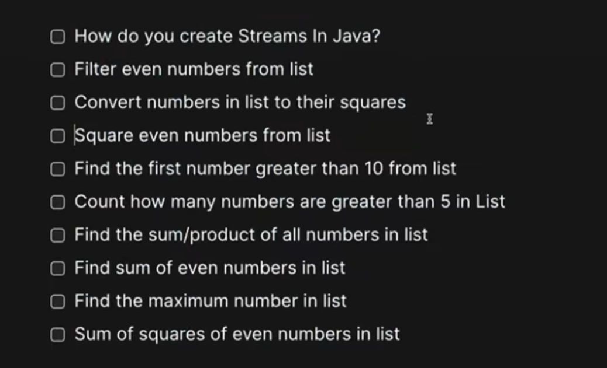

# 1 How to create Stream: 1) Create Stream via list
```java
package com.example.stream;

import java.util.Arrays;
import java.util.List;
import java.util.stream.Stream;

public class CreateStream {

	public static void main(String arg[]) {
		
		//This is List of String
		List<String> names = Arrays.asList("alice","bob");
		
		//Convert list --> Stream
		  //via stream() method
		Stream<String> stream = names.stream(); 
	}
}
```
# 2. How to create Stream: 2) Create Stream via Arrays
```java
package com.example.stream;

import java.util.Arrays;
import java.util.stream.Stream;

public class CreateStream {

	public static void main(String arg[]) {		
		
		//Now we have array of String
		String[] arr = {"Java","Phython","C++"};
		
		//Array --> stream
		  Stream<String> stream = Arrays.stream(arr);
		
	}
}
```
# 3. HOw to create stream from Random element. 3) Create Stream from an array of element. 3) via Stream.of() you can create stream inside java
```java
package com.example.stream;

import java.util.stream.Stream;

public class CreateStream {

	public static void main(String arg[]) {

		
		//WE have an random array 1,2,3 
		  //How to create stream from that.
		//via Stream.of() method

		Stream<Integer> integerStream = Stream.of(1, 2, 3);

    //Returns a sequential ordered stream from element
	}
}
```
# 4. How to create Stream. 4) Via Stream.generate() method
```java
package com.example.stream;

import java.util.stream.Stream;

public class CreateStream {

	public static void main(String arg[]) {

		/*Returns an infinite sequential unordered stream where each element is generated by the provided Supplier.
		
		Create Stream from Random number 
		      so we use Math::random          ----->      It will create Random stream		
		 
		  Stream.generate(Math::random);
		
	     Problem : It will go on and on so we need to limit it
	     
	      Math::random is return us double 
	          so Stream<Double> is created
	          
	          This is Stream.generate() method
		*/
		Stream<Double> limit = Stream.generate(Math::random).limit(5);
		
	}
}
```
# 4 ways to create Stream in java
```
1)	We can Create Stream from List ==> list.stream()
2)	We can Create Stream from Array ==> Arrays.stream(arr); passing array in it
3)	Create stream via Stream.of() method ==> Stream.of(1,2,3)
4)	Create Stream via Stream.generate() ==> Stream.generate(Math::random).limit(5);
```
#  Convert primitive arrays to stream
```java
package com.example.stream;

import java.util.Arrays;
import java.util.stream.IntStream;

public class CreateStream {

	public static void main(String arg[]) {

		//WE have arrays of primitive integer
		int[] primitiveArrays = {1,2,3};
		
		IntStream intStream = Arrays.stream(primitiveArrays);
		
		//print it
		intStream.forEach(System.out::println); //1 2 3 
	}
}
```
#  Create stream from array of Wrapper class
```java
package com.example.stream;

import java.util.stream.Stream;

public class CreateStream {

	public static void main(String arg[]) {

		//Arrays of object
		Integer[] objectArrays = {1,2,3};
		
		/* This Integer is Wrapper class
		 *  so you cannot convert it into Arrays.stream(arr)
		 *  
		 *  U need Stream.of() method for that
		 * */
		
		Stream<Integer> integerStream = Stream.of(objectArrays);
		
		integerStream.forEach(System.out::println); //1 2 3
	}
}
```
#  Convert Any Collection into Stream
```java
package com.example.stream;

import java.util.Arrays;
import java.util.List;

public class CreateStream {

	public static void main(String arg[]) {

		//List of any Collection
		List<Integer> integerList = Arrays.asList(1,2,3,4);
		
		//Convert List/Collection into Stream via stream()
		integerList.stream()
			.forEach(System.out::println); //1 2 3 4 
	}
}
```
