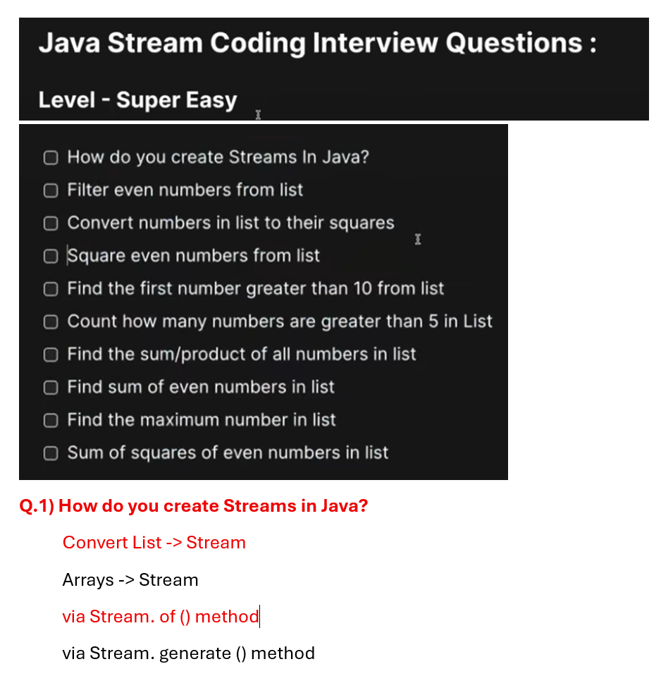
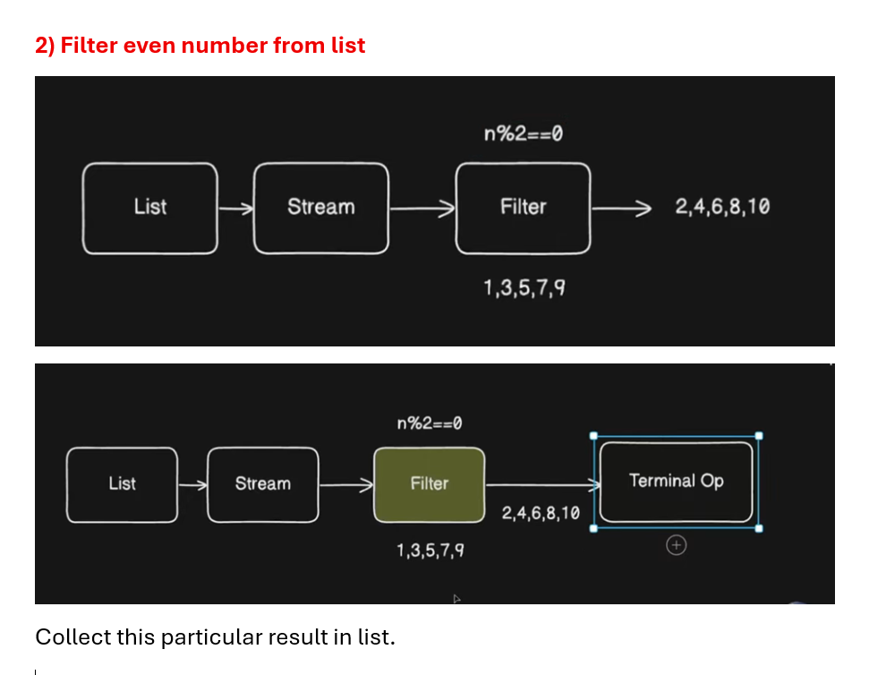
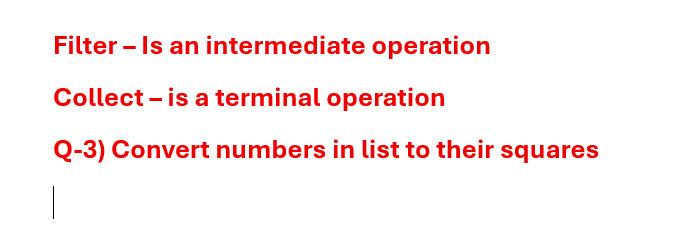
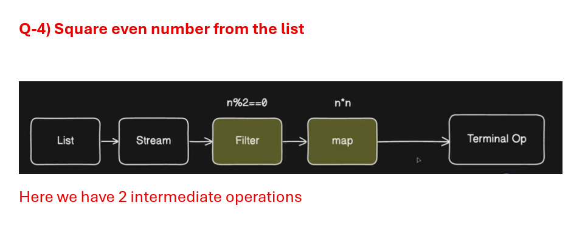
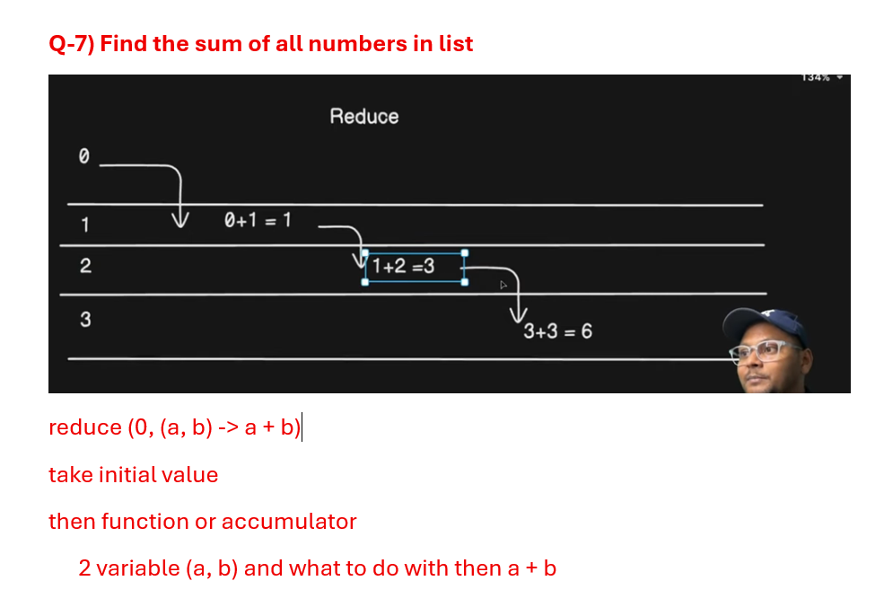
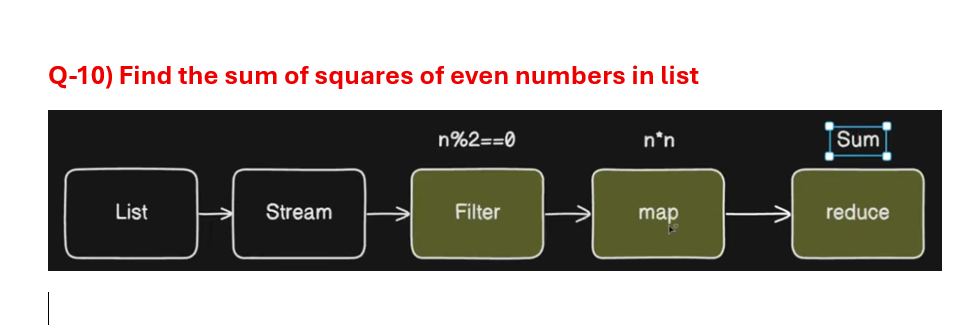

## Convert List to Stream
```java
package com.example.stream;

import java.util.Arrays;
import java.util.List;
import java.util.stream.Stream;

public class CreateStream {

	public static void main(String arg[]) {	

		List<String> names = Arrays.asList("alice","bob");
		
		//List -> Stream
		  //via .stream() method
		Stream<String> stream = names.stream();
	}
}
```
## Convert Array to Stream
```java
package com.example.stream;

import java.util.Arrays;
import java.util.stream.Stream;

public class CreateStream {

	public static void main(String arg[]) {	

		//Arrays of String
		String[] arr = {"Java","Phython","C++"};
		
		//Arrays -> Stream
			//via Arrays.stram(arr)
		Stream<String> stream = Arrays.stream(arr);
	}
}
```
## via Stream.of() method
```java
package com.example.stream;

import java.util.stream.Stream;

public class CreateStream {

	public static void main(String arg[]) {	

		//Create Stream via Stram.of() method
		 //Creating a stream from an array 
		
		Stream<Integer> of = Stream.of(1,2,3);
	
	}
}
```
## via stream.generate() method
```java
package com.example.stream;

import java.util.stream.Stream;

public class CreateStream {

	public static void main(String arg[]) {	

		//via Stream.generate() -- it require supplier
		//Create a stream of Random number
		  //Now Math::random go on and on
		    //so we need to limit it
		
		Stream<Double> limit = Stream.generate(Math::random).limit(5);
	}
}
```
#  2) Filter even number from list

```java
package com.example.stream;

import java.util.Arrays;
import java.util.List;
import java.util.stream.Collectors;
import java.util.stream.Stream;

public class CreateStream {

	public static void main(String arg[]) {	

		List<Integer> numbers = Arrays.asList(1,2,3,4,5,6,7,8,9,10);
		
		// 1. Convert list into Stream
               //i.e Collection -> stream via .stream()
		Stream<Integer> stream = numbers.stream();
		
		// 2. filter is a function which filter an element based on some condtion 
		   //3.it takes an argument Predicate 
		    // predict sth 
		
		//4. collect filter number into list
		List<Integer> result = stream.filter(num -> num%2 == 0)
						.collect(Collectors.toList());
		
		//print it
		System.out.println(result); // [2, 4, 6, 8, 10]
	}
}
```
## More clean code
```java
package com.example.stream;

import java.util.Arrays;
import java.util.List;
import java.util.stream.Collectors;
import java.util.stream.Stream;

public class CreateStream {

	public static void main(String arg[]) {	

		List<Integer> numbers = Arrays.asList(1,2,3,4,5,6,7,8,9,10);		

		List<Integer> result = numbers.stream()
									   .filter(num -> num%2 == 0)
									   .collect(Collectors.toList());
		
		//print it
		System.out.println(result); // [2, 4, 6, 8, 10]
	}
}
```
# 3. Convert numbers in list to their squares

```java
package com.example.stream;

import java.util.Arrays;
import java.util.List;
import java.util.stream.Collectors;

public class CreateStream {

	public static void main(String arg[]) {	

		List<Integer> numbers = Arrays.asList(1,2,3,4,5);		

		//we want to transform/map 1 value to another value - use map() method
		List<Integer> result = numbers.stream()
										.map(num -> num*num)
										  .collect(Collectors.toList());
		
		System.out.println(result);//[1, 4, 9, 16, 25]
	}
}
```
# 4) Square even number from the list

```java
package com.example.stream;

import java.util.Arrays;
import java.util.List;
import java.util.stream.Collectors;

public class CreateStream {

	public static void main(String arg[]) {	

		List<Integer> numbers = Arrays.asList(1,2,3,4,5);		

		List<Integer> result = numbers.stream()
		   .filter(n -> n%2 == 0)
		    .map(n -> n*n)
		     .collect(Collectors.toList());
		
		System.out.println(result); // [4, 16]
	}
}
```
## In recent version you can use toList() method instead of collect(Collectors.toList())
```java
package com.example.stream;

import java.util.Arrays;
import java.util.List;
import java.util.stream.Collectors;

public class CreateStream {

	public static void main(String arg[]) {	

		List<Integer> numbers = Arrays.asList(1,2,3,4,5);		

		List<Integer> result = numbers.stream()
		   .filter(n -> n%2 == 0)
		    .map(n -> n*n)
		     .toList();
		
		System.out.println(result); // [4, 16]
	}
}
```
# 5. Find the first number greater than 10 from list
```java
package com.example.stream;

import java.util.Arrays;
import java.util.List;
import java.util.Optional;

public class CreateStream {

	public static void main(String arg[]) {	

		List<Integer> numbers = Arrays.asList(3,7,12,5,20);		
		
		//find first element which is greater than 10 
		
		//I want number greater than 10
		  //so i don't want number less than 10 so filter()
		Optional<Integer> first = numbers.stream()
		   .filter(n -> n > 10)
		   .findFirst();
		
		System.out.println(first.get()); //12
	
	}
}
```
## Twisted
```java
package com.example.stream;

import java.util.Arrays;
import java.util.List;
import java.util.Optional;

public class CreateStream {

	public static void main(String arg[]) {	

		List<Integer> numbers = Arrays.asList(3,7,12,5,11,20);		
		
		//little change now we requie 11 as output from the list
		
		Optional<Integer> first = numbers.stream()
		   .filter(n -> n > 10) //12 11 20
		   .sorted()
		   .findFirst();
		
		System.out.println(first.get()); //11
	
	}
}
```
# Q-6) Count how many numbers are greater than 5 in the list
```java
package com.example.stream;

import java.util.Arrays;
import java.util.List;

public class CreateStream {

	public static void main(String arg[]) {	

		List<Integer> numbers = Arrays.asList(2,6,3,8,10,1);		
		
		//Count numbers greater than 5
		  //filter elements which are greater than 5
		long count = numbers.stream()
		   .filter(n -> n > 5)
		   .count();  //Its terminal operation
		
		System.out.println(count); //3
	
	}
}
```
# 7-a) find sum  

```java
package com.example.stream;

import java.util.Arrays;
import java.util.List;

public class CreateStream {

	public static void main(String arg[]) {	

		List<Integer> numbers = Arrays.asList(1,2,3,4,5);		
		
		//make sum of this
		   // we don't want filter
		   // we don't want transform i.e. map()
		   //perform operation on all of them and get single value
		Integer sum = numbers.stream()
				.reduce(0,(a,b)-> a+b);
		 
			System.out.println(sum); //15
	}
}
```
# 7-b) find product
```java
package com.example.stream;

import java.util.Arrays;
import java.util.List;

public class CreateStream {

	public static void main(String arg[]) {	

		List<Integer> numbers = Arrays.asList(1,2,3,4,5);		
		
	
		Integer sum = numbers.stream()
				.reduce(1 ,(a,b)-> a* b);
		 
			System.out.println(sum); //120
	}
}
```
# Q-8) Find the sum of all even numbers in list
```java
package com.example.stream;

import java.util.Arrays;
import java.util.List;

public class CreateStream {

	public static void main(String arg[]) {	

		List<Integer> numbers = Arrays.asList(1,2,3,4,5);				
	
		//remove all odd number then find sum
		Integer sum = numbers.stream()
		  .filter(n -> n%2 == 0)
		   .reduce(0, (a,b)-> a+b);
		
		System.out.println(sum); //6
	}
}
```
# Q-9) Find the maximum numbers in list
```java
package com.example.stream;

import java.util.Arrays;
import java.util.List;

public class CreateStream {

	public static void main(String arg[]) {	

		List<Integer> numbers = Arrays.asList(5,10,2,8,20);				
	
		//find maximum of this
		  //we can reduce it and pass number function
		    // we require maximum from a and b
		Integer max = numbers.stream()
		  .reduce(0, (a,b)-> Integer.max(a, b));
		
		System.out.println(max); //20
	}
}
```
## via method refrence
```java
package com.example.stream;

import java.util.Arrays;
import java.util.List;

public class CreateStream {

	public static void main(String arg[]) {	

		List<Integer> numbers = Arrays.asList(5,10,2,8,20);				
	
		
		Integer max = numbers.stream()
		  .reduce(0,  Integer::max);
		
		System.out.println(max); //20
	}
}
```
## Max function doesn't need initial value 0
```java
package com.example.stream;

import java.util.Arrays;
import java.util.List;
import java.util.Optional;

public class CreateStream {

	public static void main(String arg[]) {	

		List<Integer> numbers = Arrays.asList(5,10,2,8,20);				
	
		
		Optional<Integer> max = numbers.stream()
		  .reduce(Integer::max);
		
		System.out.println(max.get()); //20
	}
}
```
# 10 Find the sum of squares of even numbers in list

```java
package com.example.stream;

import java.util.Arrays;
import java.util.List;
import java.util.Optional;

public class CreateStream {

	public static void main(String arg[]) {	

		List<Integer> numbers = Arrays.asList(1,2,3,4,5,6,7,8,9,10);				
	
		//-even -- square -- sum
		Integer sum = numbers.stream()
		 .filter(n -> n%2==0)
		  .map(n -> n*n)
		   .reduce(0, (a,b)-> a+b);
		
		System.out.println(sum); //220
	}
}
```
## via method refrence
```java
package com.example.stream;

import java.util.Arrays;
import java.util.List;
import java.util.Optional;

public class CreateStream {

	public static void main(String arg[]) {	

		List<Integer> numbers = Arrays.asList(1,2,3,4,5,6,7,8,9,10);				
	
		//-even -- square -- sum
		 Optional<Integer> sum = numbers.stream()
		 .filter(n -> n%2==0)
		  .map(n -> n*n)
		   .reduce(Integer::sum);
		
		System.out.println(sum.get()); //220
	}
}
```
