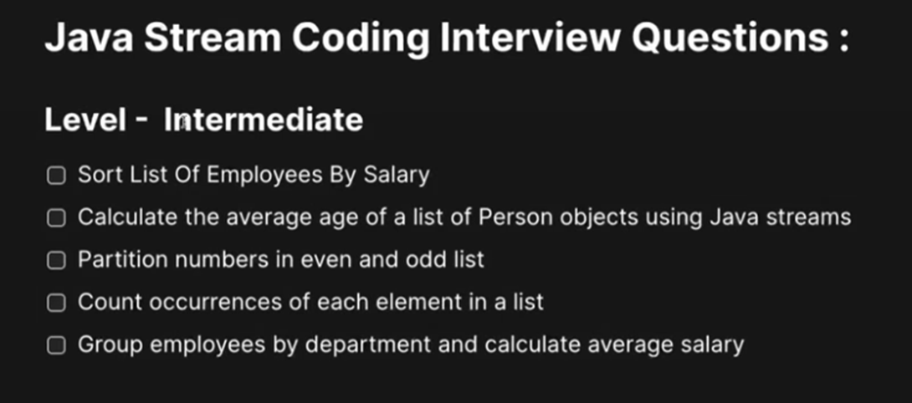
# Q-1) Sort list of employees by salary
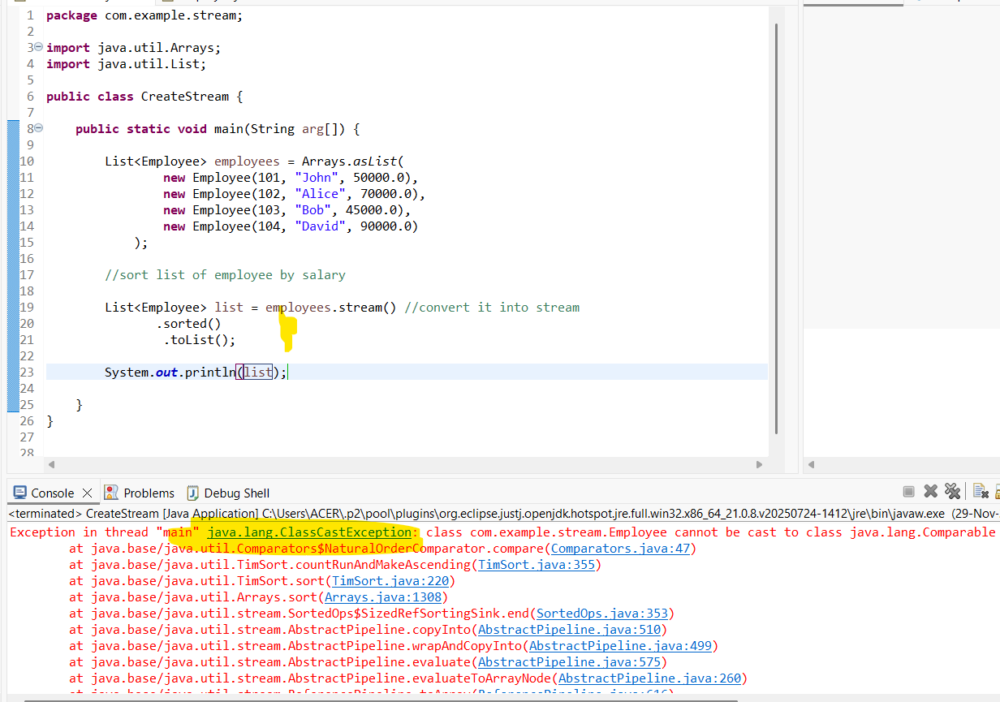
- If we try to sort object in normal way we get up ending Class Cast Exception.
- You ask me to sort the object but i don't know which field should be taken.
## Natural order
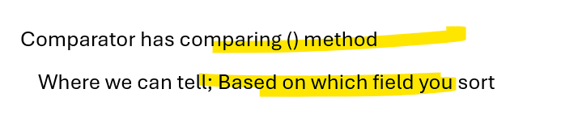
```java
package com.example.stream;

import java.util.Arrays;
import java.util.Comparator;
import java.util.List;

public class CreateStream {

	public static void main(String arg[]) {	
		
		List<Employee> employees = Arrays.asList(
				new Employee(101, "John", 50000.0),
				new Employee(102, "Alice", 70000.0),
				new Employee(103, "Bob", 45000.0),
				new Employee(104, "David", 90000.0)
			);
		
		//sort list of employee by salary
		
		List<Employee> list = employees.stream() //convert it into stream
		       .sorted(Comparator.comparing(Employee::getSalary))   //U want to sort based on salary
		        .toList();
		
		System.out.println(list);
	/*
	 * [Employee [id=103, name=Bob, salary=45000.0], 
	 * Employee [id=101, name=John, salary=50000.0],
	 *  Employee [id=102, name=Alice, salary=70000.0],
	 *   Employee [id=104, name=David, salary=90000.0]]	
	 */
	}
}
````
## Employee class
```java
package com.example.stream;

public class Employee {

	private Integer id;
	private String name;	
	private Double salary;
	public Employee(Integer id, String name, Double salary) {
		super();
		this.id = id;
		this.name = name;
		this.salary = salary;
	}
	public Integer getId() {
		return id;
	}
	public void setId(Integer id) {
		this.id = id;
	}
	public String getName() {
		return name;
	}
	public void setName(String name) {
		this.name = name;
	}
	public Double getSalary() {
		return salary;
	}
	public void setSalary(Double salary) {
		this.salary = salary;
	}
	@Override
	public String toString() {
		return "Employee [id=" + id + ", name=" + name + ", salary=" + salary + "]";
	}
}
```
## descending order
```java
package com.example.stream;

import java.util.Arrays;
import java.util.Comparator;
import java.util.List;

public class CreateStream {

	public static void main(String arg[]) {	
		
		List<Employee> employees = Arrays.asList(
				new Employee(101, "John", 50000.0),
				new Employee(102, "Alice", 70000.0),
				new Employee(103, "Bob", 45000.0),
				new Employee(104, "David", 90000.0)
			);
		
		//sort list of employee by salary
		
		List<Employee> list = employees.stream() //convert it into stream
		       .sorted(Comparator.comparing(Employee::getSalary).reversed())   
		        .toList();
		
		System.out.println(list);
	/*
	[Employee [id=104, name=David, salary=90000.0],
	 Employee [id=102, name=Alice, salary=70000.0],
	  Employee [id=101, name=John, salary=50000.0], 
	  Employee [id=103, name=Bob, salary=45000.0]]
	 */
	}
}
```
## Sorted based on id
```java
package com.example.stream;

import java.util.Arrays;
import java.util.Comparator;
import java.util.List;

public class CreateStream {

	public static void main(String arg[]) {	
		
		List<Employee> employees = Arrays.asList(
				new Employee(101, "John", 50000.0),
				new Employee(102, "Alice", 70000.0),
				new Employee(103, "Bob", 45000.0),
				new Employee(104, "David", 90000.0)
			);
		
		//sort list of employee by salary
		
		List<Employee> list = employees.stream() //convert it into stream
		       .sorted(Comparator.comparing(Employee::getId))   
		        .toList();
		
		System.out.println(list);
	/*
	[Employee [id=101, name=John, salary=50000.0],
	 Employee [id=102, name=Alice, salary=70000.0],
	  Employee [id=103, name=Bob, salary=45000.0], 
	  Employee [id=104, name=David, salary=90000.0]]
	 */
	}
}
```
## Sorted based on name
```java
package com.example.stream;

import java.util.Arrays;
import java.util.Comparator;
import java.util.List;

public class CreateStream {

	public static void main(String arg[]) {	
		
		List<Employee> employees = Arrays.asList(
				new Employee(101, "John", 50000.0),
				new Employee(102, "Alice", 70000.0),
				new Employee(103, "Bob", 45000.0),
				new Employee(104, "David", 90000.0)
			);
		
		//sort list of employee by salary
		
		List<Employee> list = employees.stream() //convert it into stream
		       .sorted(Comparator.comparing(Employee::getName))   
		        .toList();
		
		System.out.println(list);
	/*
	[Employee [id=102, name=Alice, salary=70000.0], 
	Employee [id=103, name=Bob, salary=45000.0],
	 Employee [id=104, name=David, salary=90000.0],
	  Employee [id=101, name=John, salary=50000.0]]
	 */
	}
}
```
#  Q-2) Calculate the average age of a list of Person objects using Java Stream.
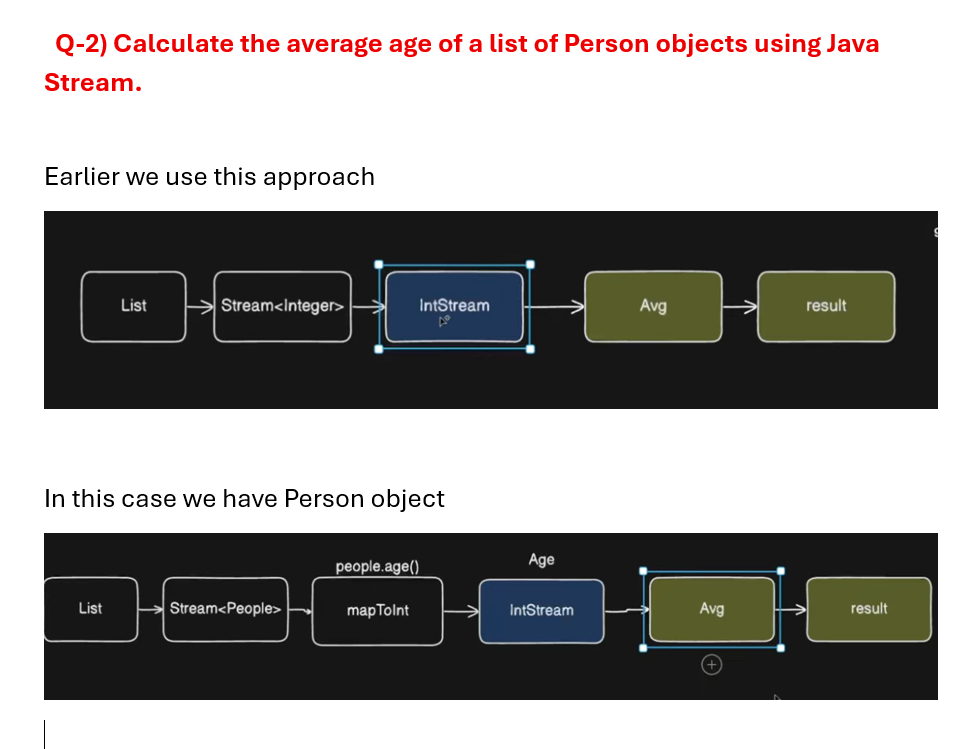
```java
package com.example.stream;

import java.util.Arrays;
import java.util.List;

public class CreateStream {

	public static void main(String arg[]) {	
		
		List<Person> people = Arrays.asList(
				new Person("Alice", 25),
				new Person("Bob", 30),
				new Person("Charlie", 28),
				new Person("David", 35)
				);
		
		//we want average age of Person
		double avgAge = people.stream()
		  .mapToInt(Person::getAge)  //This return intstream
		   .average()
		    .orElse(0.0);
		
		System.out.println(avgAge); //29.5
		 
	}
}
```
#   Q-3) Partition numbers in even and odd list
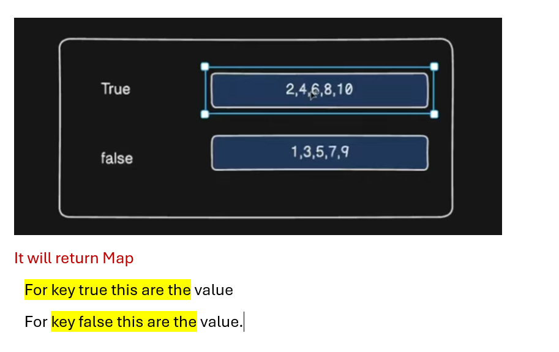
```java
package com.example.stream;

import java.util.Arrays;
import java.util.List;
import java.util.Map;
import java.util.stream.Collectors;

public class CreateStream {

	public static void main(String arg[]) {	
		
	List<Integer> numbers = Arrays.asList(1,2,3,4,5,6,7,8,9,10);
		
	Map<Boolean, List<Integer>> output = numbers.stream() 
	    .collect(Collectors.partitioningBy(n -> n%2 == 0));
		 
	
	System.out.println("Even numbers: "+ output.get(true)); //Even numbers: [2, 4, 6, 8, 10]
	System.out.println("Odd numbers: "+ output.get(false));//Odd numbers: [1, 3, 5, 7, 9]
	}
}
```
#   Q-4) Group a list of words by their length using Streams.
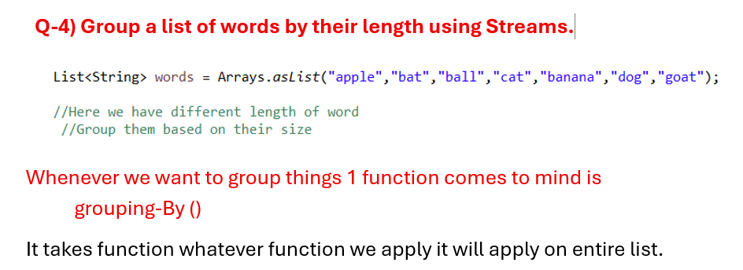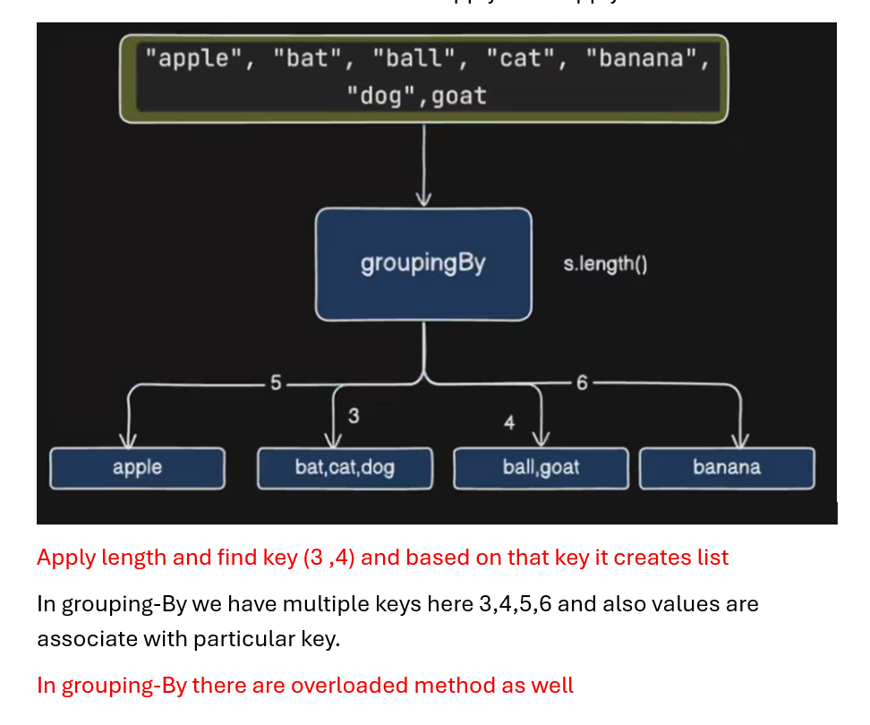
```java
package com.example.stream;

import java.util.Arrays;
import java.util.List;
import java.util.Map;
import java.util.stream.Collectors;

public class CreateStream {

	public static void main(String arg[]) {	
		
	 List<String> words = Arrays.asList("apple","bat","ball","cat","banana","dog","goat");

	 //Here we have different length of word
	  //Group them based on their size
	 
	 Map<Integer, List<String>> output = words.stream()
	    .collect(Collectors.groupingBy(String::length));
	 
	 System.out.println(output);
	 /*
	  * {
	  * 	3=[bat, cat, dog], 
	  *     4=[ball, goat], 
	  *     5=[apple], 
	  *     6=[banana]
	  * }
	  */
	}
}
```
 #  Q-5) Count occurrences of each element in a list.
 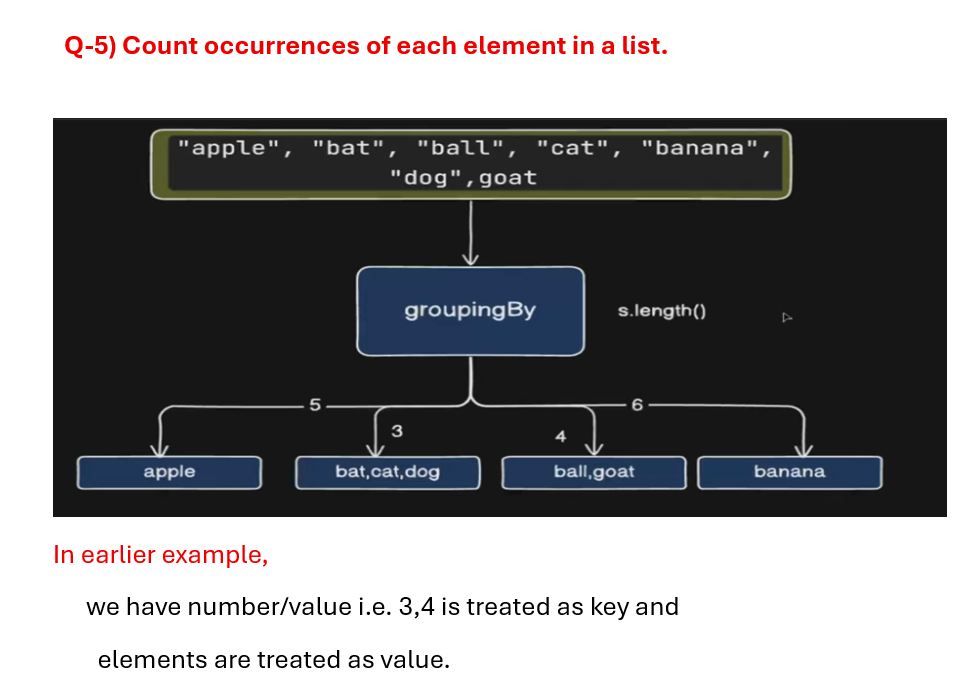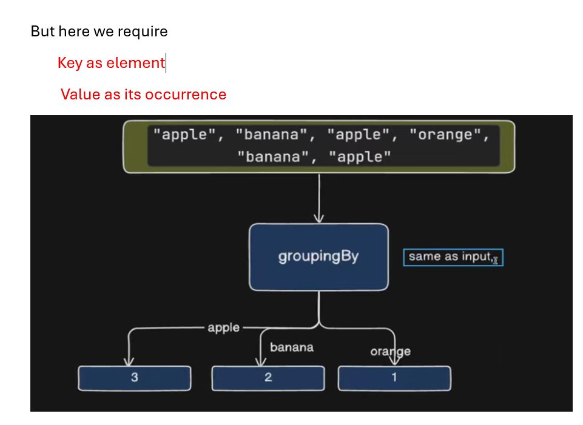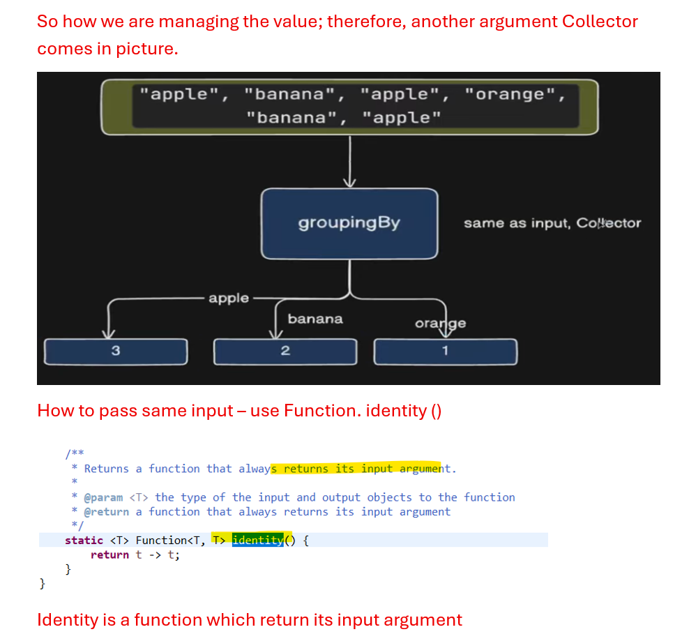
 ```java
 package com.example.stream;

import java.util.Arrays;
import java.util.List;
import java.util.Map;
import java.util.function.Function;
import java.util.stream.Collectors;

public class CreateStream {

	public static void main(String arg[]) {	
		
	 List<String> items = Arrays.asList("apple","banana","apple","orange","banana","apple");
	 //apple - 3    banana - 2   orange-1
	 
	 Map<String, Long> map = items.stream()
	      .collect(Collectors.groupingBy(Function.identity(), Collectors.counting()));
	 
	 System.out.println(map); 
	 /*
	  * {
	  *   orange=1,
	  *   banana=2,
	  *   apple=3
	  *  }
	  */
	}
}
```
#   Q-6) Group employees by department and calculate average salary.
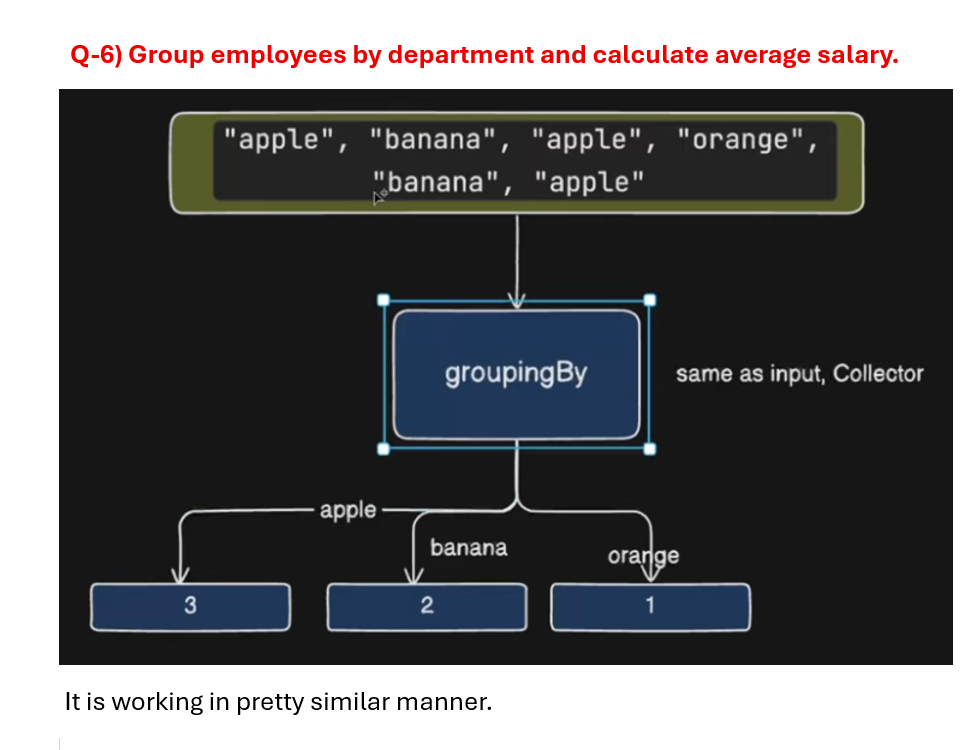
```java
package com.example.stream;

import java.util.Arrays;
import java.util.List;
import java.util.Map;
import java.util.stream.Collectors;

public class CreateStream {

	public static void main(String arg[]) {	
		
			List<Employee> employees = Arrays.asList(
					new Employee(1, "John", "HR", 50000.0),
					new Employee(2, "Jane", "IT", 70000.0),
					new Employee(3, "Mike", "IT", 80000.0),
					new Employee(4, "Sara", "Finance", 60000.0),
					new Employee(5, "Paul", "HR", 55000.0)
			);
			
			/* we need to group this employee based on department 
			 *    and then find its average salary
			 *   Finance: 60000 
			 *   HR: 52000.0
			 *   IT: 75000.0
			 */
			Map<String, Double> output = employees.stream()
			  .collect(Collectors.groupingBy(Employee::getDepartment, 
					  Collectors.averagingDouble(Employee::getSalary)));
			
			System.out.println(output);
			/*
			 * {
			 *    Finance=60000.0, 
			 *    HR=52500.0,
			 *    IT=75000.0
			 *  }
			 */
	}
}
```
