# Q-1) Find the highest paid employee in each department.
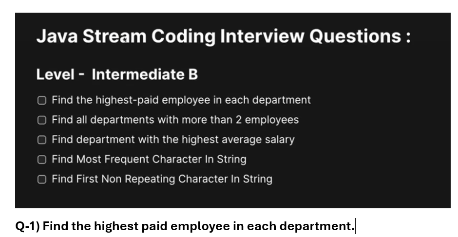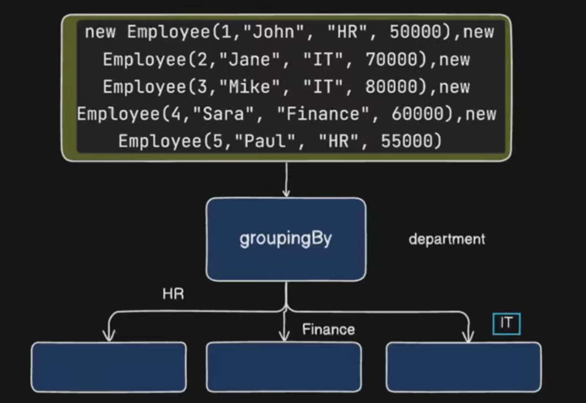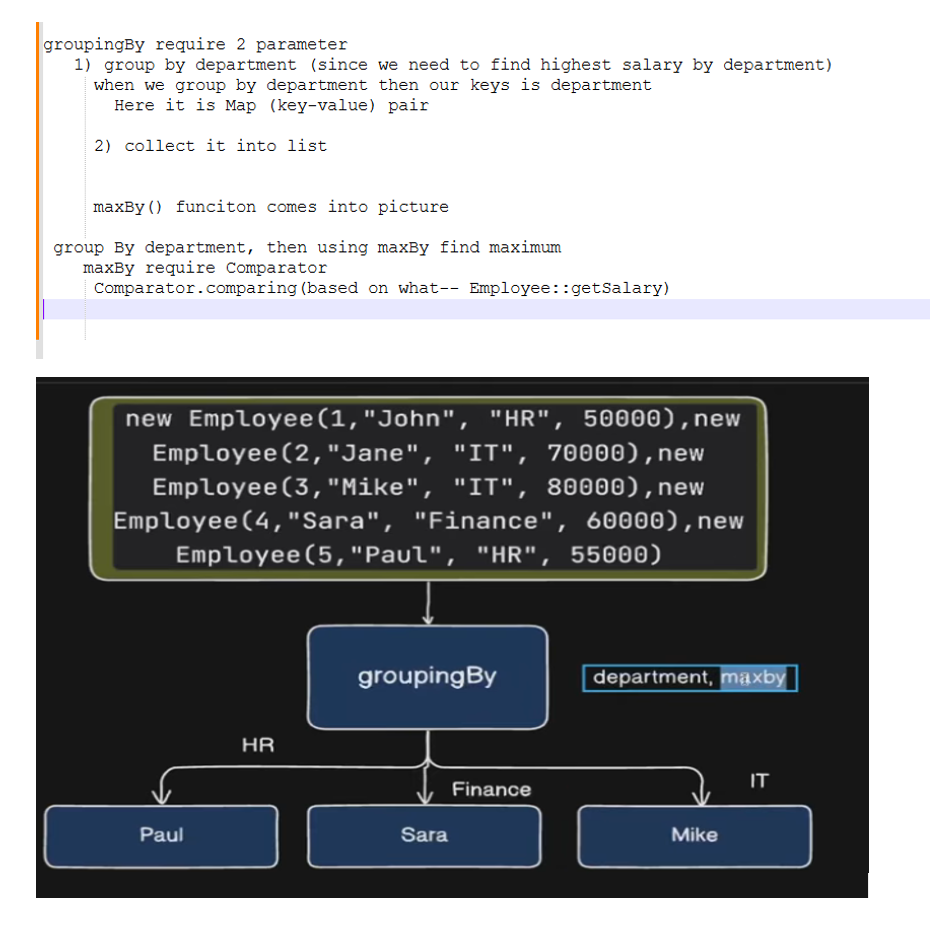
```java
package com.example.stream;

import java.util.Arrays;
import java.util.Comparator;
import java.util.List;
import java.util.Map;
import java.util.Optional;
import java.util.stream.Collectors;

public class CreateStream {

	public static void main(String arg[]) {	
		
			List<Employee> employees = Arrays.asList(
					new Employee(1, "John", "HR", 50000.0),
					new Employee(2, "Jane", "IT", 70000.0),
					new Employee(3, "Mike", "IT", 80000.0),
					new Employee(4, "Sara", "Finance", 60000.0),
					new Employee(5, "Paul", "HR", 55000.0)
			);
			
			/* Highest paid employee in each department
			 *  HR - Paul - 55K
			 *  Finanace - Saraa - 60K
			 *  IT - Mike - 80K
			 */
		
			Map<String, List<Employee>> collect = employees.stream()
			  .collect(Collectors.groupingBy(Employee::getDepartment, Collectors.toList()));
			
			System.out.println(collect);//{Finance=[Employee [id=4, name=Sara, department=Finance, salary=60000.0]], HR=[Employee [id=1, name=John, department=HR, salary=50000.0], Employee [id=5, name=Paul, department=HR, salary=55000.0]], IT=[Employee [id=2, name=Jane, department=IT, salary=70000.0], Employee [id=3, name=Mike, department=IT, salary=80000.0]]}

			//here key is dept and value is List<Employee>
			
			//U want maxBy but based on what
			 //By using employee salary i want maximum in this group
			 Map<String, Optional<Employee>> collect2 = employees.stream()
					  .collect(Collectors.groupingBy(Employee::getDepartment,
							  Collectors.maxBy(Comparator.comparing(Employee::getSalary))));
			 
			 System.out.println(collect2); //{Finance=Optional[Employee [id=4, name=Sara, department=Finance, salary=60000.0]], HR=Optional[Employee [id=5, name=Paul, department=HR, salary=55000.0]], IT=Optional[Employee [id=3, name=Mike, department=IT, salary=80000.0]]}

	}
}
```
# Similarly we have minBy
# find minimum salary employees in each department
```java
package com.example.stream;

import java.util.Arrays;
import java.util.Comparator;
import java.util.List;
import java.util.Map;
import java.util.Optional;
import java.util.stream.Collectors;

public class CreateStream {

	public static void main(String arg[]) {	
		
			List<Employee> employees = Arrays.asList(
					new Employee(1, "John", "HR", 50000.0),
					new Employee(2, "Jane", "IT", 70000.0),
					new Employee(3, "Mike", "IT", 80000.0),
					new Employee(4, "Sara", "Finance", 60000.0),
					new Employee(5, "Paul", "HR", 55000.0)
			);
			
			// groupBy based on department
			  // this give you Map of Department and it's employee
			// Apply minBy() which require Comparator
			   //Based on what i comparing 
			//finally they group All
			Map<String, Optional<Employee>> collect = employees.stream()
			  .collect(Collectors.groupingBy(Employee::getDepartment,
					 Collectors.minBy(Comparator.comparing(Employee::getSalary))));
			
			System.out.println(collect);//{Finance=Optional[Employee [id=4, name=Sara, department=Finance, salary=60000.0]], HR=Optional[Employee [id=1, name=John, department=HR, salary=50000.0]], IT=Optional[Employee [id=2, name=Jane, department=IT, salary=70000.0]]}

	}
}
```
# 2. Find all departments with more than 2 employees
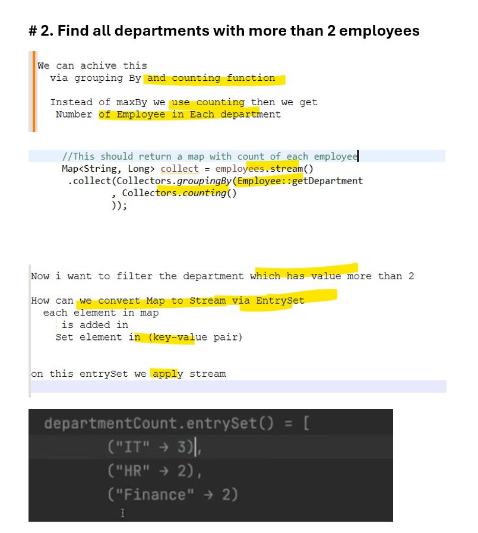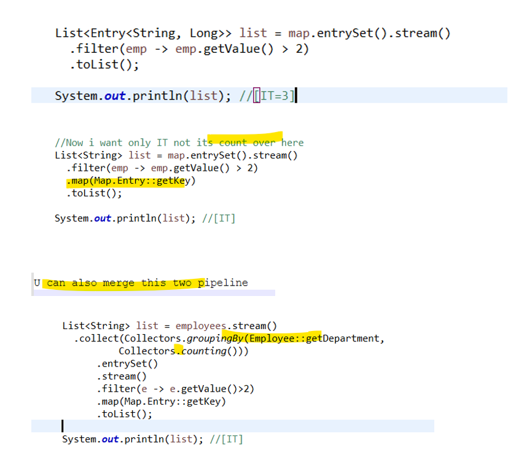
```java
package com.example.stream;

import java.util.Arrays;
import java.util.List;
import java.util.Map;
import java.util.Map.Entry;
import java.util.stream.Collectors;

public class CreateStream {

	public static void main(String arg[]) {	
		
			List<Employee> employees = Arrays.asList(
					new Employee(1, "John", "IT", 60000.0),
					new Employee(2, "Alice", "HR", 55000.0),
					new Employee(3, "Bob", "IT", 75000.0),
					new Employee(4, "Carol", "HR", 70000.0),
					new Employee(5, "David", "Finance", 65000.0),
					new Employee(6, "Eve", "IT", 80000.0),
					new Employee(7, "Frank", "Finance", 64000.0),
					new Employee(8, "Ala", "Operations", 44000.0)
			);
			
			/* IT = 3,
			 * HR = 2
			 * Finance = 2
			 * Operations = 1
			 * Find department with more than 2 employee (IT = 3 )
			 * */
			
			//This should return a map with count of each employee
			Map<String, Long> map = employees.stream()
			 .collect(Collectors.groupingBy(Employee::getDepartment
					 , Collectors.counting()
					 ));
		
			System.out.println(map);//{Finance=2, HR=2, IT=3, Operations=1}
			
			/*
			List<Entry<String, Long>> list = map.entrySet().stream()
			  .filter(emp -> emp.getValue() > 2)
			  .toList();
			
			System.out.println(list); //[IT=3]
			*/
			
			//Now i want only IT not its count over here
			List<String> list = map.entrySet().stream()
			  .filter(emp -> emp.getValue() > 2)
			  .map(Map.Entry::getKey)
			  .toList();
			
			System.out.println(list); //[IT]
	}
}
```
## MERGE 
```java
package com.example.stream;

import java.util.Arrays;
import java.util.List;
import java.util.Map;
import java.util.Map.Entry;
import java.util.stream.Collectors;

public class CreateStream {

	public static void main(String arg[]) {	
		
			List<Employee> employees = Arrays.asList(
					new Employee(1, "John", "IT", 60000.0),
					new Employee(2, "Alice", "HR", 55000.0),
					new Employee(3, "Bob", "IT", 75000.0),
					new Employee(4, "Carol", "HR", 70000.0),
					new Employee(5, "David", "Finance", 65000.0),
					new Employee(6, "Eve", "IT", 80000.0),
					new Employee(7, "Frank", "Finance", 64000.0),
					new Employee(8, "Ala", "Operations", 44000.0)
			);
			
			/* IT = 3,
			 * HR = 2
			 * Finance = 2
			 * Operations = 1
			 * Find department with more than 2 employee (IT = 3 )
			 * */
			
			List<String> list = employees.stream()
			  .collect(Collectors.groupingBy(Employee::getDepartment,
					  Collectors.counting()))
			      .entrySet()
			      .stream()
			      .filter(e -> e.getValue()>2)
			      .map(Map.Entry::getKey)
			      .toList();
			
			System.out.println(list); //[IT]
	}
}
```
# Q3) Find department with the highest average salary 
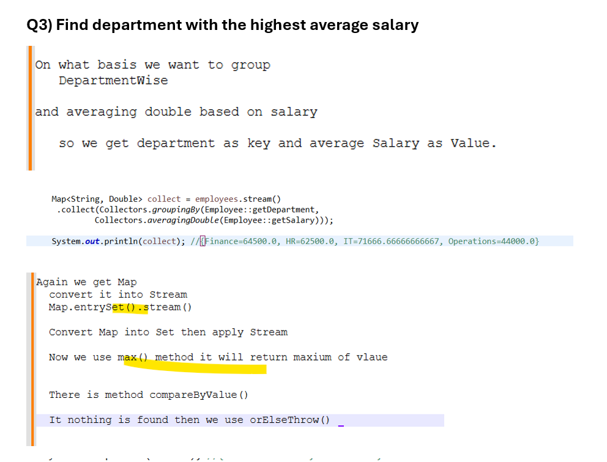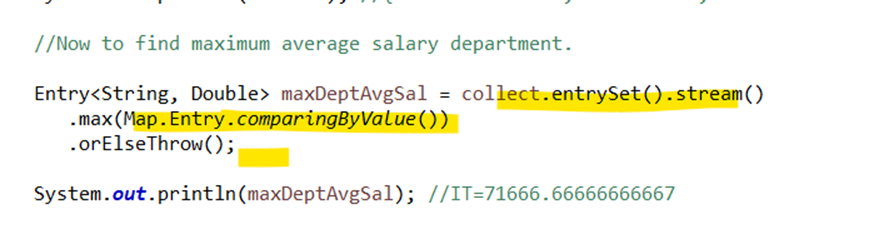
```java
package com.example.stream;

import java.util.Arrays;
import java.util.List;
import java.util.Map;
import java.util.Map.Entry;
import java.util.stream.Collectors;

public class CreateStream {

	public static void main(String arg[]) {	
		
			List<Employee> employees = Arrays.asList(
					new Employee(1, "John", "IT", 60000.0),
					new Employee(2, "Alice", "HR", 55000.0),
					new Employee(3, "Bob", "IT", 75000.0),
					new Employee(4, "Carol", "HR", 70000.0),
					new Employee(5, "David", "Finance", 65000.0),
					new Employee(6, "Eve", "IT", 80000.0),
					new Employee(7, "Frank", "Finance", 64000.0),
					new Employee(8, "Ala", "Operations", 44000.0)
			);
			
			Map<String, Double> collect = employees.stream()
			 .collect(Collectors.groupingBy(Employee::getDepartment,
					 Collectors.averagingDouble(Employee::getSalary)));
			
			System.out.println(collect); //{Finance=64500.0, HR=62500.0, IT=71666.66666666667, Operations=44000.0}
			
			//Now to find maximum average salary department.
			
			Entry<String, Double> maxDeptAvgSal = collect.entrySet().stream()
			   .max(Map.Entry.comparingByValue())
			   .orElseThrow();
			
			System.out.println(maxDeptAvgSal); //IT=71666.66666666667
	}
}
```
# Merging
```java
package com.example.stream;

import java.util.Arrays;
import java.util.List;
import java.util.Map;
import java.util.Map.Entry;
import java.util.stream.Collectors;

public class CreateStream {

	public static void main(String arg[]) {	
		
			List<Employee> employees = Arrays.asList(
					new Employee(1, "John", "IT", 60000.0),
					new Employee(2, "Alice", "HR", 55000.0),
					new Employee(3, "Bob", "IT", 75000.0),
					new Employee(4, "Carol", "HR", 70000.0),
					new Employee(5, "David", "Finance", 65000.0),
					new Employee(6, "Eve", "IT", 80000.0),
					new Employee(7, "Frank", "Finance", 64000.0),
					new Employee(8, "Ala", "Operations", 44000.0)
			);
			
		 Entry<String, Double> deptHigAvgSal = employees.stream()
			  .collect(Collectors.groupingBy(Employee::getDepartment,
					  Collectors.averagingDouble(Employee::getSalary)))
			  .entrySet().stream()
			  .max(Map.Entry.comparingByValue())
			  .orElseThrow();
		 
		 System.out.println(deptHigAvgSal); //IT=71666.66666666667
		 
	}
}
```
# Q-4) Find Most Frequent Character in String
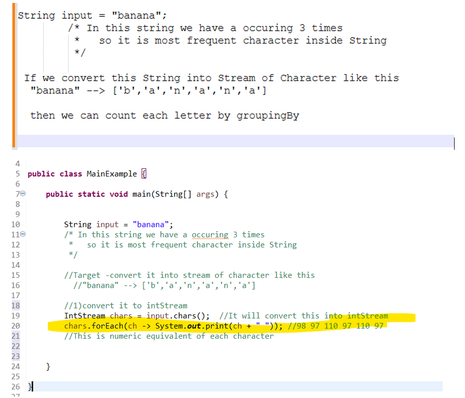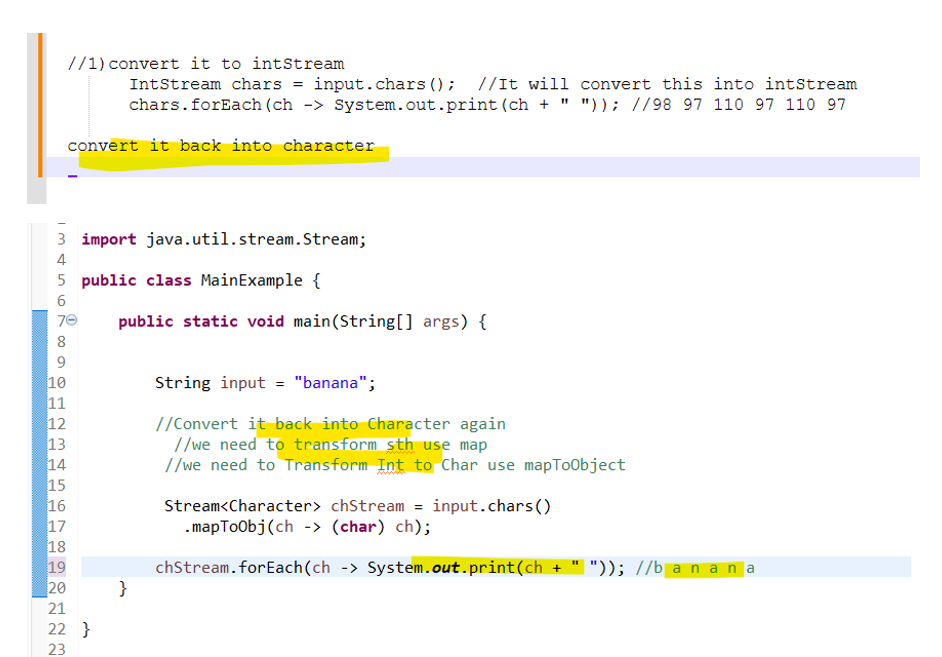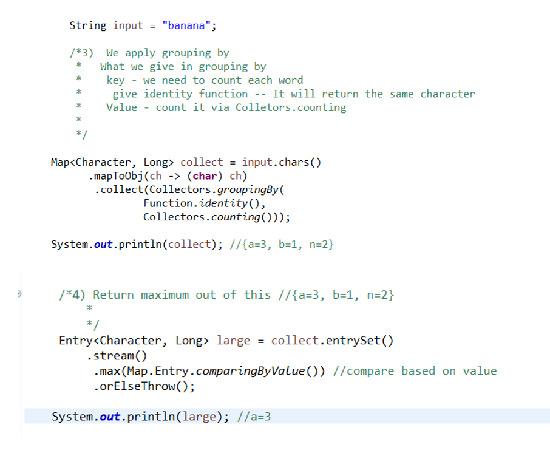
```java
package com.example;

import java.util.Map;
import java.util.Map.Entry;
import java.util.function.Function;
import java.util.stream.Collectors;

public class MainExample {

	public static void main(String[] args) {			
		
		
		String input = "banana";		
		
		
	
	 Map<Character, Long> collect = input.chars()
		   .mapToObj(ch -> (char) ch)
		    .collect(Collectors.groupingBy(
		    		Function.identity(),
		    		Collectors.counting()));
	 
	 System.out.println(collect); //{a=3, b=1, n=2}
	 
	 /*4) Return maximum out of this //{a=3, b=1, n=2}
		 * 
		 */
	 Entry<Character, Long> large = collect.entrySet()
	     .stream()
	      .max(Map.Entry.comparingByValue()) //compare based on value
	      .orElseThrow();
	   
	System.out.println(large); //a=3
		
	}

}
```
## Merge
```java
package com.example;

import java.util.Map;
import java.util.Map.Entry;
import java.util.function.Function;
import java.util.stream.Collectors;

public class MainExample {

	public static void main(String[] args) {			
		
		
		String input = "banana";		
		
	 Entry<Character, Long> largestOcc = input.chars()
		 .mapToObj(ch -> (char)ch)
		 .collect(Collectors.groupingBy(
				 Function.identity(),
				 Collectors.counting()
				 ))
		 .entrySet()
		 .stream()
		 .max(Map.Entry.comparingByValue())
		 .orElseThrow();
		 
	
	System.out.println(largestOcc); //a=3
		
	}

}
```
# Q-5) Find first non-repeating character in String
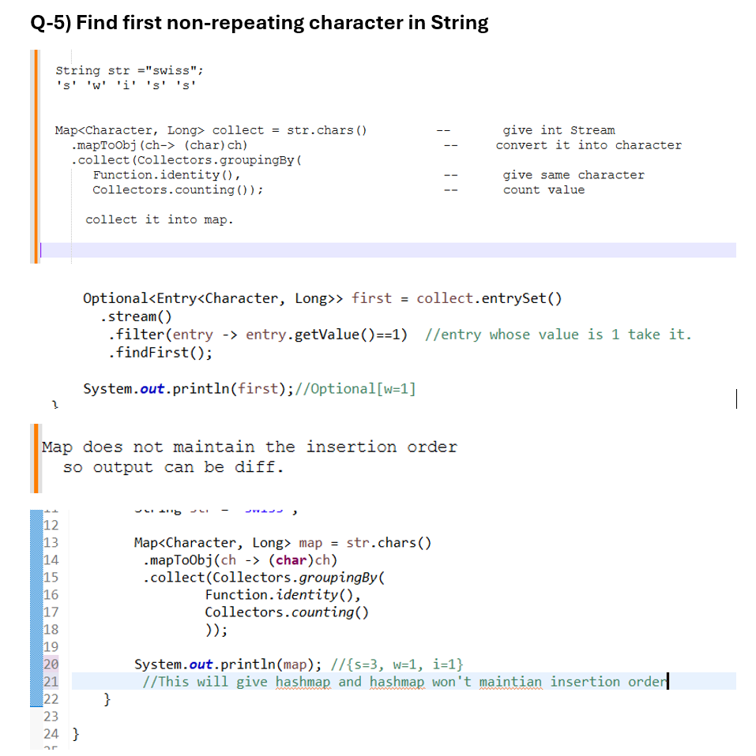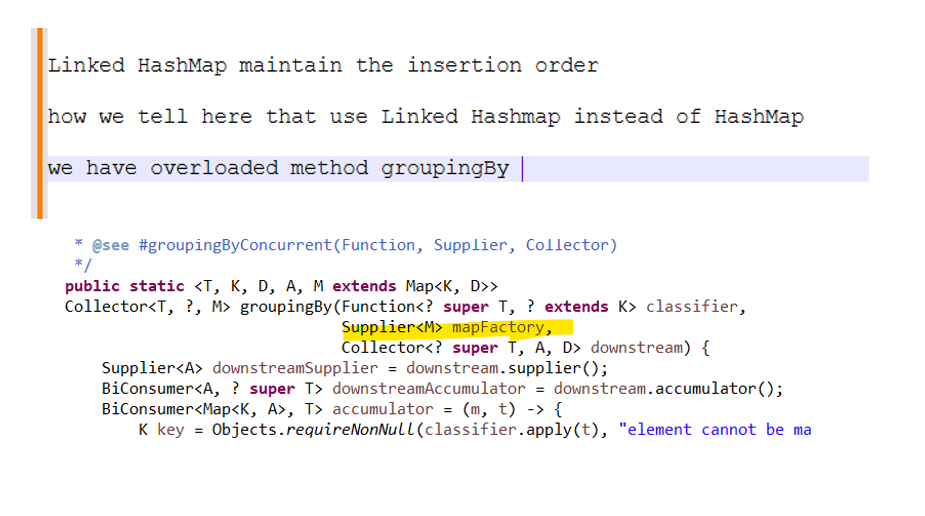

```java
package com.example;

import java.util.Map;
import java.util.Map.Entry;
import java.util.Optional;
import java.util.function.Function;
import java.util.stream.Collectors;

public class MainExample {

	public static void main(String[] args) {			
		
		String str = "swiss";
		
		//find first element which is non-repeating
		
		Map<Character, Long> collect = str.chars()
		 .mapToObj(ch -> (char)ch)
		 .collect(Collectors.groupingBy(
				  Function.identity(),
				  Collectors.counting()
				 ));
		
		System.out.println(collect); //{s=3, w=1, i=1}

		Optional<Entry<Character, Long>> first = collect.entrySet()
		  .stream()
		   .filter(entry -> entry.getValue()==1)  //entry whose value is 1 take it.
		   .findFirst();
		
		System.out.println(first);//Optional[w=1]
	}

}
```
## Merge
```java
package com.example;

import java.util.Map.Entry;
import java.util.Optional;
import java.util.function.Function;
import java.util.stream.Collectors;

public class MainExample {

	public static void main(String[] args) {			
		
		String str = "swiss";
		
		Optional<Entry<Character, Long>> first = str.chars()
		 .mapToObj(ch -> (char)ch)
		 .collect(Collectors.groupingBy(
				 Function.identity(),
				 Collectors.counting()
				 )).entrySet()
		 .stream()
		 .filter(entry -> entry.getValue()==1)
		 .findFirst();
		
		System.out.println(first);
	}

}
```
## what if the order is not maintained.
```java
package com.example;

import java.util.LinkedHashMap;
import java.util.Map.Entry;
import java.util.Optional;
import java.util.function.Function;
import java.util.stream.Collectors;

public class MainExample {

	public static void main(String[] args) {			
		
		String str = "swiss";
		
		 Optional<Entry<Character, Long>> first = str.chars()
		 .mapToObj(ch -> (char)ch)
		 .collect(Collectors.groupingBy(
				 Function.identity(),
				 LinkedHashMap::new,   //pass new LinkedHashmap
				 Collectors.counting()
				 )).entrySet()
		      .stream()
		       .filter(entry -> entry.getValue() ==1)
		       .findFirst();
		
		System.out.println(first.get()); //w=1

	}

}
```
