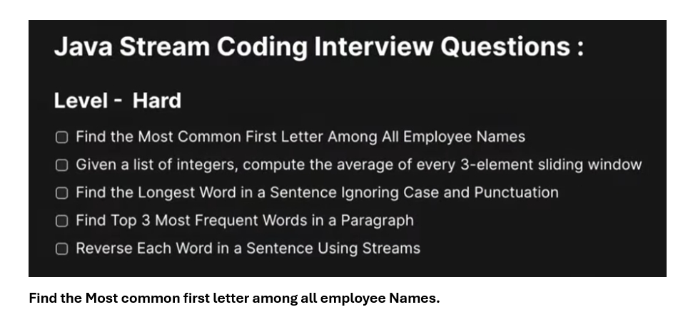
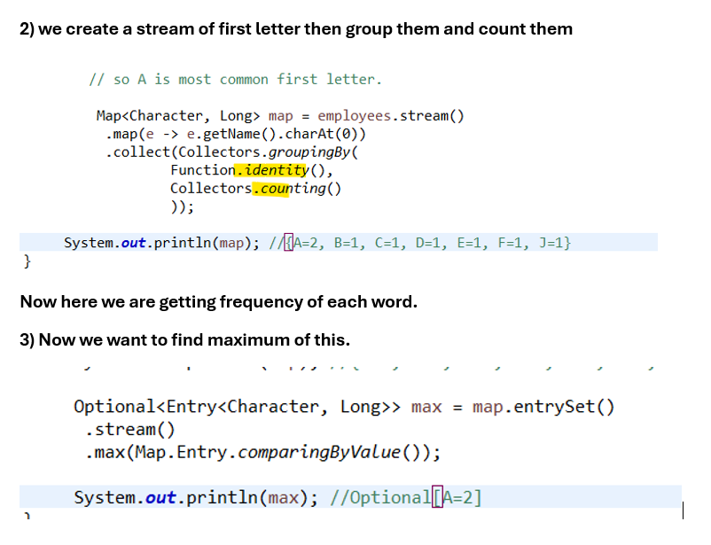

# Q1) Find the Most common first letter among all employee Names.

```java
package com.example.stream;

import java.util.Arrays;
import java.util.List;
import java.util.Map;
import java.util.Map.Entry;
import java.util.Optional;
import java.util.function.Function;
import java.util.stream.Collectors;

public class CreateStream {

	public static void main(String arg[]) {	
		
			List<Employee> employees = Arrays.asList(
					new Employee(1, "John", "IT", 60000.0),
					new Employee(2, "Alice", "HR", 55000.0),
					new Employee(3, "Bob", "IT", 75000.0),
					new Employee(4, "Carol", "HR", 70000.0),
					new Employee(5, "David", "Finance", 65000.0),
					new Employee(6, "Eve", "IT", 80000.0),
					new Employee(7, "Frank", "Finance", 64000.0),
					new Employee(8, "Ala", "Operations", 44000.0)
			);
			
		
			// so A is most common first letter.
			
			 Map<Character, Long> map = employees.stream()
			  .map(e -> e.getName().charAt(0))
			  .collect(Collectors.groupingBy(
					  Function.identity(),
					  Collectors.counting()
					  ));
			 
		 System.out.println(map); //{A=2, B=1, C=1, D=1, E=1, F=1, J=1}
		 
		 Optional<Entry<Character, Long>> max = map.entrySet()
		  .stream()
		  .max(Map.Entry.comparingByValue());
		 
		 System.out.println(max); //Optional[A=2]
	}
}
```
## merge
```java
package com.example.stream;

import java.util.Arrays;
import java.util.List;
import java.util.Map;
import java.util.Map.Entry;
import java.util.Optional;
import java.util.function.Function;
import java.util.stream.Collectors;

public class CreateStream {

	public static void main(String arg[]) {	
		
			List<Employee> employees = Arrays.asList(
					new Employee(1, "John", "IT", 60000.0),
					new Employee(2, "Alice", "HR", 55000.0),
					new Employee(3, "Bob", "IT", 75000.0),
					new Employee(4, "Carol", "HR", 70000.0),
					new Employee(5, "David", "Finance", 65000.0),
					new Employee(6, "Eve", "IT", 80000.0),
					new Employee(7, "Frank", "Finance", 64000.0),
					new Employee(8, "Ala", "Operations", 44000.0)
			);
			
		
		Entry<Character, Long> max = employees.stream()
		  .map(e->e.getName().charAt(0))
		  .collect(Collectors.groupingBy(
				  	Function.identity(),
				  	Collectors.counting()
				  	)).entrySet()
		  .stream()
		  .max(Map.Entry.comparingByValue())
		  .orElseThrow();
		
		System.out.println(max); //A=2
	}
}
```
# Q2)Given a list of integers, compute the average of every 3-element sliding window.

