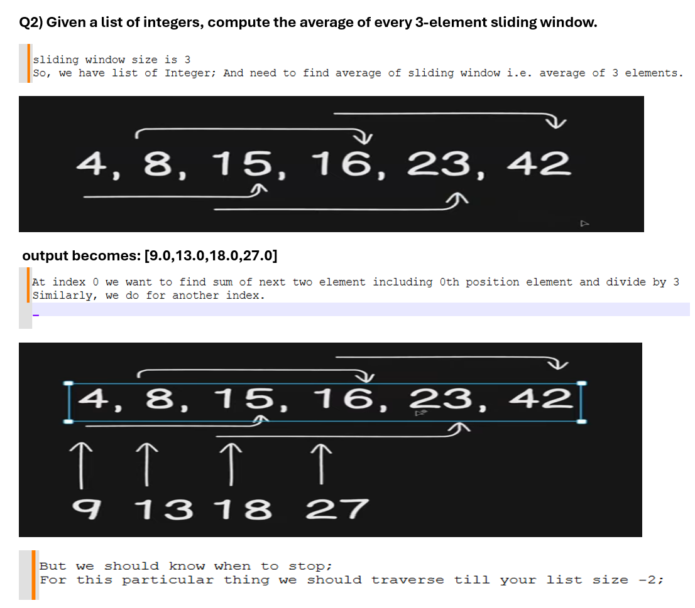
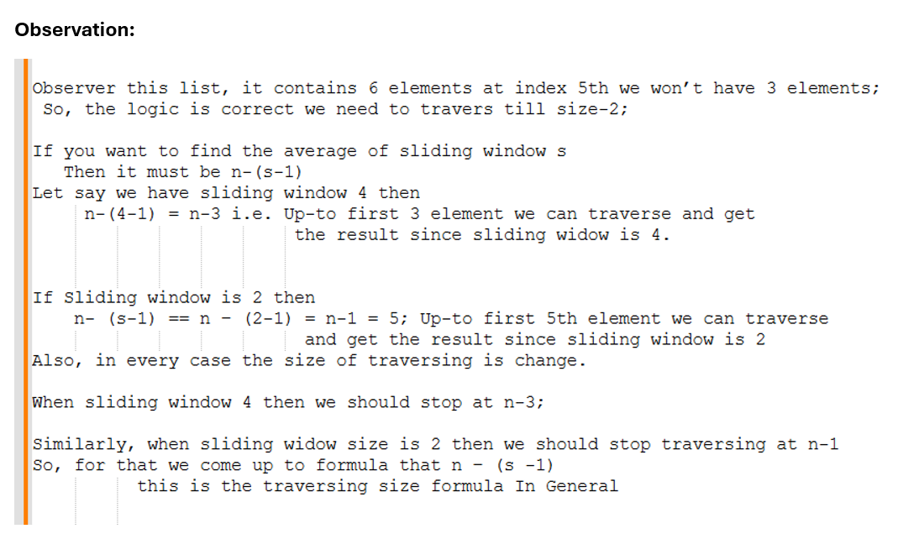

# Q1) Find the Most common first letter among all employee Names.

```java
package com.example.stream;

import java.util.Arrays;
import java.util.List;
import java.util.Map;
import java.util.Map.Entry;
import java.util.Optional;
import java.util.function.Function;
import java.util.stream.Collectors;

public class CreateStream {

	public static void main(String arg[]) {	
		
			List<Employee> employees = Arrays.asList(
					new Employee(1, "John", "IT", 60000.0),
					new Employee(2, "Alice", "HR", 55000.0),
					new Employee(3, "Bob", "IT", 75000.0),
					new Employee(4, "Carol", "HR", 70000.0),
					new Employee(5, "David", "Finance", 65000.0),
					new Employee(6, "Eve", "IT", 80000.0),
					new Employee(7, "Frank", "Finance", 64000.0),
					new Employee(8, "Ala", "Operations", 44000.0)
			);
			
		
			// so A is most common first letter.
			
			 Map<Character, Long> map = employees.stream()
			  .map(e -> e.getName().charAt(0))
			  .collect(Collectors.groupingBy(
					  Function.identity(),
					  Collectors.counting()
					  ));
			 
		 System.out.println(map); //{A=2, B=1, C=1, D=1, E=1, F=1, J=1}
		 
		 Optional<Entry<Character, Long>> max = map.entrySet()
		  .stream()
		  .max(Map.Entry.comparingByValue());
		 
		 System.out.println(max); //Optional[A=2]
	}
}
```
## merge
```java
package com.example.stream;

import java.util.Arrays;
import java.util.List;
import java.util.Map;
import java.util.Map.Entry;
import java.util.Optional;
import java.util.function.Function;
import java.util.stream.Collectors;

public class CreateStream {

	public static void main(String arg[]) {	
		
			List<Employee> employees = Arrays.asList(
					new Employee(1, "John", "IT", 60000.0),
					new Employee(2, "Alice", "HR", 55000.0),
					new Employee(3, "Bob", "IT", 75000.0),
					new Employee(4, "Carol", "HR", 70000.0),
					new Employee(5, "David", "Finance", 65000.0),
					new Employee(6, "Eve", "IT", 80000.0),
					new Employee(7, "Frank", "Finance", 64000.0),
					new Employee(8, "Ala", "Operations", 44000.0)
			);
			
		
		Entry<Character, Long> max = employees.stream()
		  .map(e->e.getName().charAt(0))
		  .collect(Collectors.groupingBy(
				  	Function.identity(),
				  	Collectors.counting()
				  	)).entrySet()
		  .stream()
		  .max(Map.Entry.comparingByValue())
		  .orElseThrow();
		
		System.out.println(max); //A=2
	}
}
```
# Q2)Given a list of integers, compute the average of every 3-element sliding window.


```java
package com.example;

import java.util.Arrays;
import java.util.List;
import java.util.stream.IntStream;

public class MainExample {

	public static void main(String[] args) {			
		
		List<Integer> input = Arrays.asList(4,8,15,16,23,42);
	/*
		Sliding window size = 3  and output: [9.0,13.0,18.0,27.0]
		  traversing till  n-2 i.e. input.size()-2
		
		We need to traverse particular to particular index in Stream
		 for this we use IntStream.range() method 
		    where we need to pass index -i.e. start indexInclusive and endIndex exclusive
		    
		 Require mapToObject
		   For Each index we need to find average of sliding window;
		      so index + next 2 index added then divided by 3
		      
		   For Each index we require then next 2 index should be added and divided by 3
		     so that we get average of sliding window.
		 
	*/	   
		List<Double> list = IntStream.range(0, input.size()-2)
		 .mapToObj(i -> (input.get(i) + input.get(i+1) + input.get(i+2))/3.0) 
		 .toList();
		
		System.out.println(list); //[9.0, 13.0, 18.0, 27.0]
		
	}

}
```
## Generic
```java
package com.example;

import java.util.Arrays;
import java.util.List;
import java.util.stream.IntStream;

public class MainExample {

	public static void main(String[] args) {

		List<Integer> input = Arrays.asList(4, 8, 15, 16, 23, 42);
		/*
		 * Can we make this more generic
		 */
		int windowSize = 3; // Sliding window size is given

		List<Integer> list = IntStream.range(0, input.size() - (windowSize - 1))
				             .mapToObj(i -> (input.get(i) + input.get(i + 1) + input.get(i + 2)) / windowSize)
				              .toList();

		System.out.println(list); // [9, 13, 18, 27]

	}

}
```
## Observation
```
* If we change sliding window size  
		 *   then again we need to find more generic 
		 *     Above one is correct working for  windowSize =3 
		 *      but behave abnormally for windowSize =4
```
## Other generic
```java
package com.example;

import java.util.Arrays;
import java.util.List;
import java.util.stream.IntStream;

public class MainExample {

	public static void main(String[] args) {

		List<Integer> input = Arrays.asList(4, 8, 15, 16, 23, 42);
		
		/* 
		 */
		int windowSize = 4; // Sliding window size is given

		List<Integer> list = IntStream.range(0, input.size() - (windowSize - 1))
				             .mapToObj(i -> (input.get(i) + input.get(i + 1) + input.get(i + 2) + input.get(i + 3)) / windowSize)
				              .toList();
		
		//need to add 2 more input.get(i+3) in order to find correct output

		System.out.println(list); // [10, 15, 24]

	}

}
```
## Most Generic
- If i change winodow size to anything then it should work fine
```java
package com.example;

import java.util.Arrays;
import java.util.List;
import java.util.OptionalDouble;
import java.util.stream.IntStream;
import java.util.stream.Stream;

public class MainExample {

	public static void main(String[] args) {

		List<Integer> input = Arrays.asList(4, 8, 15, 16, 23, 42);
		
		/*- If i change window size to anything then it should work fine
		 * For this we can use subList() function
		 *  It take 2 indexed fromIndex toIndex
		 * 
		 */
		int windowSize = 4; 

		List<List<Integer>> list = IntStream.range(0,(input.size() - (windowSize - 1)))
				             .mapToObj(i -> input.subList(i, (int)i+windowSize))
				              .toList();
		
	

		System.out.println(list); // [[4, 8, 15, 16], [8, 15, 16, 23], [15, 16, 23, 42]]
		
		//Now simply we need to find the average
		
	 List<Double> list2 = IntStream.range(0,(input.size() - (windowSize - 1)))
        .mapToObj(i -> input.subList(i, (int)i+windowSize))
        .map(window -> window.stream()
        		         .mapToInt(Integer::intValue)
        		         .average()
        		         .orElse(0.0))
                          .toList();
		
		
	 System.out.println(list2); //[10.75, 15.5, 24.0]

	}

}
```
### Observaton: Now you simply change the SlidingWindow size and get the respected output
# Q-3) Find the longest word in a sentence ignoring case and punctuation

```java
package com.example;

import java.util.Arrays;
import java.util.Comparator;
import java.util.stream.Stream;

public class MainExample {

	public static void main(String[] args) {

		String sentence = "The quick, brown fox jumped over the lazy dog!";
		/*
		 * Find longest word inside the sentence
		 *  
		 *  1) Convert this sentence into list of Words
		 *    also remove the stuff like punctuation as well
		 *    
		 *    Need to use of regular expression to remove this
		 *     split using spaces
		 *     and convert them into list of words
		 *     
		 */
		Stream<String> stream = Arrays.stream(
				sentence.toLowerCase()
				.split(" ")
				);
		
		stream.forEach(st -> System.out.print(st +" ") ); //the quick, brown fox jumped over the lazy dog! 
		
		/*
		 * We have special character as well;
		 * filter the special character
		 *  use regular expression to remove this
		 *   [^a-z\\s] regular expression for special character
		 */

		Stream<String> stream2 = Arrays.stream(
				sentence.toLowerCase()
				.replaceAll("[^a-z\\s]", "")
				.split(" ")
				);
		
		System.out.println();
		stream2.forEach(st -> System.out.print(st +" ") ); //the quick brown fox jumped over the lazy dog 
		
		/*
		 * Find longest among them 
		 *  find maximum among them based on length of that particular string
		 *  
		 */
		String str = Arrays.stream(
				sentence.toLowerCase()
				.replaceAll("[^a-z\\s]", "")
				.split(" ")
				).max(Comparator.comparing(String::length))
		         .orElse("");
		
		System.out.println("---------------------------------");
		System.out.println(str); //jumped
	}

}
```
# Q-4) Find top 3 most frequent words in a paragraph


```java
package com.example;

import java.util.Arrays;
import java.util.List;
import java.util.Map;
import java.util.Map.Entry;
import java.util.function.Function;
import java.util.stream.Collectors;
import java.util.stream.Stream;

public class MainExample {

	public static void main(String[] args) {

		String paragraph = "Java is great. Java is object oreinted. Java streams are powerful, and java is fun!";
		
		/*
		 * We want to find top 3 most frequent word
		 *  1st apply groupBy and find count of each word
		 *    before we need to replace special character
		 */
		
		Stream<String> stream = Arrays.stream(
				paragraph.toLowerCase()
				 .replaceAll("[^a-z\\s]", "")
				 .split(" ")
				);
		
		stream.forEach(str -> System.out.print(str + " "));
		//java is great java is object oreinted java streams are powerful and java is fun 
		
		System.out.println("-----------------------");
		System.out.println();
		
		//Now find the count of each word
		Map<String, Long> collect = Arrays.stream(
				paragraph.toLowerCase()
				 .replaceAll("[^a-z\\s]", "")
				 .split(" ")
				).collect(Collectors.groupingBy(Function.identity(),
						                        Collectors.counting()));
		
		System.out.println(collect);
		//{oreinted=1, java=4, powerful=1, are=1, and=1, streams=1, is=3, great=1, fun=1, object=1}

		//Now we want to top 3
		  //Sort in desending order based on value
		List<Entry<String, Long>> list = collect.entrySet()
		 .stream()
		 .sorted(Map.Entry.<String,Long>comparingByValue().reversed())
		 .limit(3)
		 .toList();
		
		System.out.println(list); //[java=4, is=3, oreinted=1]
		  
	}

}
```
### Why oriented is printing we also have other words with value 1
```java
package com.example;

import java.util.Arrays;
import java.util.List;
import java.util.Map;
import java.util.Map.Entry;
import java.util.function.Function;
import java.util.stream.Collectors;
import java.util.stream.Stream;

public class MainExample {

	public static void main(String[] args) {

		String paragraph = "Java is great. Java is object oreinted. Java streams are powerful, and java is fun!";
		
		//Now find the count of each word
		Map<String, Long> collect = Arrays.stream(
				paragraph.toLowerCase()
				 .replaceAll("[^a-z\\s]", "")
				 .split(" ")
				).collect(Collectors.groupingBy(Function.identity(),
						                        Collectors.counting()));
	
		List<Entry<String, Long>> sortedList = collect.entrySet()
		 .stream()
		 .sorted(Map.Entry.<String,Long>comparingByValue().reversed())		
		 .toList();
		
		System.out.println(sortedList); //[java=4, is=3, oreinted=1, powerful=1, are=1, and=1, streams=1, great=1, fun=1, object=1]

		/*
		 * How many unique count we have 
		 *   Let's find the distinct count 
		 */
		  List<Long> topFrequency = sortedList.stream()
		   .map(Map.Entry::getValue) //We fetch value
		   .distinct()              //for each value we find distinct
		   .limit(3)
		   .toList();
		  
		  System.out.println(topFrequency); //[4, 3, 1]

		  //Now print it
		  List<Entry<String, Long>> list = sortedList.stream()
		   .filter(e -> topFrequency.contains(e.getValue())) 
		   .toList();
		   
		  System.out.println(list);
		  //[java=4, is=3, oreinted=1, powerful=1, are=1, and=1, streams=1, great=1, fun=1, object=1]

	} 

}
```
# Q-5) Reversed each word in a sentence using Streams.
## via StringBuilder reverse()
```java
package com.example;

import java.util.Arrays;
import java.util.stream.Collectors;

public class MainExample {

	public static void main(String[] args) {

		String sentence	 = "Java streams are powerful";
		
		/*
		 * Need to reverse each word in Stream
		 * 
		 *  split it by spaces
		 *   then map and use StringBuilder() it has reverse method
		 *     and toString() convert it in String
		 */
		
		String collect = Arrays.stream(
				sentence.split(" "))
		   .map(word -> new StringBuilder(word).reverse().toString())
		   .collect(Collectors.joining(" "));
		
		System.out.println(collect); //avaJ smaerts era lufrewop	
		
	} 

}
```
## via reduce method
```java
package com.example;

import java.util.Arrays;
import java.util.stream.Collectors;

public class MainExample {

	public static void main(String[] args) {

		String sentence	 = "Java streams are powerful";
		
		/*
		 *Don't use internal method 
		 * use reduce() method
		 */
		
		String collect = Arrays.stream(
				sentence.split(" "))
		   .map(word -> Arrays.stream(word.split(""))
				    .reduce("",(rev,ch)->ch + rev)				   
				   )		  
		   .collect(Collectors.joining(" "));
		
		System.out.println(collect); //avaJ smaerts era lufrewop	
		
	} 

}
```

