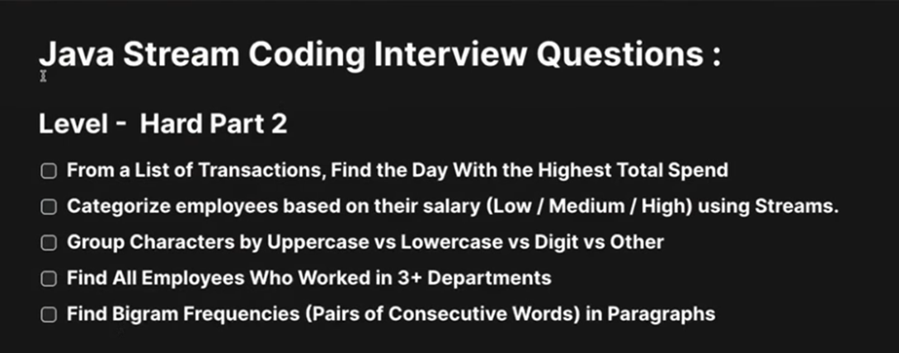
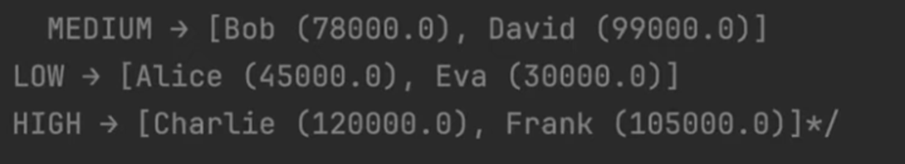
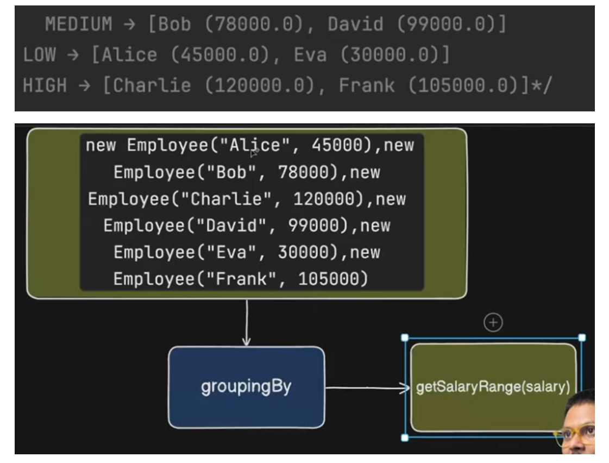
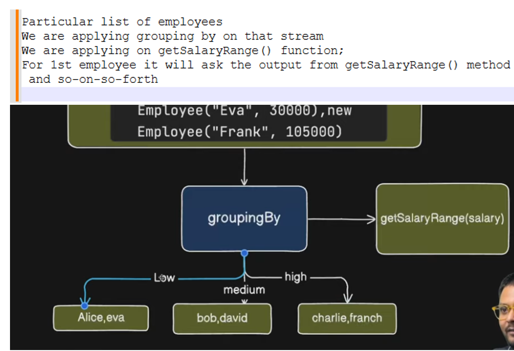

# Q-1) From a list of Transactions, find the day with the highest total Spend
```java
package com.example;

import java.time.LocalDate;

public class Transaction {

	private String id;
	private LocalDate date;
	private double amount;

	public Transaction(String id, LocalDate date, double amount) {
		super();
		this.id = id;
		this.date = date;
		this.amount = amount;
	}

	public String getId() {
		return id;
	}

	public void setId(String id) {
		this.id = id;
	}

	public LocalDate getDate() {
		return date;
	}

	public void setDate(LocalDate date) {
		this.date = date;
	}

	public double getAmount() {
		return amount;
	}

	public void setAmount(double amount) {
		this.amount = amount;
	}

	@Override
	public String toString() {
		return "Transaction [id=" + id + ", date=" + date + ", amount=" + amount + "]";
	}

}
```
# Main
```java
package com.example;

import java.time.LocalDate;
import java.util.Arrays;
import java.util.List;
import java.util.Map;
import java.util.Map.Entry;
import java.util.Optional;
import java.util.stream.Collectors;

public class MainExample {

	public static void main(String[] args) {
	
		List<Transaction> transactions = Arrays.asList(
				new Transaction("T1", LocalDate.of(2024, 1, 1),300),
				new Transaction("T2", LocalDate.of(2024, 1, 1),200),
				new Transaction("T3", LocalDate.of(2024, 1, 2),500),
				new Transaction("T4", LocalDate.of(2024, 1, 2),300),
				new Transaction("T5", LocalDate.of(2024, 1, 3),100)
				);
		
		/* Find the day with highest spending
		 *  1) Group transaction by this particular date (key)
		 *     (value) sum of amount	
		 *  2) For sum we have Collectors.summingDouble () function is there
		 *  3) Get max by catch
		 */
		
		/*
		Map<LocalDate, List<Transaction>> collect = transactions.stream()
		 .collect(Collectors.groupingBy(Transaction::getDate));
		
		System.out.println(collect);
		//{2024-01-03=[Transaction [id=T5, date=2024-01-03, amount=100.0]], 
		//2024-01-02=[Transaction [id=T3, date=2024-01-02, amount=500.0], Transaction [id=T4, date=2024-01-02, amount=300.0]], 
		//2024-01-01=[Transaction [id=T1, date=2024-01-01, amount=300.0], Transaction [id=T2, date=2024-01-01, amount=200.0]]}
		*/
		
		Map<LocalDate, Double> collect = transactions.stream()
		 .collect(Collectors.groupingBy(Transaction::getDate,
				                          Collectors.summingDouble(Transaction::getAmount)));
		
		System.out.println(collect);
		//{2024-01-03=100.0,        2024-01-02=800.0,        2024-01-01=500.0}
		
		Optional<Entry<LocalDate, Double>> max = collect.entrySet()
		.stream()
		.max(Map.Entry.comparingByValue());
		
		System.out.println(max.get()); //2024-01-02=800.0
	}  
}
```
# Q-2) Categorize employees based on their salary (low/medium/high) using Streams.

## Employee
```java
package com.example;

public class Employee2 {

	private String name;
	private double salary;

	public Employee2(String name, double salary) {
		super();
		this.name = name;
		this.salary = salary;
	}

	public String getName() {
		return name;
	}

	public void setName(String name) {
		this.name = name;
	}

	public double getSalary() {
		return salary;
	}

	public void setSalary(double salary) {
		this.salary = salary;
	}

	@Override
	public String toString() {
		return "Employee2 [name=" + name + ", salary=" + salary + "]";
	}
}
```
### SalaryRange
```java
package com.example;

public enum SalaryRange {
	LOW,   //0-50K
	MEDIUM, //50K-100K
	HIGH   //100K+
}
```
## Main
```java
package com.example;

import java.util.Arrays;
import java.util.List;
import java.util.Map;
import java.util.stream.Collectors;

public class MainExample {

	public static void main(String[] args) {
	
		List<Employee2> employees2 = Arrays.asList(
				new Employee2("Alice", 45000),
				new Employee2("Bob", 78000),
				new Employee2("Charlie", 120000),
				new Employee2("David", 99000),
				new Employee2("Eva", 30000),
				new Employee2("Frank", 105000)
				);
		
		/* Need to find low, medium and high Range
		 *  Under 50k - low; above 50 to 1lakh - medium; Above 1lakh - high
		 *  
		 *  We need to group employee with particular salary range
		 *  but salary range like low, medium and high is not the part of this employee
		 *  
		 *  Then how you proceede
		 *  
		 *  1) We can create Enum for this particular salary range
		 *  2) 
		 *  We need to group by using Range
		 *    For that we need to find range of each employee
		 *    
		 *    We do Collectors.groupingBy
		 *     on what basis we need to group this employee
		 *     For each employee we are returning the salary range
		 *       based on Salary of an employee
		 */
		
		Map<SalaryRange, List<Employee2>> collect = employees2.stream()
		 .collect(Collectors.groupingBy(
				  e -> {
					      if(e.getSalary() < 50000) return SalaryRange.LOW;
					      if(e.getSalary() < 100000) return SalaryRange.MEDIUM;
					      else return SalaryRange.HIGH;
				  }		
				 ));
		
		System.out.println(collect);
		/*
		 * {MEDIUM=[Employee2 [name=Bob, salary=78000], Employee2 [name=David, salary=99000]], 
		 * HIGH=[Employee2 [name=Charlie, salary=120000], Employee2 [name=Frank, salary=105000]], 
		 * LOW=[Employee2 [name=Alice, salary=45000], Employee2 [name=Eva, salary=30000]]}
*/
		
	}  
}
```
### other way to written
```java
package com.example;

import java.util.Arrays;
import java.util.List;
import java.util.Map;
import java.util.stream.Collectors;

public class MainExample {

	public static void main(String[] args) {

		List<Employee2> employees2 = Arrays.asList(
				new Employee2("Alice", 45000), 
				new Employee2("Bob", 78000),
				new Employee2("Charlie", 120000), 
				new Employee2("David", 99000),
				new Employee2("Eva", 30000),
				new Employee2("Frank", 105000));
		
		//Based on salary Range we segregate the grouping by

		 Map<SalaryRange, List<Employee2>> collect = employees2.stream()
				.collect(Collectors.groupingBy(
					 	e -> getSalaryRange(e.getSalary())));

		System.out.println(collect);

	}

	private static SalaryRange getSalaryRange(double salary) {
		if ( salary < 50000)
			return SalaryRange.LOW;
		if (salary < 100000)
			return SalaryRange.MEDIUM;
		else
			return SalaryRange.HIGH;
	}
}
```
# Q-3) Group Characters by Uppercase vs lowercase vs Digit vs Other

