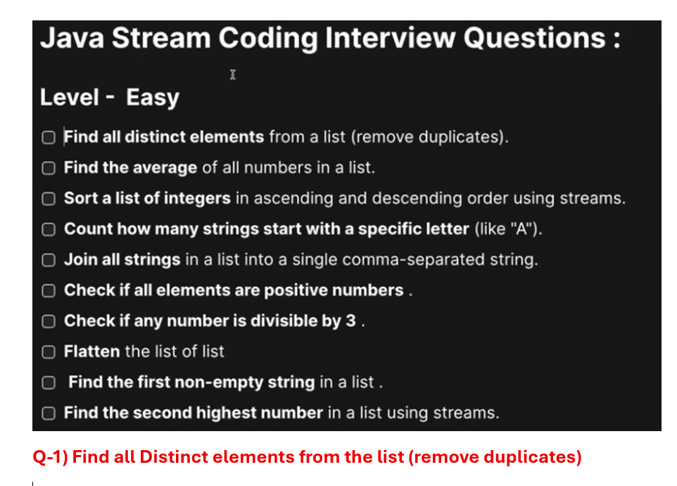
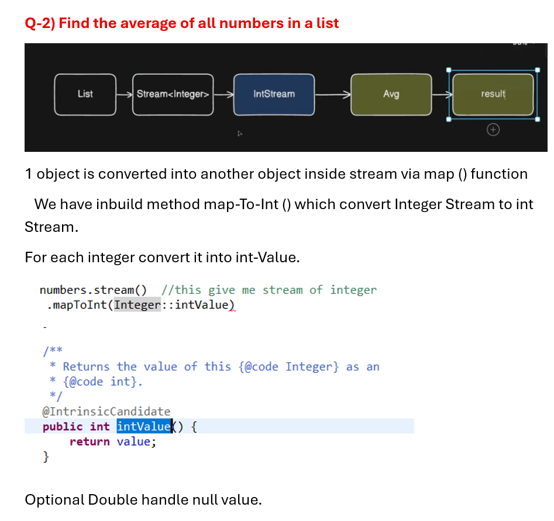
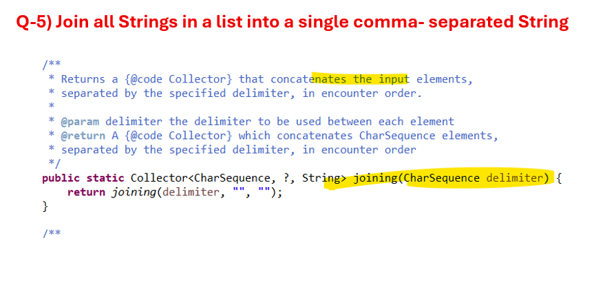
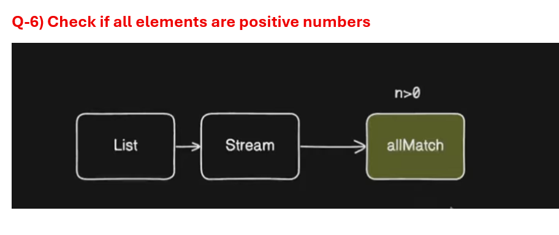

# Find all Distinct elements from the list (remove duplicates)

```java
package com.example.stream;

import java.util.Arrays;
import java.util.List;
import java.util.Set;
import java.util.stream.Collectors;

public class CreateStream {

	public static void main(String arg[]) {	

		List<Integer> numbers = Arrays.asList(5,2,8,2,3,5,9,3);			
		
		// Set store unique element
		
		Set<Integer> set = numbers.stream()   //convert it to stream
		 .collect(Collectors.toSet()); //collect in a Set
		 
		System.out.println(set); //[2, 3, 5, 8, 9]
	}
}
```
## But we require output as 5,2,8,3,9. Since HashSet will not maintain the insertion order.
## U don't require stream here
```java
package com.example.stream;

import java.util.Arrays;
import java.util.HashSet;
import java.util.List;
import java.util.Set;

public class CreateStream {

	public static void main(String arg[]) {	

		List<Integer> numbers = Arrays.asList(5,2,8,2,3,5,9,3);			
		
		// Set store unique element
		
		Set<Integer> set = new HashSet<Integer>(numbers);
		 
		System.out.println(set);  //[2, 3, 5, 8, 9]
	}
}
```
## via distinct()
```java
package com.example.stream;

import java.util.Arrays;
import java.util.List;

public class CreateStream {

	public static void main(String arg[]) {	

		List<Integer> numbers = Arrays.asList(5,2,8,2,3,5,9,3);			
		
		List<Integer> list = numbers.stream()
		 .distinct()
		  .toList();
		
		System.out.println(list); //[5, 2, 8, 3, 9]
	}
}
```
# 2. Find the average of all numbers in a list

```java
package com.example.stream;

import java.util.Arrays;
import java.util.List;
import java.util.OptionalDouble;

public class CreateStream {

	public static void main(String arg[]) {	

		List<Integer> numbers = Arrays.asList(5,10,15,20,25);			
		
		//find average
			//avg is mathematical operation
		//sum min max avg - stream has inbuild method for them
			//but those method work on primitive objects (int) 
		      //Wrapper object Integer
		
		OptionalDouble average = numbers.stream()  //this give me stream of integer
		 .mapToInt(Integer::intValue) //convert it into int stream
		  .average();
		
		System.out.println(average.getAsDouble()); //15.0

	}
}
```
## via orelse
```java
package com.example.stream;

import java.util.Arrays;
import java.util.List;

public class CreateStream {

	public static void main(String arg[]) {	

		List<Integer> numbers = Arrays.asList(5,10,15,20,25);			
	
		
		 double avg = numbers.stream()  
		 .mapToInt(Integer::intValue) 
		  .average() 
		  .orElse(0.0);
		
		System.out.println(avg); //15.0

	}
}
```
## U can find sum 
```java
package com.example.stream;

import java.util.Arrays;
import java.util.List;

public class CreateStream {

	public static void main(String arg[]) {	

		List<Integer> numbers = Arrays.asList(5,10,15,20,25);			
	
		
		 int sum = numbers.stream()  
		 .mapToInt(Integer::intValue) 
		  .sum();
		
		System.out.println(sum); //75

	}
}
```
## find minimum
```java
package com.example.stream;

import java.util.Arrays;
import java.util.List;

public class CreateStream {

	public static void main(String arg[]) {	

		List<Integer> numbers = Arrays.asList(5,10,15,20,25);			
	
		
		 int minimun = numbers.stream()  
		 .mapToInt(Integer::intValue) 
		  .min()
		  .orElse(0);
		
		System.out.println(minimun); //5

	}
}
```
## find maximun
```java
package com.example.stream;

import java.util.Arrays;
import java.util.List;

public class CreateStream {

	public static void main(String arg[]) {	

		List<Integer> numbers = Arrays.asList(5,10,15,20,25);			
	
		
		 int maximun = numbers.stream()  
		 .mapToInt(Integer::intValue) 
		  .max()
		  .orElse(0);
		
		System.out.println(maximun); //25

	}
}
```
# 3. Sort a list of integers in ascending and descending order using stream
## ascending order
```java
package com.example.stream;

import java.util.Arrays;
import java.util.List;

public class CreateStream {

	public static void main(String arg[]) {	

		List<Integer> numbers = Arrays.asList(5,1,8,3,2,10);			
	
		List<Integer> list = numbers.stream()
		  .sorted()
		   .toList();
	

		System.out.println(list); //[1, 2, 3, 5, 8, 10]
		
		/* 
		 * This is natural order sorting in ascending order.
		 */
	}
}
```
## desending order
```java
package com.example.stream;

import java.util.Arrays;
import java.util.Comparator;
import java.util.List;

public class CreateStream {

	public static void main(String arg[]) {	

		List<Integer> numbers = Arrays.asList(5,1,8,3,2,10);			
	
		//Descending order
		List<Integer> list = numbers.stream()
		  .sorted(Comparator.reverseOrder())
		   .toList();
	

		System.out.println(list); //[10, 8, 5, 3, 2, 1]	
		
	}
}
```
## Duplicate case
```java
package com.example.stream;

import java.util.Arrays;
import java.util.Comparator;
import java.util.List;

public class CreateStream {

	public static void main(String arg[]) {	

		List<Integer> numbers = Arrays.asList(5,5,1,5,1,8,3,2,10);			
	
		
		List<Integer> list = numbers.stream()
		  .sorted(Comparator.reverseOrder())
		   .toList();
	

		System.out.println(list); //[10, 8, 5, 5, 5, 3, 2, 1, 1]
		
	}
}
```
## Remove duplicate and then sort
```java
package com.example.stream;

import java.util.Arrays;
import java.util.Comparator;
import java.util.List;

public class CreateStream {

	public static void main(String arg[]) {	

		List<Integer> numbers = Arrays.asList(5,5,1,5,1,8,3,2,10);			
	
		
		List<Integer> list = numbers.stream()
		   .distinct()
		  .sorted(Comparator.reverseOrder())
		   .toList();
	

		System.out.println(list); //[10, 8, 5, 3, 2, 1]
		
	}
}
```
# 4.) Count how many strings start with specific letter like “A”
##  start's with letter A
```java
package com.example.stream;

import java.util.Arrays;
import java.util.List;

public class CreateStream {

	public static void main(String arg[]) {	
		
		List<String> fruits = Arrays.asList("Apple","Banana","Avacado","Mango","Apricot");			
	
		// filter fruit which are not starting with A
		
		List<String> list = fruits.stream()
			.filter(fr -> fr.startsWith("A"))
			 .toList();
		
		System.out.println(list); //[Apple, Avacado, Apricot]
	}
}
```
## count them
```java
package com.example.stream;

import java.util.Arrays;
import java.util.List;

public class CreateStream {

	public static void main(String arg[]) {	
		
		List<String> fruits = Arrays.asList("Apple","Banana","Avacado","Mango","Apricot");		
		
		 long count = fruits.stream()
			.filter(fr -> fr.startsWith("A"))
			  .count();
		
		System.out.println(count); // 3
	}
}
```
# 5. ) Join all Strings in a list into a single comma- separated String
## collector.joining string
```java
package com.example.stream;

import java.util.Arrays;
import java.util.List;
import java.util.stream.Collectors;

public class CreateStream {

	public static void main(String arg[]) {	
		
		List<String> fruits = Arrays.asList("Apple","Banana","Mango","Orange");		
		
		//Join them in single String and separated by comma
		 //for joining things we have collector 
		
		String collect = fruits.stream()
		    .collect(Collectors.joining()); //that concatenates the input elements
		
		System.out.println(collect); // AppleBananaMangoOrange
	}
}
```
## we want comma separated

```java
package com.example.stream;

import java.util.Arrays;
import java.util.List;
import java.util.stream.Collectors;

public class CreateStream {

	public static void main(String arg[]) {	
		
		List<String> fruits = Arrays.asList("Apple","Banana","Mango","Orange");		
		
		
		String collect = fruits.stream()
		    .collect(Collectors.joining(",")); 
		
		System.out.println(collect); // Apple,Banana,Mango,Orange
	}
}
```
## we have also joiining with delemiter, prefix and suffix
```java
package com.example.stream;

import java.util.Arrays;
import java.util.List;
import java.util.stream.Collectors;

public class CreateStream {

	public static void main(String arg[]) {	
		
		List<String> fruits = Arrays.asList("Apple","Banana","Mango","Orange");		
		
		
		String collect = fruits.stream()
		    .collect(Collectors.joining(",","{","]")); 
		
		System.out.println(collect); // {Apple,Banana,Mango,Orange]
	}
}
```
# 6) Check if all elements are positive numbers

## Positive scenario
```java
package com.example.stream;

import java.util.Arrays;
import java.util.List;

public class CreateStream {

	public static void main(String arg[]) {	
		
		 List<Integer> numbers = Arrays.asList(5,10,3,8,2);		
		
		//simple for loop - check each number is > 0 
		  //we can do same thing via filter
		 
		 //in stream we have allMatch() method
		 boolean match = numbers.stream()
		  .allMatch(n -> n>0); //Match this condition with all elements
		 
		 System.out.println(match); //true
	}
}
```
## negative one
```java
package com.example.stream;

import java.util.Arrays;
import java.util.List;

public class CreateStream {

	public static void main(String arg[]) {	
		
		 List<Integer> numbers = Arrays.asList(5,-1,10,3,8,2);		
		
		 boolean match = numbers.stream()
		  .allMatch(n -> n>0); 
		 
		 System.out.println(match); //false
	}
}
```
# 7) Check if any number is divisible by 3
## Positive scen
```java
package com.example.stream;

import java.util.Arrays;
import java.util.List;

public class CreateStream {

	public static void main(String arg[]) {	
		
		 List<Integer> numbers = Arrays.asList(5,7,9,10,14);		
		
		//find any number is divisible by 3
		  //condition should not be apply for all element
		     // it should be apply to specific element.
		 
		 boolean match = numbers.stream()
		   .anyMatch(n -> n%3==0);
		 
		 System.out.println(match); //true
	}
}
```
## negate
```java
package com.example.stream;

import java.util.Arrays;
import java.util.List;

public class CreateStream {

	public static void main(String arg[]) {	
		
		 List<Integer> numbers = Arrays.asList(5,7,10,14);		
		 
		 boolean match = numbers.stream()
		   .anyMatch(n -> n%3==0);
		 
		 System.out.println(match); //false
	}
}
```
# Q-8) Flatten the list of list
```java
package com.example.stream;

import java.util.Arrays;
import java.util.List;

public class CreateStream {

	public static void main(String arg[]) {	
		
		List<List<Integer>> listOfLists = Arrays.asList(
				Arrays.asList(1,2,3),
				Arrays.asList(4,5),
				Arrays.asList(6,7,8)
			);
		
		//Convert them into single list which contain 1,2,3,4,5,6,7,8
		
		List<Integer> list = listOfLists.stream()
		  .flatMap(List::stream) //we just pass list in flatMap
		   .toList();
		
		System.out.println(list); //[1, 2, 3, 4, 5, 6, 7, 8]

	}
}
```
# Q-9) Find the first non-empty string in a list
## How to find non empty element
```java
package com.example.stream;

import java.util.Arrays;
import java.util.List;

public class CreateStream {

	public static void main(String arg[]) {	
		
		List<String> strings = Arrays.asList("","","Hello","World","");
		
		//find first non empty string
			List<String> list = strings.stream()
			        .filter(s -> !s.isEmpty())
			        .toList();
			
			System.out.println(list); //[Hello, World]
	}
}
```
## non empty first element
```java
package com.example.stream;

import java.util.Arrays;
import java.util.List;
import java.util.Optional;

public class CreateStream {

	public static void main(String arg[]) {	
		
		List<String> strings = Arrays.asList("","","Hello","World","");
		
		//find first non empty string
			Optional<String> first = strings.stream()
			        .filter(s -> !s.isEmpty())
			        .findFirst();
			
			System.out.println(first.get()); //Hello
	}
}
```
# Q-10) Find the second highest number in a list using stream
## 2nd highest
```java
package com.example.stream;

import java.util.Arrays;
import java.util.Comparator;
import java.util.List;
import java.util.Optional;

public class CreateStream {

	public static void main(String arg[]) {	
		
		List<Integer> numbers = Arrays.asList(5,9,11,2,8,21,1);
		
		//find the 2nd highest
		  // u can sort it and get the element
		Optional<Integer> first = numbers.stream()
		  .sorted(Comparator.reverseOrder())
		  .skip(1)  //skip the first one
		  .findFirst();
		
		System.out.println(first.get()); //11
	}
}
```
## 3rd highest
```java
package com.example.stream;

import java.util.Arrays;
import java.util.Comparator;
import java.util.List;
import java.util.Optional;

public class CreateStream {

	public static void main(String arg[]) {	
		
		List<Integer> numbers = Arrays.asList(5,9,11,2,8,21,1);
		
		Optional<Integer> first = numbers.stream()
		  .sorted(Comparator.reverseOrder())
		  .skip(2) 
		  .findFirst();
		
		System.out.println(first.get()); //9
	}
}
```


