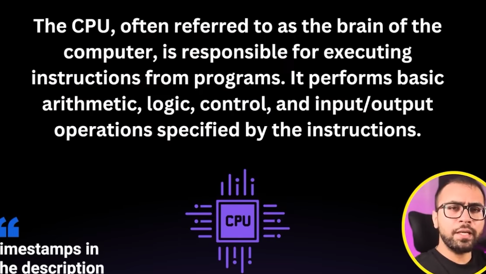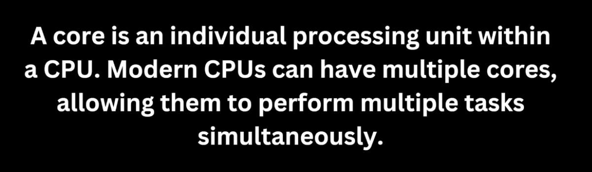
# 1. Basic
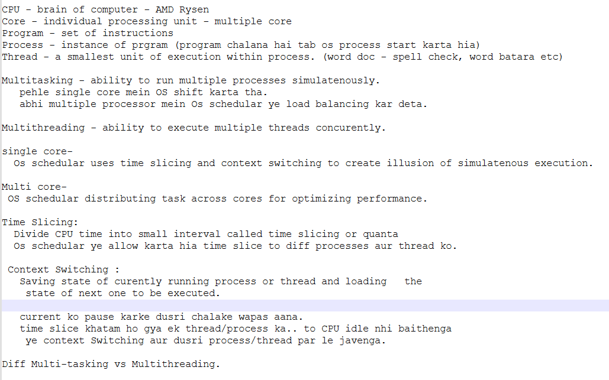
# 2. How Java Handles Multithreaing?
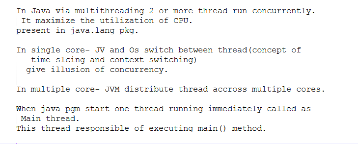
```java
package com.bharat.simpleprogram;

public class TestThread {

	public static void main(String[] args) {
		
		System.out.println("Hello World"); //Hello World
		System.out.println(Thread.currentThread().getName()); //main
	}

}
```
# 3. 2 ways to create thread
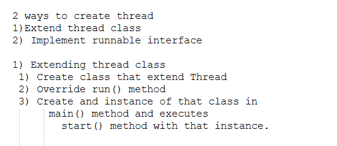
```java
package com.bharat.simpleprogram;

public class World extends Thread {

	@Override
	public void run() {

		for (int i = 0; i < 100000; i++) {
			System.out.println(Thread.currentThread().getName());
		}
	}

}
```
## Main
```java
package com.bharat.simpleprogram;

public class TestThread {

	public static void main(String[] args) {
		
		World world = new World();
		world.start();
		
		for(int i=0; i < 100000; i++) {
			System.out.println(Thread.currentThread().getName());
		}
	}

}
```
### via implementing Runnable interface
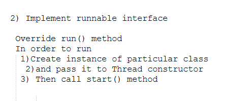
```java
package com.bharat.simpleprogram;

public class World implements Runnable {

	@Override
	public void run() {

		for (int i = 0; i < 100000; i++) {
			System.out.println(Thread.currentThread().getName());
		}
	}

}
```
### Main
```java
package com.bharat.simpleprogram;

public class TestThread {

	public static void main(String[] args) {
		
		World world = new World();
		Thread t1 = new Thread(world);
		t1.start();
		
		for(int i=0; i < 100000; i++) {
			System.out.println(Thread.currentThread().getName());
		}
	}

}
```
# 4. Lifecycle
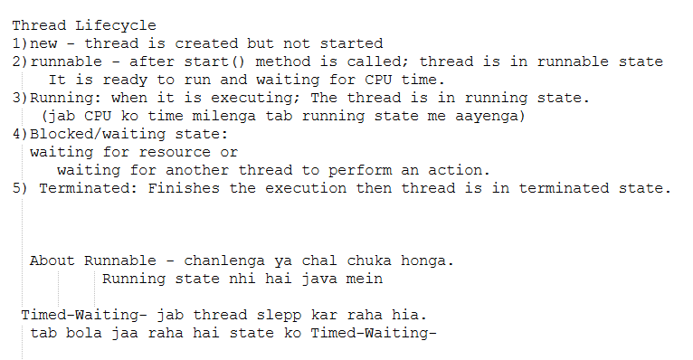
```java
package com.bharat.simpleprogram;

public class MyThread extends Thread{	

	@Override
	public void run() {
		System.out.println("Running");//4.  running
		try {
			//yaha thread t1 chala raha hai
			System.out.println(Thread.currentThread().getName());//Thread-0
			Thread.sleep(2000);
		} catch (InterruptedException e) {
			System.out.println(e);
		}
	}

	public static void main(String[] args) throws InterruptedException {
	
		MyThread t1 = new MyThread(); 		
		System.out.println(t1.getState()); // 1. NEW
		
		t1.start(); 
		System.out.println(t1.getState()); //2. RUNNABLE
		
		//Main Thread ki state ko nikal raha hai	
		System.out.println(Thread.currentThread().getState()); //3. RUNNABLE
		
		Thread.sleep(100); //we pause main() method for 100ms 
		  //so that our other thread get chance for execution.
		
		//2s ka waiting hai.. so main thread got chance
		 //yaha t1 ki state kya hai
		System.out.println(t1.getState()); //5. TIMED_WAITING
		
		t1.join(); //main thread t1 ka exe finish hone ko wait karenga
		System.out.println(t1.getState());//TERMINATED

	}

}
```
# 5 When to use extends Thread and implements Runnable Interface
- multiple inheritance is not allowed in java
- self explanatory
# 6. Thread methods
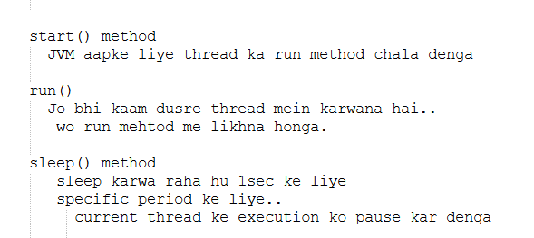
```java
package com.bharat.simpleprogram;

public class MyThread extends Thread{	

	@Override
	public void run() {
		
		for(int i=1; i<=5;i++) {
			try {
				Thread.sleep(1000);
			} catch (InterruptedException e) {
				e.printStackTrace();
			}
			System.out.println(i);
		}
	}

	public static void main(String[] args) throws InterruptedException {	
		MyThread t1 = new MyThread();
		t1.start();
		
		t1.join();
	}

}
```
### join
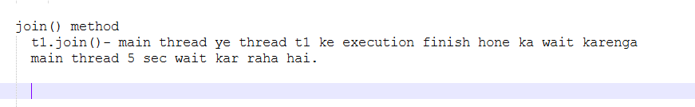
```java
package com.bharat.simpleprogram;

public class MyThread extends Thread{	

	@Override
	public void run() {		
		
			try {
				Thread.sleep(5000);
			} catch (InterruptedException e) {
				e.printStackTrace();
			}		
	}

	public static void main(String[] args) throws InterruptedException {	
		MyThread t1 = new MyThread();
		t1.start();
		
		t1.join();
		System.out.println("Hello");
	}

}
```
### priority() method
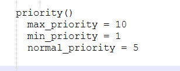
```java
package com.bharat.simpleprogram;

public class MyThread extends Thread {

	//2.Give Name
	public MyThread(String name) {
		super(name);
	}
	@Override
	public void run() {

		for (int i = 0; i <= 5; i++) {			
		
			System.out.println(Thread.currentThread().getName() 
					+ " - Priority: " + Thread.currentThread().getPriority()
					+ " -count: " + i);	//1.Thread-0 - Priority: 5 -count: 0		
			try {
				Thread.sleep(100);
			} catch (InterruptedException e) {
				e.printStackTrace();
			}
		}
	}

	public static void main(String[] args) throws InterruptedException {
//		MyThread t1 = new MyThread("aditya"); //3.aditya - Priority: 5 -count: 0
//		t1.start();
//		t1.setPriority(MAX_PRIORITY); //aditya - Priority: 10 -count: 0
		
		MyThread l = new MyThread("low priority Thread");
		MyThread m = new MyThread("medium priority Thread");
		MyThread h = new MyThread("max priority Thread");
		
		l.setPriority(MIN_PRIORITY); //low priority Thread - Priority: 1 -count: 0
		m.setPriority(NORM_PRIORITY); //medium priority Thread - Priority: 5 -count: 0
		h.setPriority(MAX_PRIORITY); //max priority Thread - Priority: 10 -count: 0
		
		l.start();
		m.start();
		h.start();
		
	}

}
```
### interrupt() 
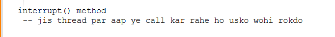
```java
package com.bharat.simpleprogram;

public class MyThread extends Thread {
	
	@Override
	public void run() {	
			try {
				Thread.sleep(1000);
				System.out.println("Thread is running....");
			} catch (InterruptedException e) {
				System.out.println("Thread interrupted: "+e);
			}		
	}

	public static void main(String[] args) throws InterruptedException {

		MyThread t1 = new MyThread();
		t1.start();
		// without interrupted  output is Thread is running....
		//after calling interrupt() method
		
		t1.interrupt(); //Thread interrupted: java.lang.InterruptedException: sleep interrupted
	}

}
```
### yeild() method
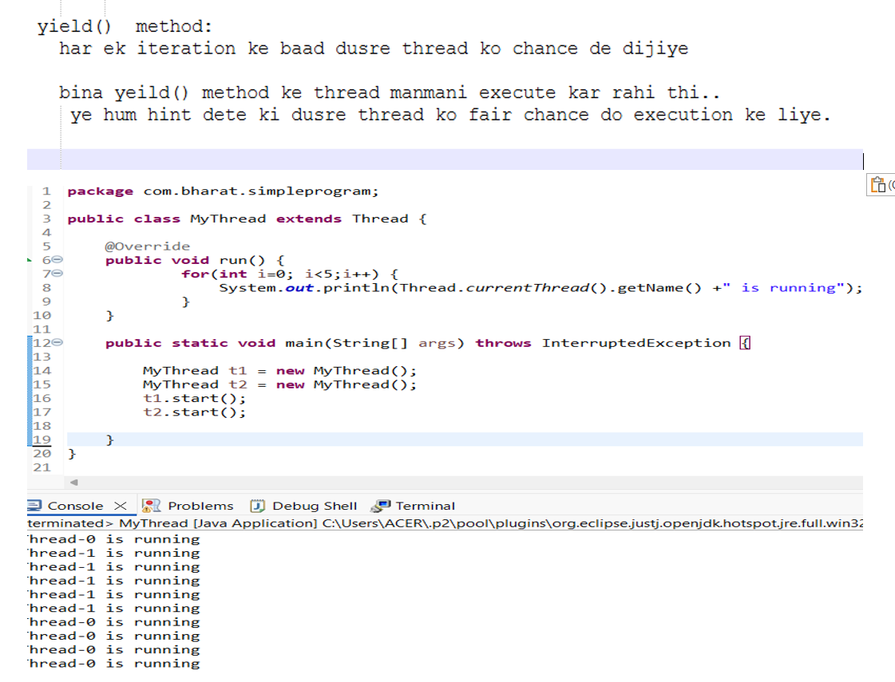
```java
package com.bharat.simpleprogram;

public class MyThread extends Thread {
	
	public MyThread(String name) {
		super(name);
	}
	
	@Override
	public void run() {	
			for(int i=0; i<5;i++) {
				System.out.println(Thread.currentThread().getName() +" is running");
				Thread.yield();
			}
	}

	public static void main(String[] args) throws InterruptedException {

		MyThread t1 = new MyThread("t1");
		MyThread t2 = new MyThread("t2");
		t1.start();
		t2.start();
	
	}
}
```
### deamon
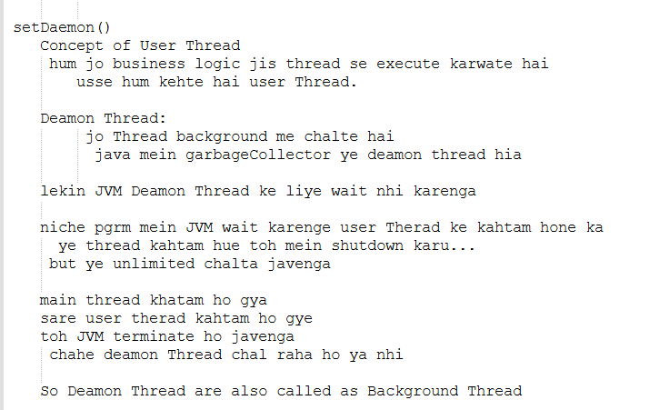
```java
package com.bharat.simpleprogram;

public class MyThread extends Thread {
	
	@Override
	public void run() {	
			while(true) {
				System.out.println("Hello World!");
			}
	}

	public static void main(String[] args) throws InterruptedException {

		MyThread t1 = new MyThread(); //This is user Thread
		t1.start();	
	}
}
```
### Some change in above pgm
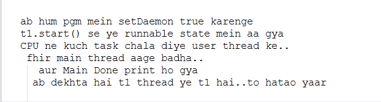
```java
package com.bharat.simpleprogram;

public class MyThread extends Thread {
	
	@Override
	public void run() {	
			while(true) {
				System.out.println("Hello World!");
			}
	}

	public static void main(String[] args) throws InterruptedException {

		MyThread t1 = new MyThread(); 
		t1.setDaemon(true);
		t1.start();	
		System.out.println("Main done");
	}
}
```
### Further more
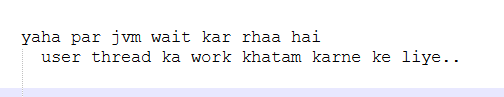
```java
package com.bharat.simpleprogram;

public class MyThread extends Thread {
	
	@Override
	public void run() {	
			while(true) {
				System.out.println("Hello World!");
			}
	}

	public static void main(String[] args) throws InterruptedException {

		MyThread t1 = new MyThread(); 
		t1.setDaemon(true);
		t1.start();	
		
		MyThread t2 = new MyThread(); 
		t2.start();
		System.out.println("Main done");
	}
}
```

