# Master Synchronization and synchronized keyword
### Counter
```java
package com.bharat.simpleprogram;

public class Counter {
	
	private int count = 0;
	
	public void increment() {
		count++;
	}
	
    public int getCount() {
    	return count;
    }
}
```
### Mythread
```java
package com.bharat.simpleprogram;

public class MyThread extends Thread {
	
	private Counter counter;
	
	public MyThread(Counter counter) {
		this.counter = counter; //set kiya hai counter ko
	}

	@Override
	public void run() {
		for(int i = 0; i < 1000; i++) {
			counter.increment();
		}
	}	
	
}
```
### Main method
```java
package com.bharat.simpleprogram;

public class TestThread {

	public static void main(String[] args) {
		
		Counter counter = new Counter();
		MyThread t1 = new MyThread(counter);
		MyThread t2 = new MyThread(counter);
		t1.start();
		t2.start();
		
		try {
			t1.join();
			t2.join();
		} catch (InterruptedException e) {
			
			e.printStackTrace();
		}	
		
		System.out.println("Counter value = "+counter.getCount());
	}
}
```
### Analysis
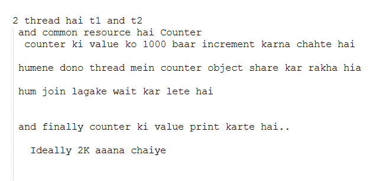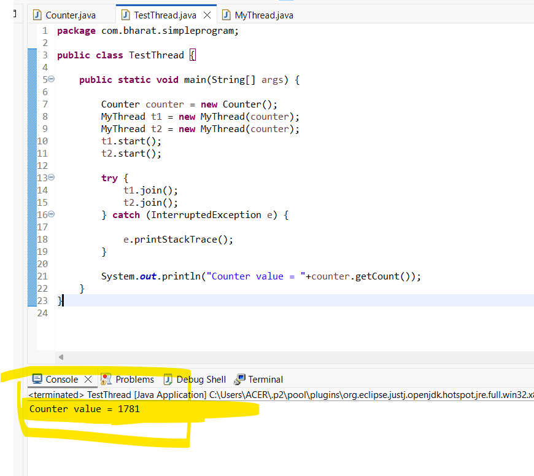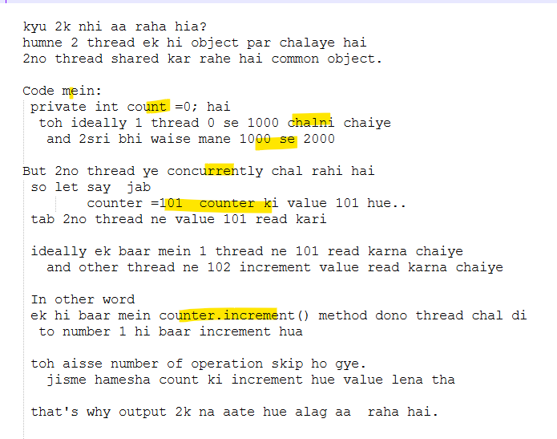
### Solution
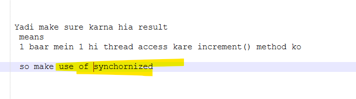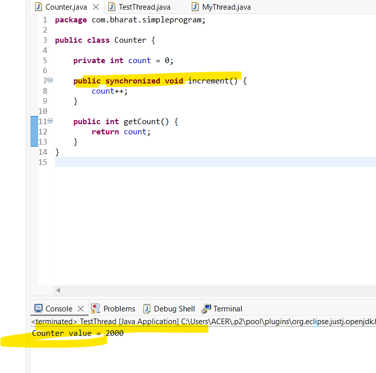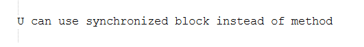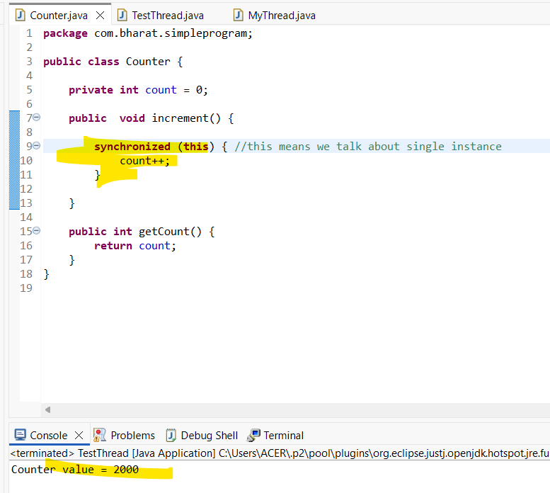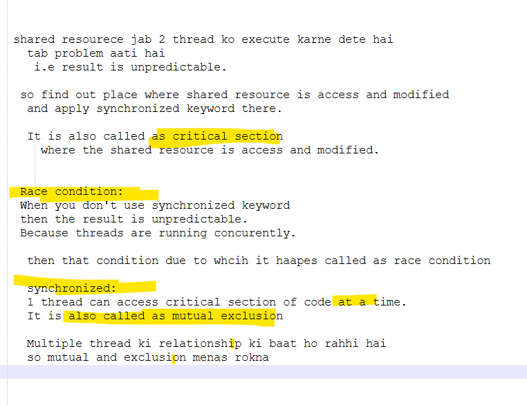
### A race condition is a situation that may occur inside a critical section.
### A mutual exclusion is a property of synchronization where  only 1 thread can access to critical section at a given time
# Java Locks
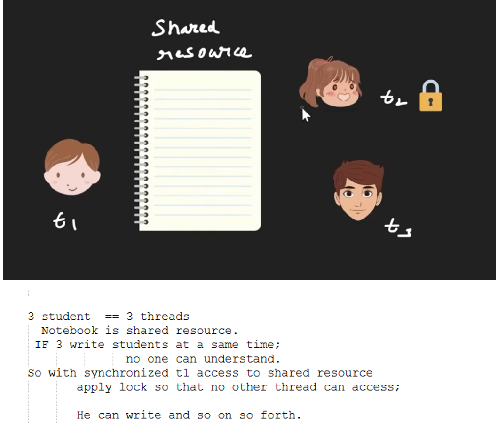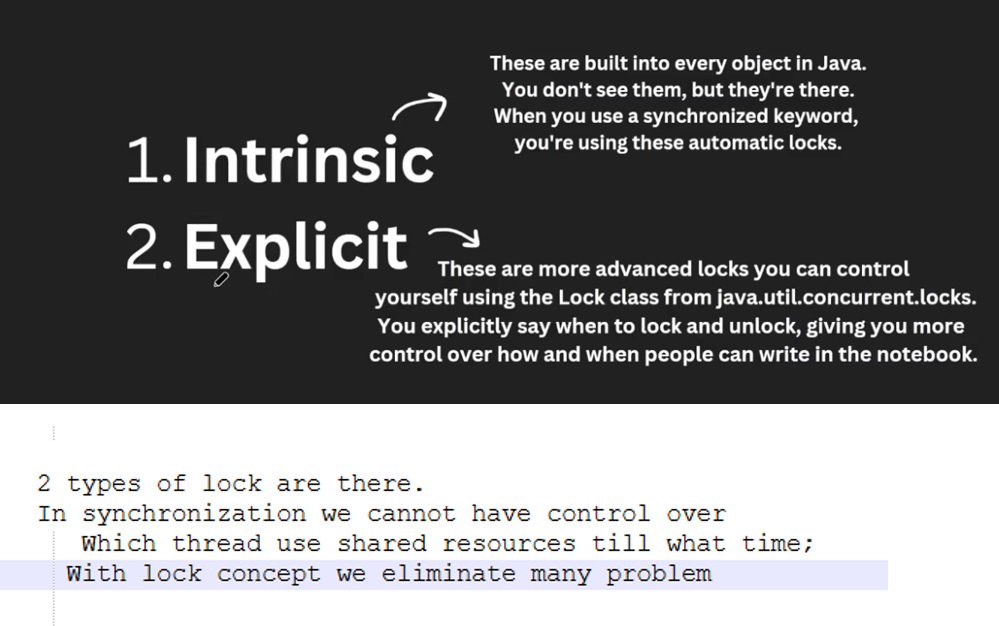
### Code
```java
package com.bharat.simpleprogram;

public class BankAccount {
	
	private int balance = 100;
	
	public synchronized void withdraw(int amount) {
		
		System.out.println(Thread.currentThread().getName() +"  attempting to withdraw "+ amount);
		
		if(balance >= amount) {
			System.out.println(Thread.currentThread().getName() + " Proceeding with withdrawl");
			
			//some processing -- some tranaction .. db mein hulchul
			try {
				Thread.sleep(3000); //wait for 3 sec
			} catch (InterruptedException e) {
				
			} 
			balance -= amount;
			
			System.out.println(Thread.currentThread().getName() + " Completed  withdrawl. Remaining Balance: "+balance);
		}else {
			System.out.println(Thread.currentThread().getName() + " insufficient balance");
		}
	}

}
```
### Main
```java
package com.bharat.simpleprogram;

public class Main {

	public static void main(String[] args) {
		
		BankAccount bankAccount = new BankAccount();
		
		 //Earlier you create separat class extend thread or runnable interface.
		//Here we use Runnable interface - (Anonymous type)		
		Runnable task = new Runnable() {
			
			@Override
			public void run() {
				bankAccount.withdraw(50);				
			}
		};
		
		Thread t1 = new Thread(task,"Thread 1");
		Thread t2 = new Thread(task,"Thread 2");
		
		t1.start();
		t2.start();

	}

}
```
### Problem
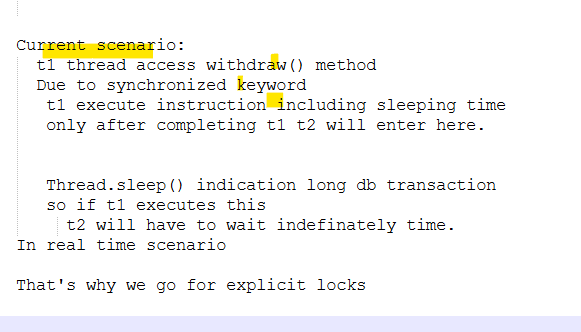
## Explicit log
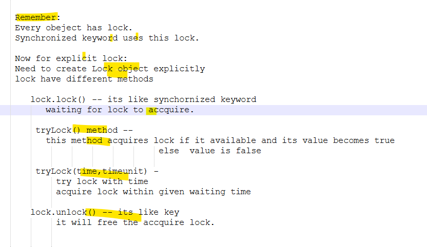
### Pgm
```java
package com.bharat.simpleprogram;

import java.util.concurrent.TimeUnit;
import java.util.concurrent.locks.Lock;
import java.util.concurrent.locks.ReentrantLock;

public class BankAccount {
	
	private int balance = 100;
	
	private final Lock lock = new ReentrantLock(); 
	//It implements Lock Interface
	 //Make it final so no one can change
	
	public  void withdraw(int amount) {
		
		System.out.println(Thread.currentThread().getName() +"  attempting to withdraw "+ amount);
		
		try {
			if(lock.tryLock(1000,TimeUnit.MILLISECONDS)) {
				if(balance >= amount) {
					try {
					     System.out.println(Thread.currentThread().getName() + " Proceeding with withdrawl");					
						 Thread.sleep(3000);
						 balance -= amount;						
						 System.out.println(Thread.currentThread().getName() + " Completed  withdrawl. Remaining Balance: "+balance);
						
					} catch (InterruptedException e) {
						
					} 
					finally {
						lock.unlock(); //always use in finally
					}
					
				}else {
					System.out.println(Thread.currentThread().getName() + " insufficient balance");
				}
			}else {
				System.out.println(Thread.currentThread().getName() + " Could not acquire the lock we try again later");
			}
		} catch (InterruptedException e) {
			
			e.printStackTrace();
		}
	}

}
```
### Pgm
```java
package com.bharat.simpleprogram;

public class Main {

	public static void main(String[] args) {
		
		BankAccount bankAccount = new BankAccount();
		
		 //Earlier you create separat class extend thread or runnable interface.
		//Here we use Runnable interface - (Anonymous type)		
		Runnable task = new Runnable() {
			
			@Override
			public void run() {
				bankAccount.withdraw(50);				
			}
		};
		
		Thread t1 = new Thread(task,"Thread 1");
		Thread t2 = new Thread(task,"Thread 2");
		
		t1.start();
		t2.start();

	}

}
```
### Output:
```
Thread 2  attempting to withdraw 50
Thread 1  attempting to withdraw 50
Thread 2 Proceeding with withdrawl
Thread 1 Could not acquire the lock we try again later
Thread 2 Completed  withdrawl. Remaining Balance: 50
```
### Problem-solution
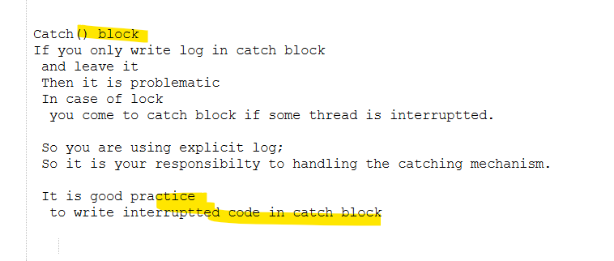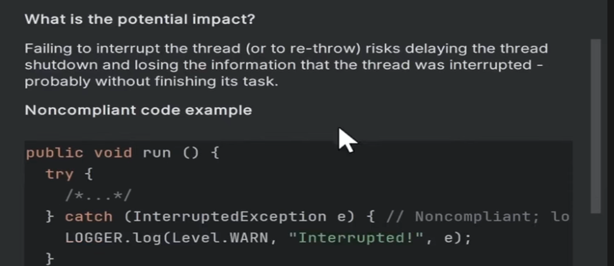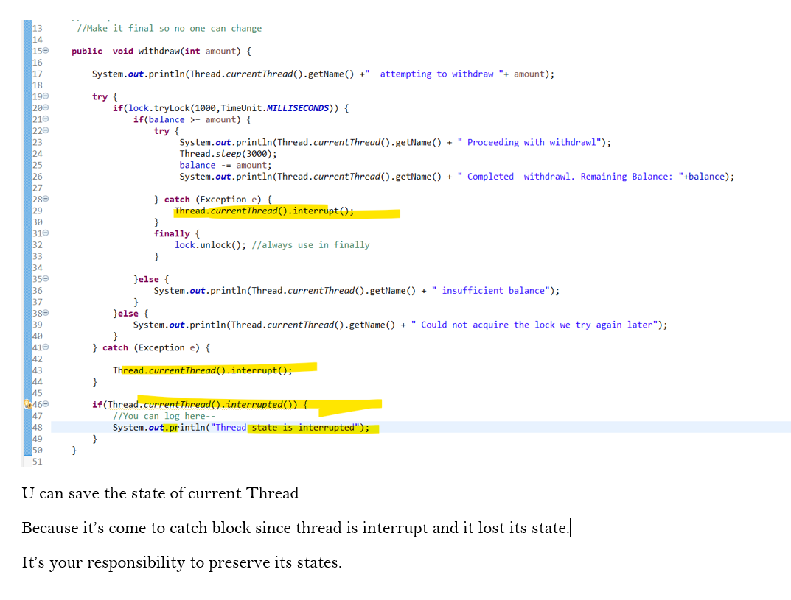
### Pgm
```java
package com.bharat.simpleprogram;

import java.util.concurrent.TimeUnit;
import java.util.concurrent.locks.Lock;
import java.util.concurrent.locks.ReentrantLock;

public class BankAccount {
	
	private int balance = 100;
	
	private final Lock lock = new ReentrantLock(); 
	//It implements Lock Interface
	 //Make it final so no one can change
	
	public  void withdraw(int amount) {
		
		System.out.println(Thread.currentThread().getName() +"  attempting to withdraw "+ amount);
		
		try {
			if(lock.tryLock(1000,TimeUnit.MILLISECONDS)) {
				if(balance >= amount) {
					try {
					     System.out.println(Thread.currentThread().getName() + " Proceeding with withdrawl");					
						 Thread.sleep(3000);
						 balance -= amount;						
						 System.out.println(Thread.currentThread().getName() + " Completed  withdrawl. Remaining Balance: "+balance);
						
					} catch (Exception e) {
						Thread.currentThread().interrupt();
					} 
					finally {
						lock.unlock(); //always use in finally
					}
					
				}else {
					System.out.println(Thread.currentThread().getName() + " insufficient balance");
				}
			}else {
				System.out.println(Thread.currentThread().getName() + " Could not acquire the lock we try again later");
			}
		} catch (Exception e) {
			
			Thread.currentThread().interrupt();
		}
		
		if(Thread.currentThread().interrupted()) {
			//You can log here-- 
			System.out.println("Thread state is interrupted");
		}
	}

}
```
### why reentrant lock
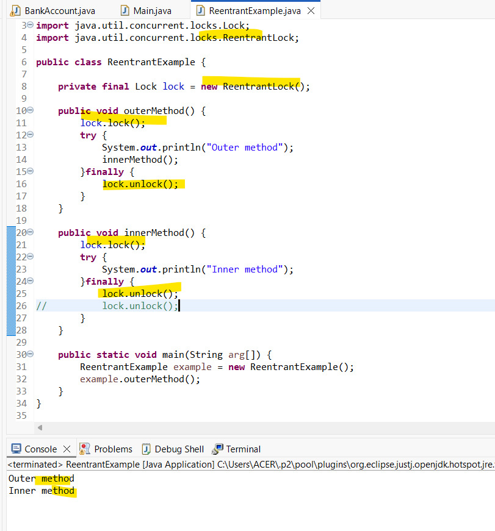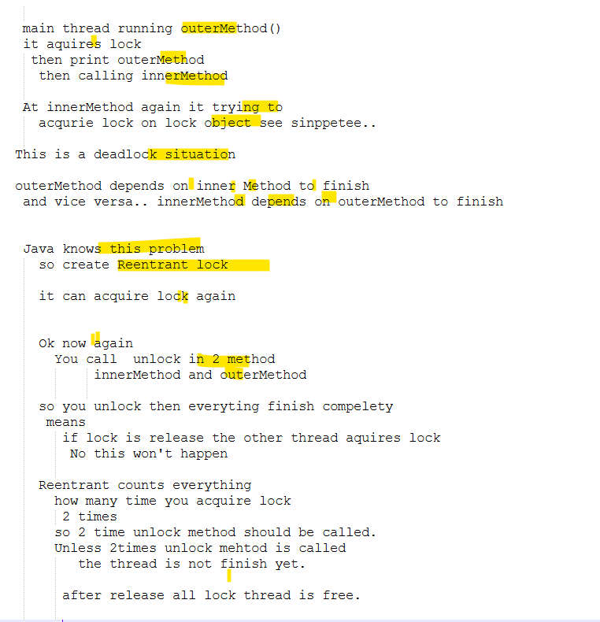
### if you increse lock.. count will disturb and exception is throw
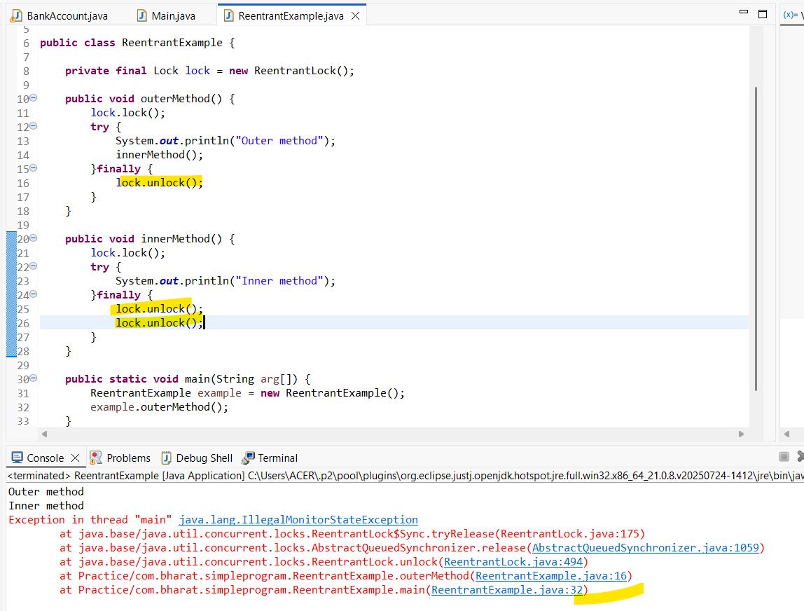
### pgm
```java
package com.bharat.simpleprogram;

import java.util.concurrent.locks.Lock;
import java.util.concurrent.locks.ReentrantLock;

public class ReentrantExample {

	private final Lock lock = new ReentrantLock();
	
	public void outerMethod() {
		lock.lock();
		try {
			System.out.println("Outer method");
			innerMethod();
		}finally {
			lock.unlock();
		}
	}
	
	public void innerMethod() {
		lock.lock();
		try {
			System.out.println("Inner method");
		}finally {
			lock.unlock();
		}
	}
	
	public static void main(String arg[]) {
		ReentrantExample example = new ReentrantExample();
		example.outerMethod();
	}
}
```
### Thread State
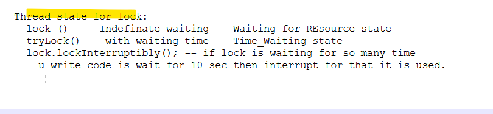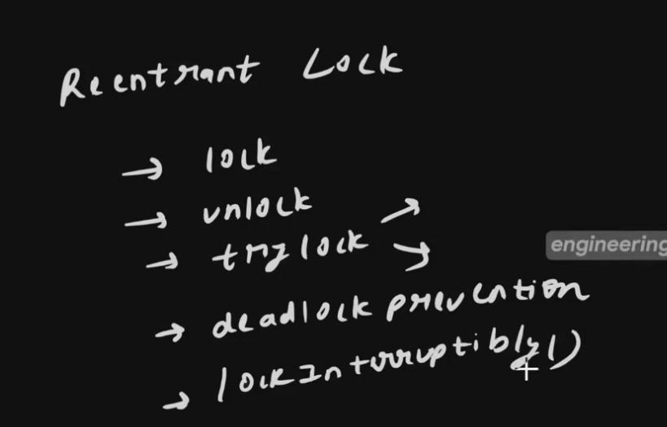

# 06Mar26


