# Fairness of Locks: Prevent Deadlock
### Pgm
```java
package com.bharat.simpleprogram;

import java.util.concurrent.locks.Lock;
import java.util.concurrent.locks.ReentrantLock;

public class FairnessExample {

	private final Lock lock = new ReentrantLock();
	
	public void accessResource() {
		lock.lock();
		try {
			System.out.println(Thread.currentThread().getName() + " accquired the lock");
			Thread.sleep(1000);
		} catch (Exception e) {
			Thread.currentThread().interrupt();
		}finally {
			//First Print then unlock; otherwise print statement order change;
			//As soon as you unlock new thread will acquire lock and print sout of accuqire lock
			System.out.println(Thread.currentThread().getName() + " released the lock"); 
			lock.unlock();			
		}
	}
	
	public static void main(String arg[]) {
		FairnessExample fairnessExample = new FairnessExample();
		
		Runnable task = new Runnable() {
			
			@Override
			public void run() {
				
				fairnessExample.accessResource();				
			}
		};
		
		Thread thread1 = new Thread(task,"Thread1");
		Thread thread2 = new Thread(task,"Thread2");
		Thread thread3 = new Thread(task,"Thread3");
		
		thread1.start();
		thread2.start();
		thread3.start();
	}
}
```
### Anlayse - solution
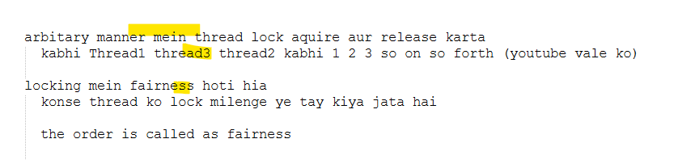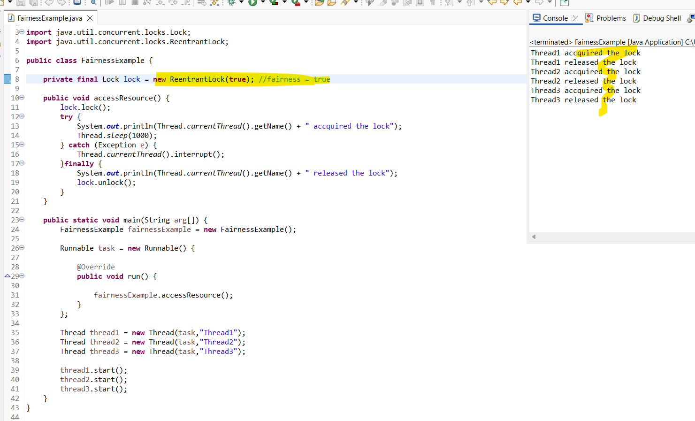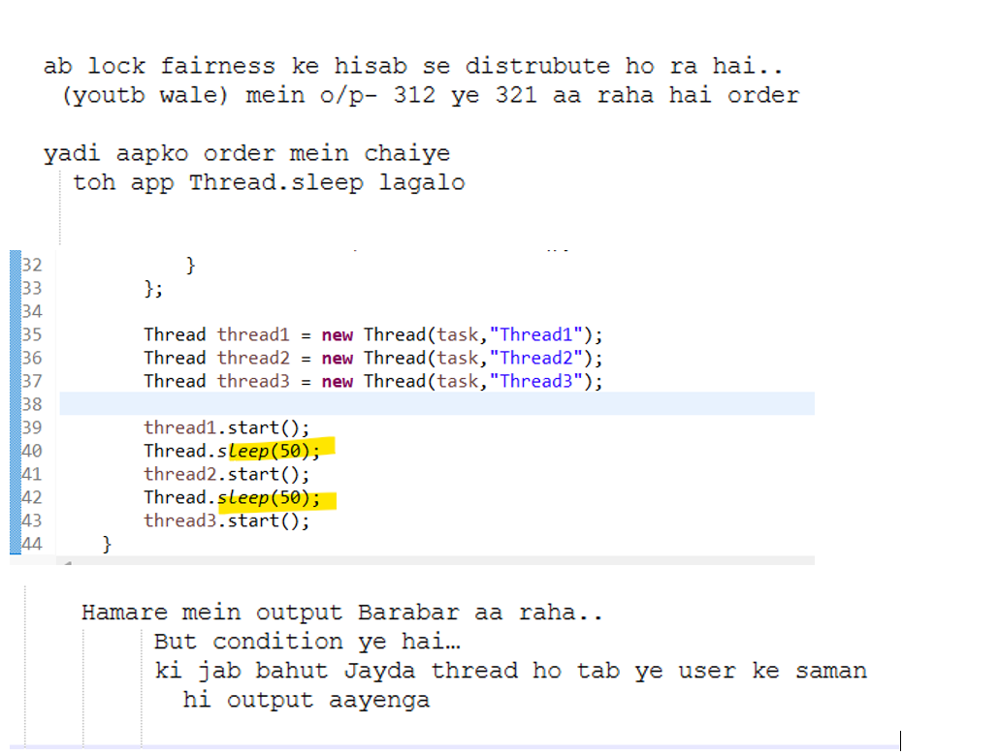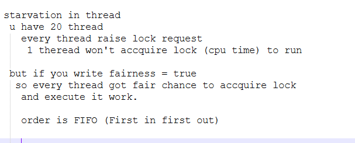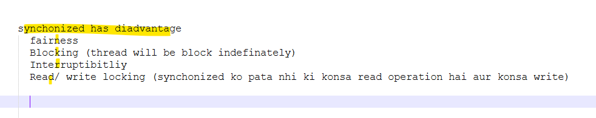
# Read Write lock
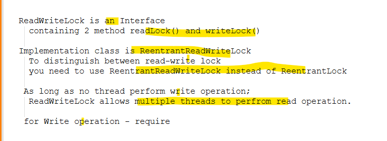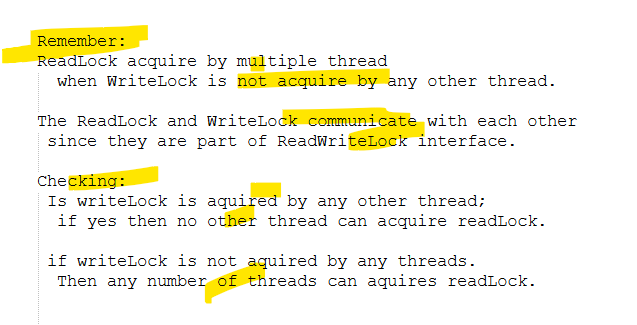
### Pgm
```java
package com.bharat.simpleprogram;

import java.util.concurrent.locks.Lock;
import java.util.concurrent.locks.ReadWriteLock;
import java.util.concurrent.locks.ReentrantReadWriteLock;

public class ReadWriteCounter {
	
	private int count = 0;
	
	
	private final ReadWriteLock lock = new ReentrantReadWriteLock();
	
	private final Lock readLock = lock.readLock();
	
	private final Lock writeLock = lock.writeLock();
	
	public void increment() {
		writeLock.lock();
		try {
			count++;
		}finally {
			writeLock.unlock();
		}
	}
	
	public int getCount() {
		readLock.lock();
		try {
			return count;
		} finally {
			readLock.unlock();
		}
	}
	
	public static void main(String arg[]) throws InterruptedException {
		ReadWriteCounter counter = new ReadWriteCounter();
		
         Runnable readTask = new Runnable() {
			
			@Override
			public void run() {
				for(int i = 0; i < 10; i++) {				
					System.out.println(Thread.currentThread().getName() + " read: "+ counter.getCount());
				}				
			}
		};
		
		Runnable writeTask = new Runnable() {
			
			@Override
			public void run() {
				for(int i = 0; i < 10; i++) {
					counter.increment();
					System.out.println(Thread.currentThread().getName() + " incremented");
				}				
			}
		};
		
		Thread writerThread = new Thread(writeTask);
		Thread readerThread1 = new Thread(readTask);
		Thread readerThread2 = new Thread(readTask);
		
		writerThread.start();
		readerThread1.start();
		readerThread2.start();
		
		
		writerThread.join();
		readerThread1.join();
		readerThread2.join();
		
		System.out.println("Final Count: "+ counter.getCount());
	}

}
```
### Output
```
Thread-0 incremented
Thread-0 incremented
Thread-0 incremented
Thread-0 incremented
Thread-0 incremented
Thread-0 incremented
Thread-0 incremented
Thread-0 incremented
Thread-0 incremented
Thread-0 incremented
Thread-2 read: 1
Thread-2 read: 10
Thread-1 read: 1
Thread-1 read: 10
Thread-1 read: 10
Thread-1 read: 10
Thread-2 read: 10
Thread-2 read: 10
Thread-2 read: 10
Thread-2 read: 10
Thread-2 read: 10
Thread-2 read: 10
Thread-2 read: 10
Thread-2 read: 10
Thread-1 read: 10
Thread-1 read: 10
Thread-1 read: 10
Thread-1 read: 10
Thread-1 read: 10
Thread-1 read: 10
Final Count: 10
```
### Observation
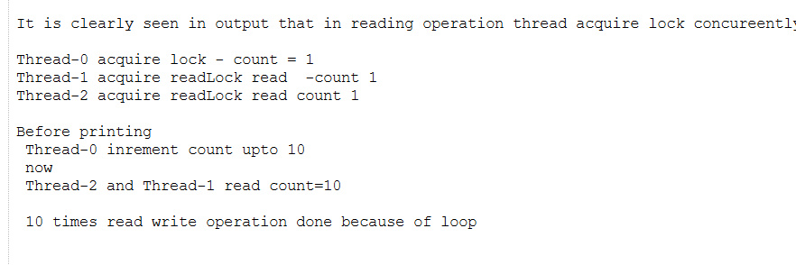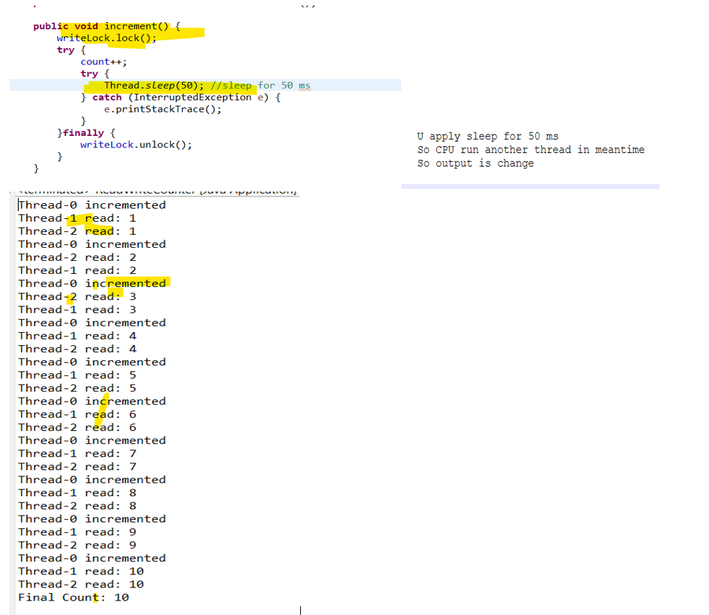
# Java Deadlock explained 
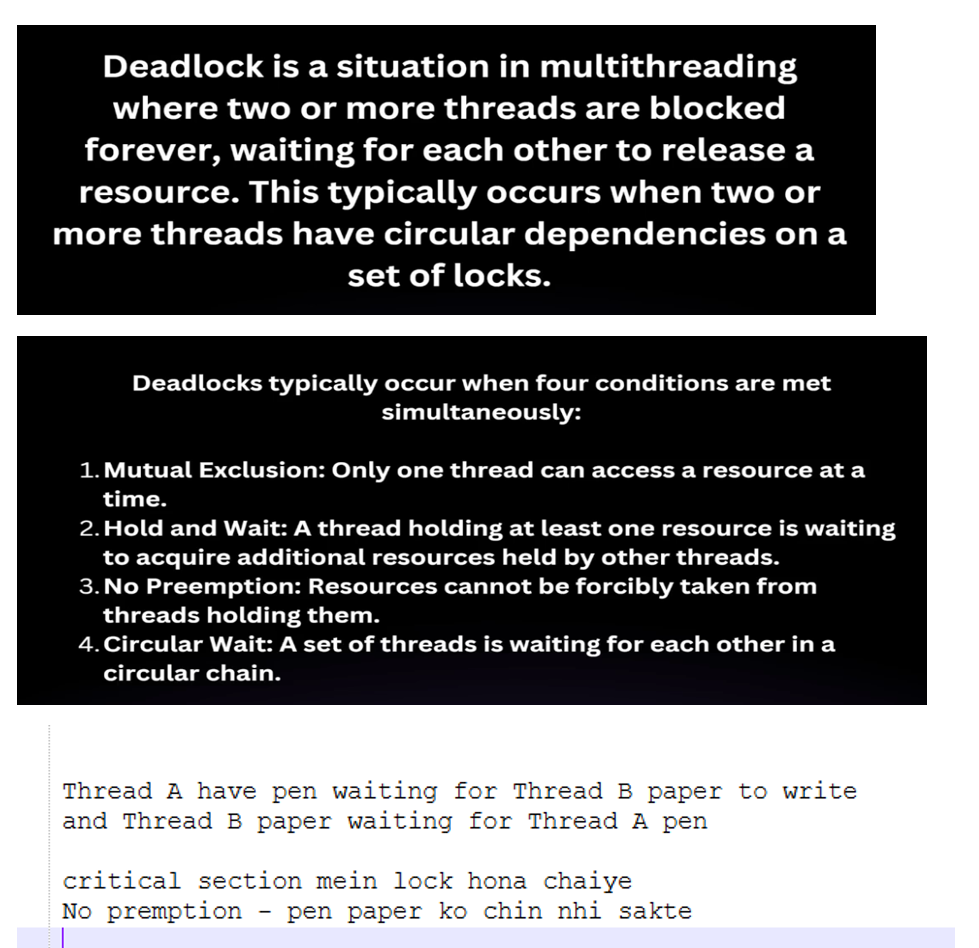
### Pgm
```java
package com.bharat.simpleprogram;

class Pen {
	public synchronized void writeWithPenAndPaper(Paper paper) {
		System.out.println(Thread.currentThread().getName() + " is using pen = "+this 
				      + " and trying to use paper ==> " + paper);
		paper.finishWriting();
	}
	
	public synchronized void finishWriting() {
		System.out.println(Thread.currentThread().getName() + " finished using pen "+this);
	}
}

class Paper {
	public synchronized void writeWithPenAndPaper(Pen pen) {
		System.out.println(Thread.currentThread().getName() + " is using paper = " +this 
				           + " and trying to use pen ==> " + pen);
		pen.finishWriting();
	}
	
	public synchronized void finishWriting() {
		System.out.println(Thread.currentThread().getName() + " finished using paper "+this);
	}
}

class Task1 implements Runnable{
 
	private Pen pen;
	private Paper paper;
	
	
	
	public Task1(Pen pen, Paper paper) {
		super();
		this.pen = pen;
		this.paper = paper;
	}

	@Override
	public void run() {
		pen.writeWithPenAndPaper(paper);		
	}
	
}

class Task2 implements Runnable{
	 
	private Pen pen;
	private Paper paper;
	
	
	
	public Task2(Pen pen, Paper paper) {
		super();
		this.pen = pen;
		this.paper = paper;
	}

	@Override
	public void run() {
		paper.writeWithPenAndPaper(pen);		
	}
	
}

public class DeadLockExample {

	public static void main(String[] args) {
		
		Pen pen = new Pen();
		Paper paper = new Paper();
		
		Thread thread1 = new Thread(new Task1(pen, paper),"Thread-1");
		Thread thread2 = new Thread(new Task2(pen, paper),"Thread-2");
		
		thread1.start();
		thread2.start();	

	}

}
```
### Analysis and output
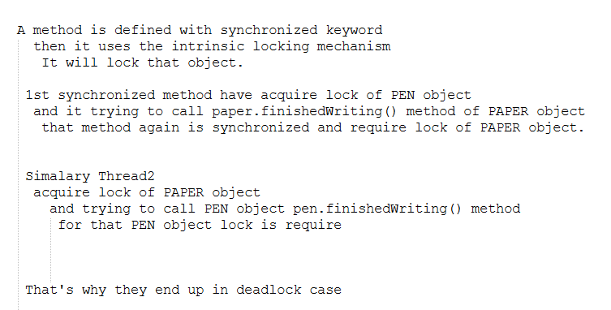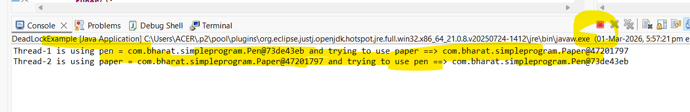
### forcefully need to close the output
## Problem and solution for above scenario
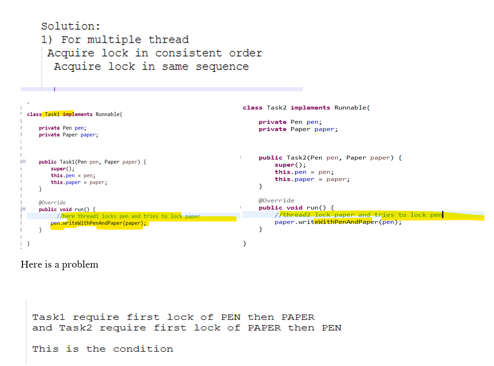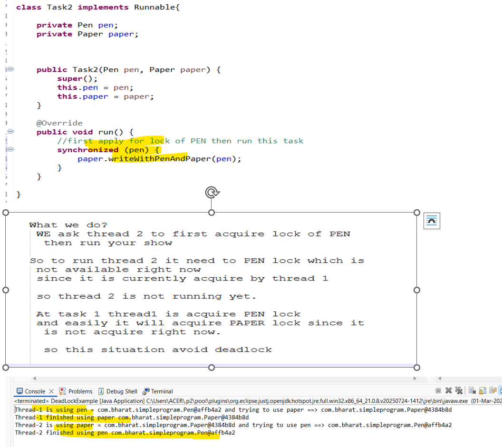
### Pgm
```java
package com.bharat.simpleprogram;

class Pen {
	public synchronized void writeWithPenAndPaper(Paper paper) {
		System.out.println(Thread.currentThread().getName() + " is using pen = "+this 
				      + " and trying to use paper ==> " + paper);
		paper.finishWriting();
	}
	
	public synchronized void finishWriting() {
		System.out.println(Thread.currentThread().getName() + " finished using pen "+this);
	}
}

class Paper {
	public synchronized void writeWithPenAndPaper(Pen pen) {
		System.out.println(Thread.currentThread().getName() + " is using paper = " +this 
				           + " and trying to use pen ==> " + pen);
		pen.finishWriting();
	}
	
	public synchronized void finishWriting() {
		System.out.println(Thread.currentThread().getName() + " finished using paper "+this);
	}
}

class Task1 implements Runnable{
 
	private Pen pen;
	private Paper paper;
	
	
	
	public Task1(Pen pen, Paper paper) {
		super();
		this.pen = pen;
		this.paper = paper;
	}

	@Override
	public void run() { 
		pen.writeWithPenAndPaper(paper);		
	}
	
}

class Task2 implements Runnable{
	 
	private Pen pen;
	private Paper paper;
	
	
	
	public Task2(Pen pen, Paper paper) {
		super();
		this.pen = pen;
		this.paper = paper;
	}

	@Override
	public void run() {
		//first apply for lock of PEN then run this task
		synchronized (pen) {
			paper.writeWithPenAndPaper(pen);
		}				
	}
	
}

public class DeadLockExample {

	public static void main(String[] args) {
		
		Pen pen = new Pen();
		Paper paper = new Paper();
		
		Thread thread1 = new Thread(new Task1(pen, paper),"Thread-1");
		Thread thread2 = new Thread(new Task2(pen, paper),"Thread-2");
		
		thread1.start();
		thread2.start();	

	}

}
```
# 06Mar26


