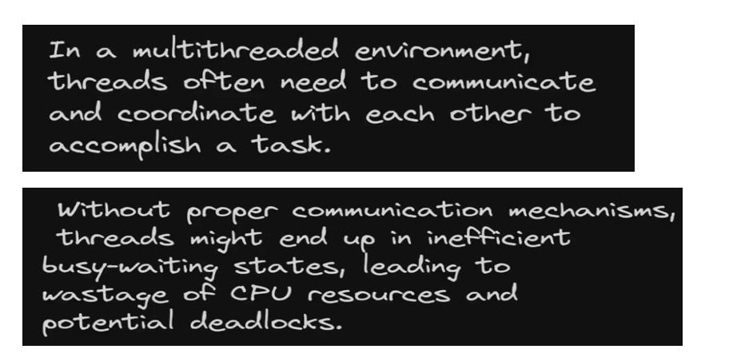
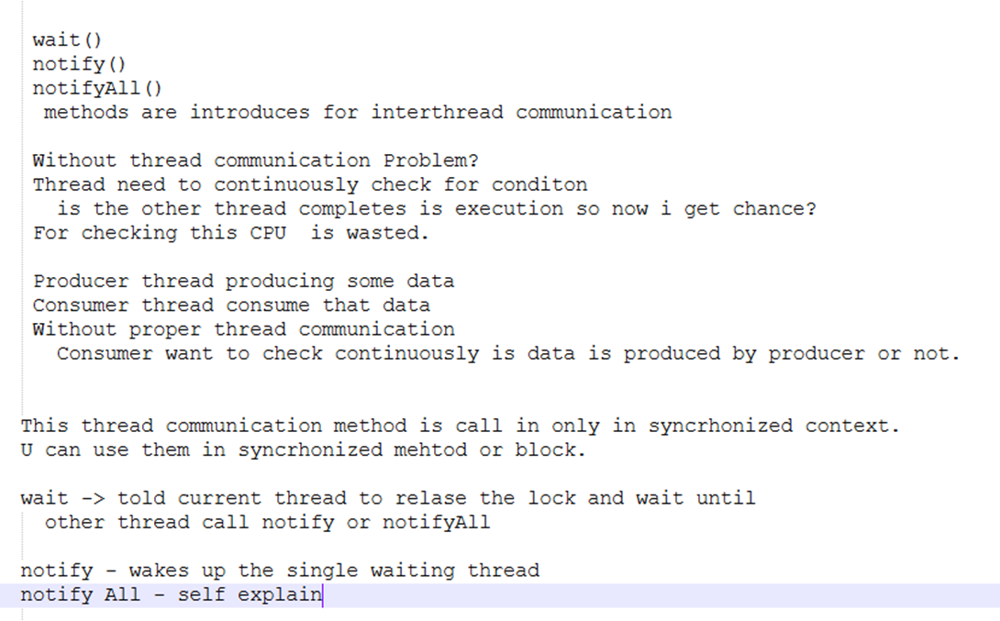
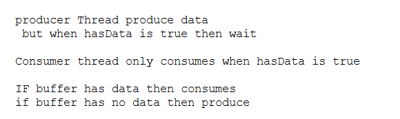
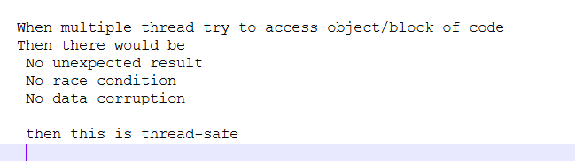
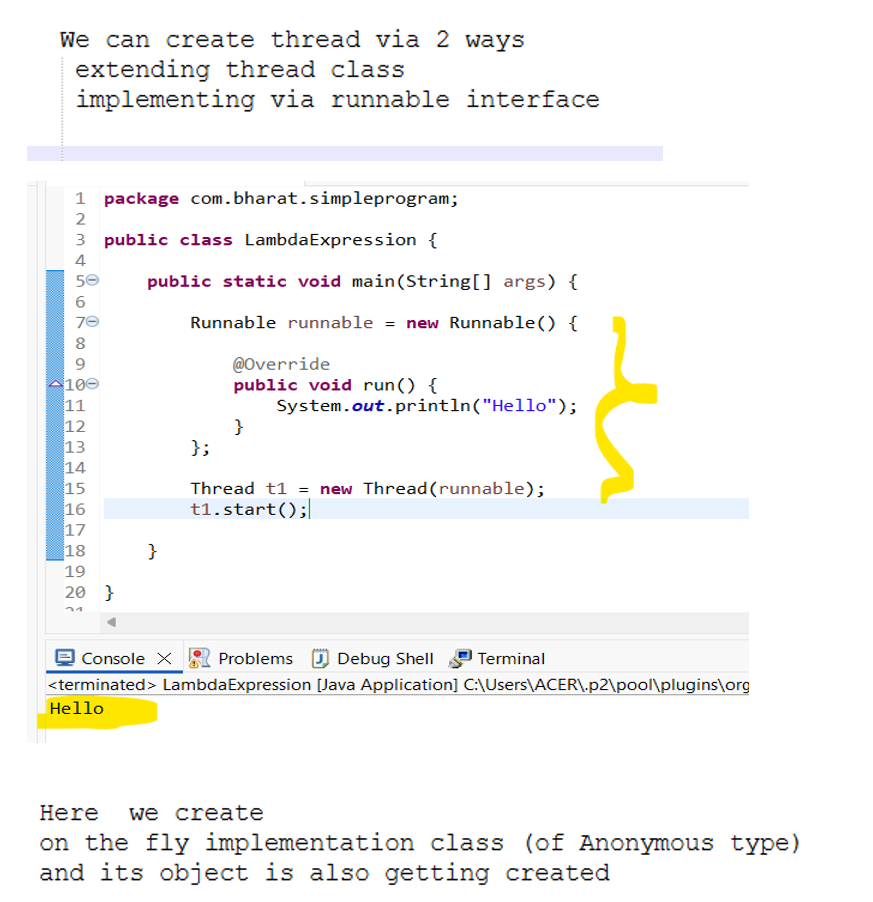
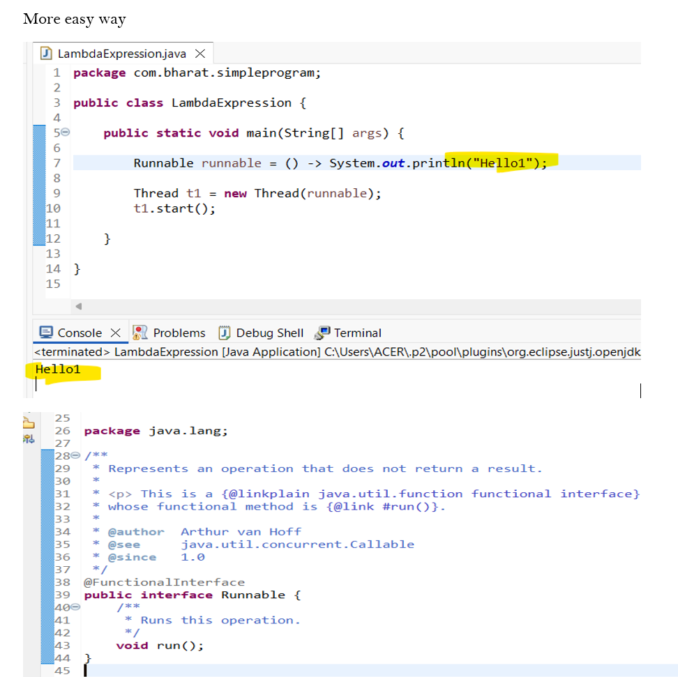
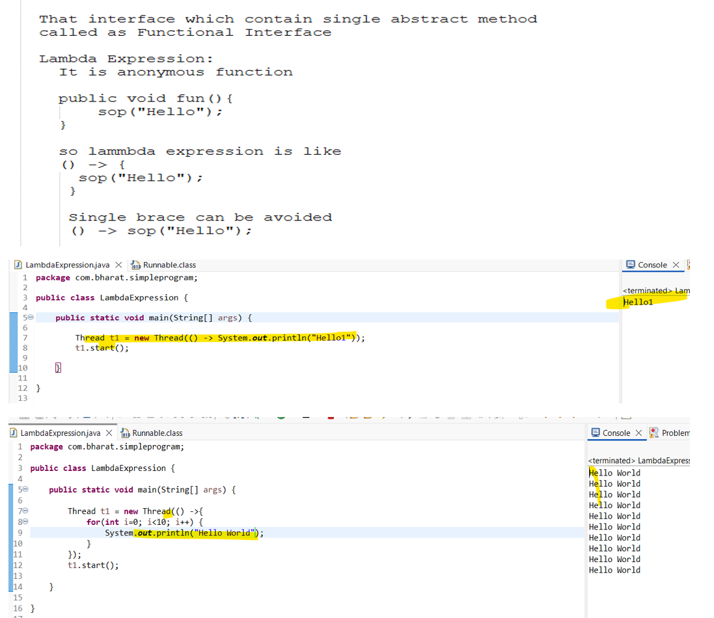
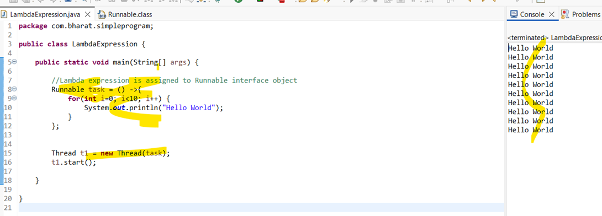
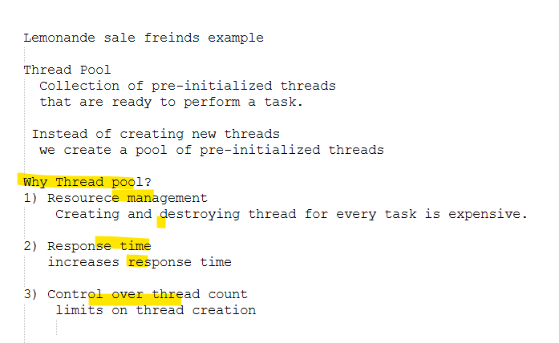

# Thread Communication

### pgm
```java
package com.bharat.simpleprogram;

class SharedResource {

	private int data;
	private boolean hasData;

	public synchronized void produce(int value) {
		while (hasData) {
			try {
				wait();
			} catch (InterruptedException e) {
				// To restore its step
				Thread.currentThread().interrupt();
			}
		}
		data = value;
		hasData = true;
		System.out.println("Produced: " + value);
		notify(); // Notify other thread
	}

	public synchronized int consume() {
		while (!hasData) { // IF data is not there

			try {
				wait();
			} catch (InterruptedException e) {
				Thread.currentThread().interrupt();
			}
		}
		hasData = false;
		notify(); //notify to producer
		System.out.println("Consume: " + data);
		return data;
	}
}

class Producer implements Runnable {

	private SharedResource resource;

	public Producer(SharedResource resource) {
		this.resource = resource;
	}

	@Override
	public void run() {
		for (int i = 0; i < 10; i++) {
			resource.produce(i);
		}
	}

}

class Consumer implements Runnable {

	private SharedResource resource;

	public Consumer(SharedResource resource) {
		this.resource = resource;
	}

	@Override
	public void run() {
		for (int i = 0; i < 10; i++) {
			int value = resource.consume();
		}
	}

}

public class ThreadCommunication {

	public static void main(String[] args) {

		SharedResource resource = new SharedResource();
		Thread producerThread = new Thread(new Producer(resource));
		Thread consumerThread = new Thread(new Consumer(resource));

		producerThread.start();
		consumerThread.start();

	}

}
```
### Output
```
Produced: 0
Consume: 0
Produced: 1
Consume: 1
Produced: 2
Consume: 2
Produced: 3
Consume: 3
Produced: 4
Consume: 4
Produced: 5
Consume: 5
Produced: 6
Consume: 6
Produced: 7
Consume: 7
Produced: 8
Consume: 8
Produced: 9
Consume: 9
```
# Thread Safety

# Write thread via Lambda

# Thread pool

# 06Mar26