# CountDownLatch  
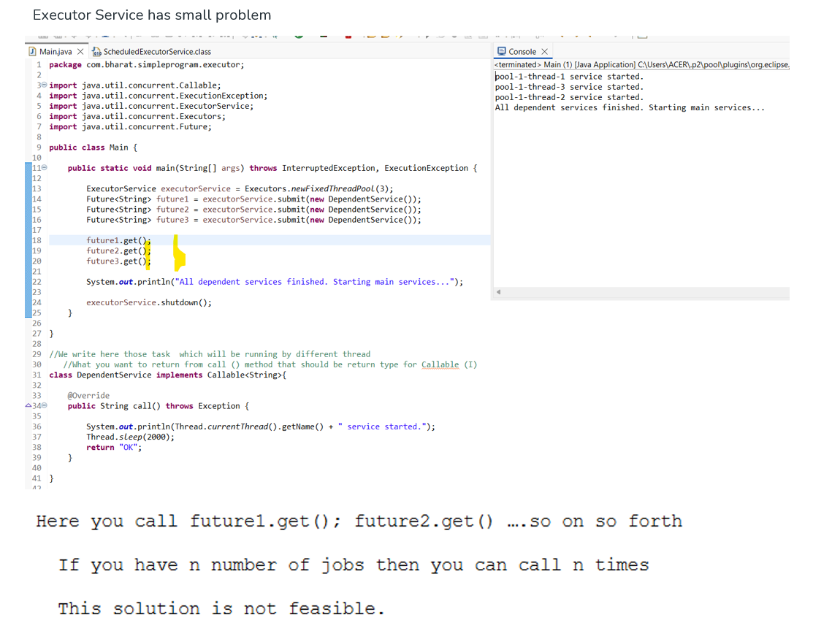
### Pgm
```java
package com.bharat.simpleprogram.executor;

import java.util.concurrent.Callable;
import java.util.concurrent.ExecutionException;
import java.util.concurrent.ExecutorService;
import java.util.concurrent.Executors;
import java.util.concurrent.Future;

public class Main {

	public static void main(String[] args) throws InterruptedException, ExecutionException {

		ExecutorService executorService = Executors.newFixedThreadPool(3);
		Future<String> future1 = executorService.submit(new DependentService());
		Future<String> future2 = executorService.submit(new DependentService());
		Future<String> future3 = executorService.submit(new DependentService());
		
		future1.get();
		future2.get();
		future3.get();
		
		System.out.println("All dependent services finished. Starting main services...");
		
		executorService.shutdown();
	}

}

//We write here those task  which will be running by different thread
   //What you want to return from call () method that should be return type for Callable (I)
class DependentService implements Callable<String>{ 

	@Override
	public String call() throws Exception {
		
		System.out.println(Thread.currentThread().getName() + " service started.");
		Thread.sleep(2000);
		return "OK";
	}
	
}
```
## latch propect
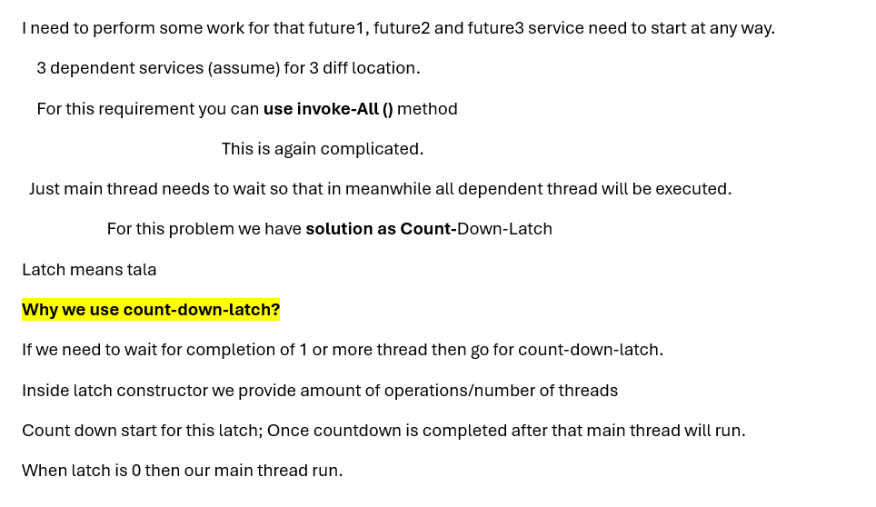
### Pgm
```java
package com.bharat.simpleprogram.executor;

import java.util.concurrent.Callable;
import java.util.concurrent.CountDownLatch;
import java.util.concurrent.ExecutionException;
import java.util.concurrent.ExecutorService;
import java.util.concurrent.Executors;

public class Main {

	public static void main(String[] args) throws InterruptedException, ExecutionException {

		int numberOfServices = 3;
		ExecutorService executorService = Executors.newFixedThreadPool(numberOfServices);
		
		//1. Create CountDown Latch
		CountDownLatch latch = new CountDownLatch(numberOfServices);
		
		//3. write task with latch
		executorService.submit(new DependentService(latch));
		executorService.submit(new DependentService(latch));
		executorService.submit(new DependentService(latch));
		
		//4. wait for all task to be executed/finished
		latch.await();

		System.out.println("All dependent services finished. Starting main services...");

		executorService.shutdown();
	}

}

class DependentService implements Callable<String> {

	//2. Pass it to the constructor of the dependent service
	private final CountDownLatch latch;

	public DependentService(CountDownLatch latch) {
		super();
		this.latch = latch;
	}

	@Override
	public String call() throws Exception {
		try {
			System.out.println(Thread.currentThread().getName() + " service started.");
			Thread.sleep(2000);
		}finally {
			latch.countDown(); //3-b Latch must be count down
		}		
		return "OK";
	}

}
```
# U can use latch with executor framework or manually thread creation.
```java
package com.bharat.simpleprogram.executor;

import java.util.concurrent.CountDownLatch;
import java.util.concurrent.ExecutionException;

public class Main {

	public static void main(String[] args) throws InterruptedException, ExecutionException {

		int numberOfServices = 3;

		// 1. Create CountDown Latch
		CountDownLatch latch = new CountDownLatch(numberOfServices);

		for (int i = 0; i < numberOfServices; i++) {
			new Thread(new DependentService(latch)).start();
		}

		// 3/ wait for all task to be executed/finished
		latch.await();

		System.out.println("All dependent services finished. Starting main services...");

	}

}

class DependentService implements Runnable {

	// 2. Pass it to the constructor of the dependent service
	private final CountDownLatch latch;

	public DependentService(CountDownLatch latch) {
		super();
		this.latch = latch;
	}

	@Override
	public void run() {
		try {
			System.out.println(Thread.currentThread().getName() + " service started.");
			Thread.sleep(2000);
		} catch (Exception e) {
			e.printStackTrace();
		}

		finally {
			latch.countDown(); // 3-b Latch must be count down
		}
	}

}
```
# We can also pass timeUnit in latch.await() method
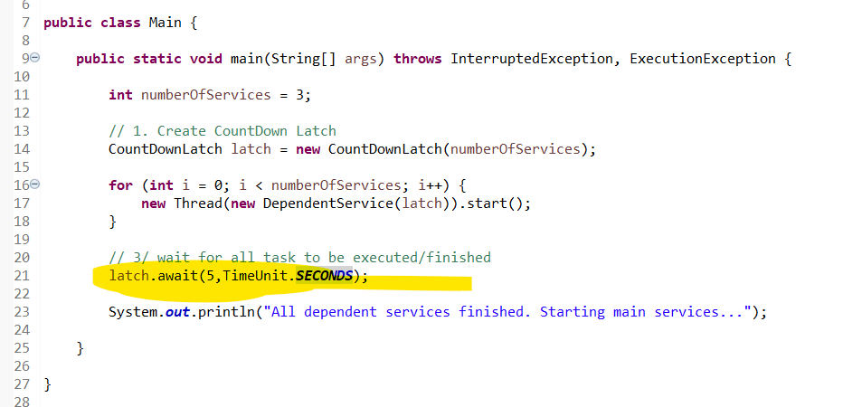
```java
package com.bharat.simpleprogram.executor;

import java.util.concurrent.CountDownLatch;
import java.util.concurrent.ExecutionException;
import java.util.concurrent.TimeUnit;

public class Main {

	public static void main(String[] args) throws InterruptedException, ExecutionException {

		int numberOfServices = 3;

		// 1. Create CountDown Latch
		CountDownLatch latch = new CountDownLatch(numberOfServices);

		for (int i = 0; i < numberOfServices; i++) {
			new Thread(new DependentService(latch)).start();
		}

		// 3/ wait for all task to be executed/finished
		latch.await(5,TimeUnit.SECONDS);

		System.out.println("All dependent services finished. Starting main services...");

	}

}

class DependentService implements Runnable {

	// 2. Pass it to the constructor of the dependent service
	private final CountDownLatch latch;

	public DependentService(CountDownLatch latch) {
		super();
		this.latch = latch;
	}

	@Override
	public void run() {
		try {			
			Thread.sleep(6000);
			System.out.println(Thread.currentThread().getName() + " service started.");
		} catch (Exception e) {
			e.printStackTrace();
		}

		finally {
			latch.countDown(); // 3-b Latch must be count down
		}
	}

}
```
### Output
```
All dependent services finished. Starting main services...
Thread-2 service started.
Thread-1 service started.
Thread-0 service started.
```
### Analysis
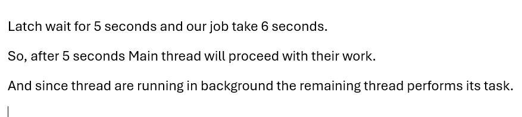
### In Executor 
```java
package com.bharat.simpleprogram.executor;

import java.util.concurrent.Callable;
import java.util.concurrent.CountDownLatch;
import java.util.concurrent.ExecutionException;
import java.util.concurrent.ExecutorService;
import java.util.concurrent.Executors;
import java.util.concurrent.TimeUnit;

public class Main {

	public static void main(String[] args) throws InterruptedException, ExecutionException {

		int numberOfServices = 3;
		ExecutorService executorService = Executors.newFixedThreadPool(numberOfServices);
		
		//1. Create CountDown Latch
		CountDownLatch latch = new CountDownLatch(numberOfServices);
		
		//3. write task with latch
		executorService.submit(new DependentService(latch));
		executorService.submit(new DependentService(latch));
		executorService.submit(new DependentService(latch));
		
		//4. wait for all task to be executed/finished
		latch.await(5,TimeUnit.SECONDS);

		System.out.println("All dependent services finished. Starting main services...");

		executorService.shutdown();
	}

}

class DependentService implements Callable<String> {

	//2. Pass it to the constructor of the dependent service
	private final CountDownLatch latch;

	public DependentService(CountDownLatch latch) {
		super();
		this.latch = latch;
	}

	@Override
	public String call() throws Exception {
		try {			
			Thread.sleep(6000);
			System.out.println(Thread.currentThread().getName() + " service started.");
		}finally {
			latch.countDown(); //3-b Latch must be count down
		}		
		return "OK";
	}

}
````
## pgm
```
All dependent services finished. Starting main services...
pool-1-thread-2 service started.
pool-1-thread-1 service started.
pool-1-thread-3 service started.
```
### If you want your worker thread stop then use shutDownNow()
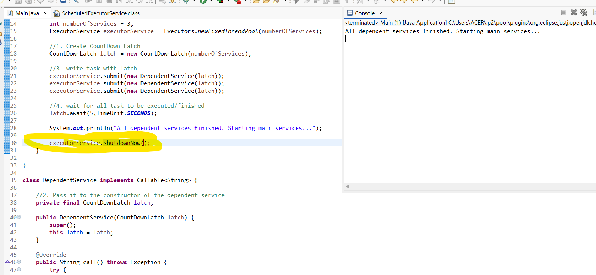
### output
```
All dependent services finished. Starting main services...
```
### After shutDownNow() worker thread will stop 
## When to use
## When you want multiple threads to wait then use CountDownLatch
# 2 Java Cyclic Barrier 
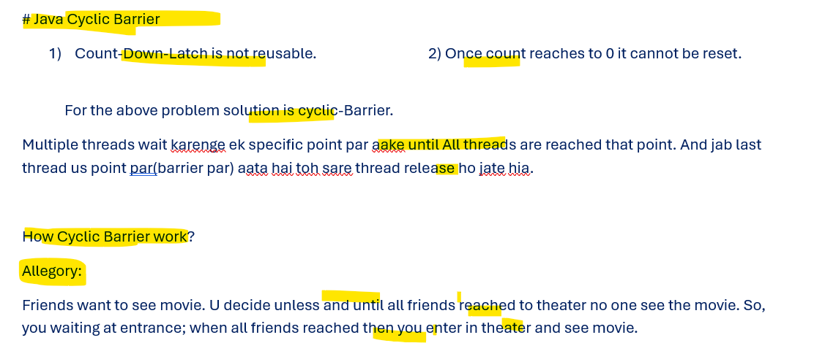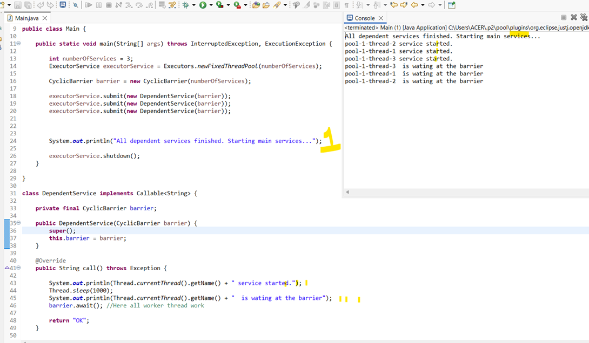
### Pgm
```java
package com.bharat.simpleprogram.executor;

import java.util.concurrent.Callable;
import java.util.concurrent.CyclicBarrier;
import java.util.concurrent.ExecutionException;
import java.util.concurrent.ExecutorService;
import java.util.concurrent.Executors;

public class Main {

	public static void main(String[] args) throws InterruptedException, ExecutionException {

		int numberOfServices = 3;
		ExecutorService executorService = Executors.newFixedThreadPool(numberOfServices);
		
		CyclicBarrier barrier = new CyclicBarrier(numberOfServices);		
	
		executorService.submit(new DependentService(barrier));
		executorService.submit(new DependentService(barrier));
		executorService.submit(new DependentService(barrier));
		
		 

		System.out.println("All dependent services finished. Starting main services...");

		executorService.shutdown();
	}

}

class DependentService implements Callable<String> {

	private final CyclicBarrier barrier;

	public DependentService(CyclicBarrier barrier) {
		super();
		this.barrier = barrier;
	}

	@Override
	public String call() throws Exception {
		
		System.out.println(Thread.currentThread().getName() + " service started.");
		Thread.sleep(1000);
		System.out.println(Thread.currentThread().getName() + "  is wating at the barrier");
		barrier.await(); //Here all worker thread work
			
		return "OK";
	}

}
```
## When to use Cyclic Barrier?
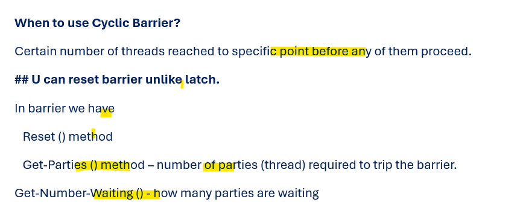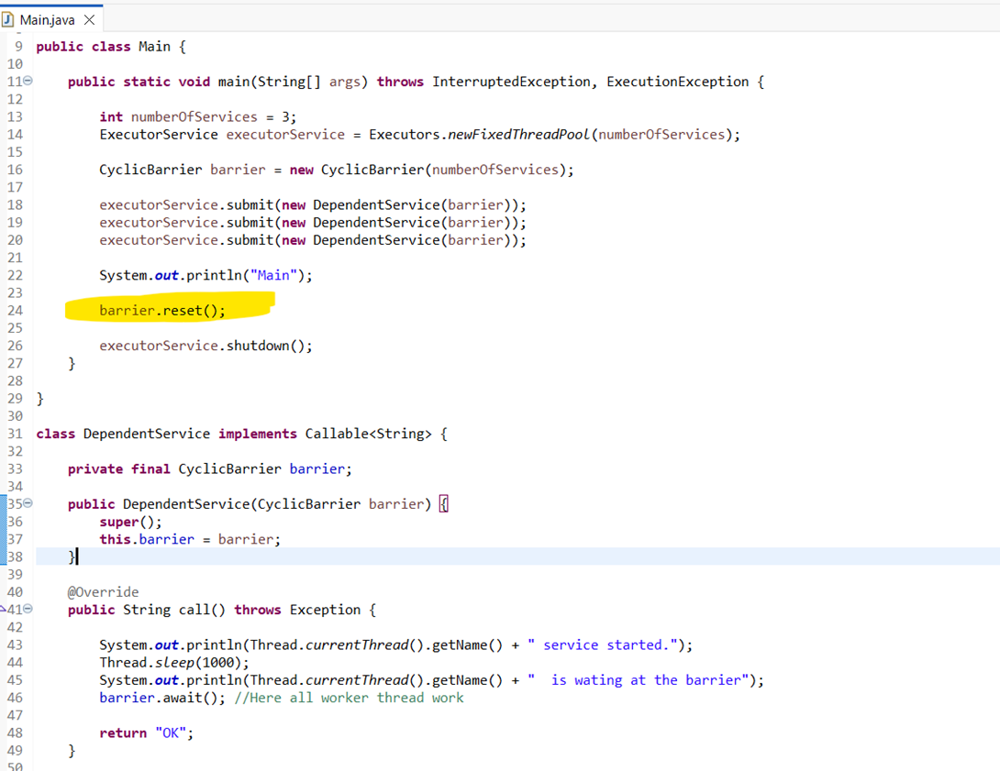
## Another pgm
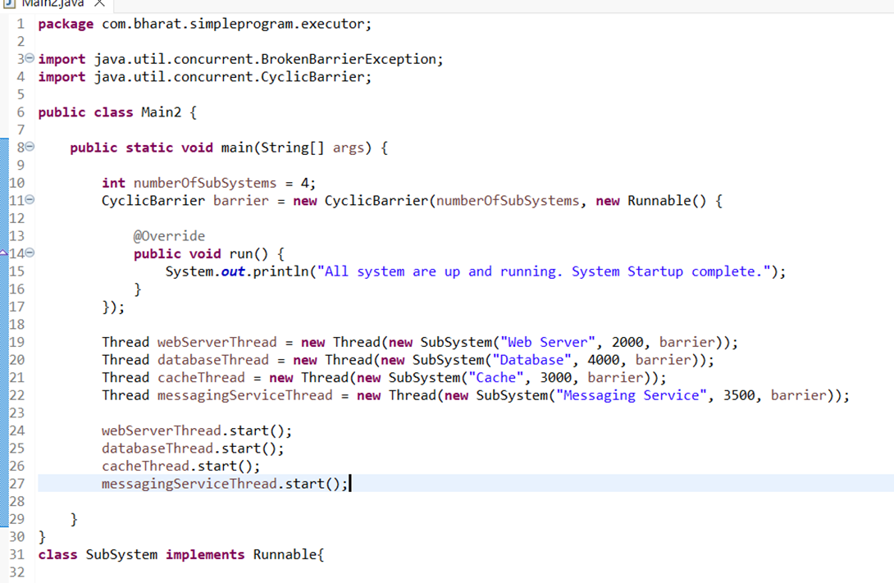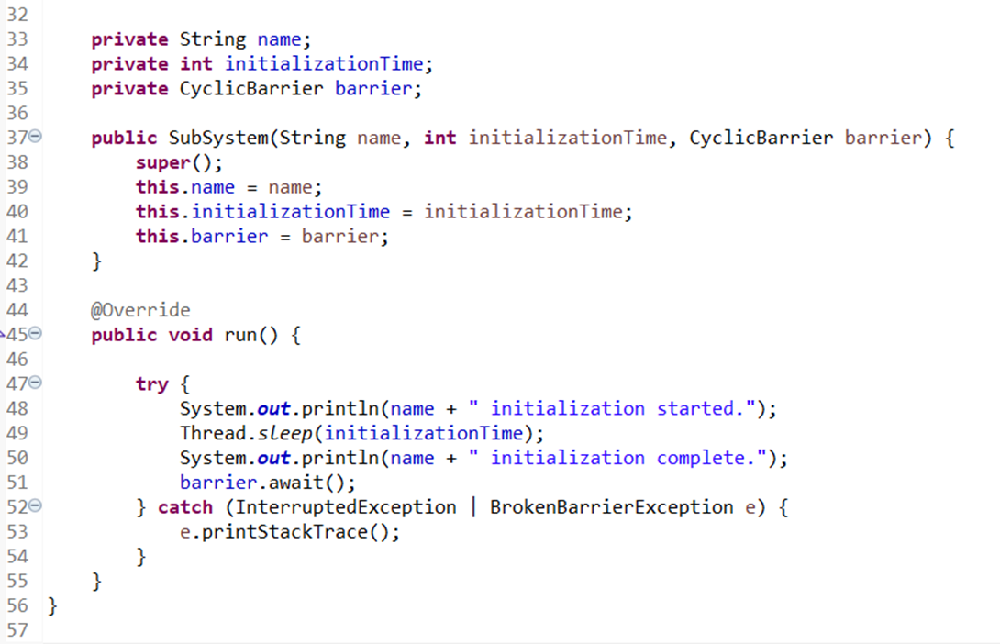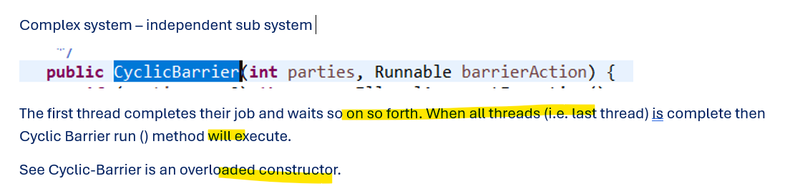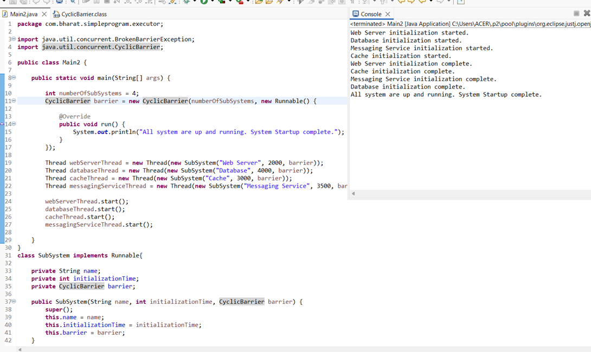
## pgm
```java
package com.bharat.simpleprogram.executor;

import java.util.concurrent.BrokenBarrierException;
import java.util.concurrent.CyclicBarrier;

public class Main2 {

	public static void main(String[] args) {
		
		int numberOfSubSystems = 4;
		CyclicBarrier barrier = new CyclicBarrier(numberOfSubSystems, new Runnable() {
			
			@Override
			public void run() {
				System.out.println("All system are up and running. System Startup complete.");				
			}
		});
		
		Thread webServerThread = new Thread(new SubSystem("Web Server", 2000, barrier));
		Thread databaseThread = new Thread(new SubSystem("Database", 4000, barrier));
		Thread cacheThread = new Thread(new SubSystem("Cache", 3000, barrier));
		Thread messagingServiceThread = new Thread(new SubSystem("Messaging Service", 3500, barrier));
		
		webServerThread.start();
		databaseThread.start();
		cacheThread.start();
		messagingServiceThread.start();
		
	}
}
class SubSystem implements Runnable{
	
	private String name;
	private int initializationTime;
	private CyclicBarrier barrier;	
	
	public SubSystem(String name, int initializationTime, CyclicBarrier barrier) {
		super();
		this.name = name;
		this.initializationTime = initializationTime;
		this.barrier = barrier;
	}

	@Override
	public void run() {
		
		try {
			System.out.println(name + " initialization started.");
			Thread.sleep(initializationTime);
			System.out.println(name + " initialization complete.");
			barrier.await();
		} catch (InterruptedException | BrokenBarrierException e) {		
			e.printStackTrace();
		}		
	}	
}
```
## output
```
Cache initialization started.
Messaging Service initialization started.
Database initialization started.
Web Server initialization started.
Web Server initialization complete.
Cache initialization complete.
Messaging Service initialization complete.
Database initialization complete.
All system are up and running. System Startup complete.
```


