# Completable Future
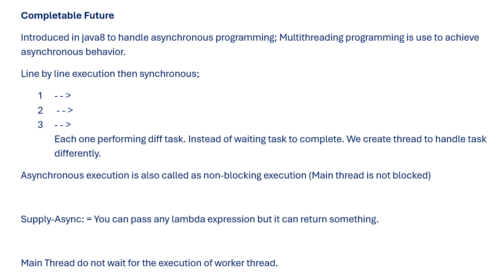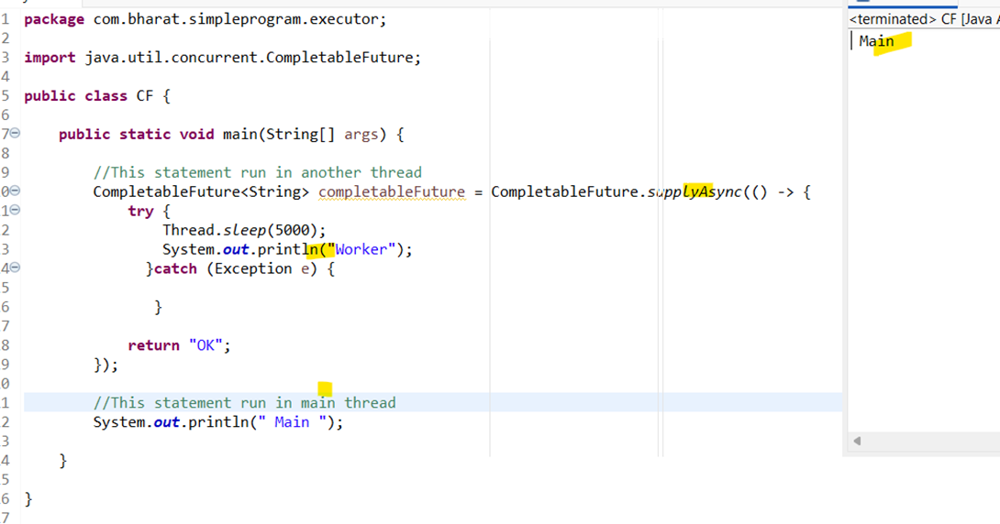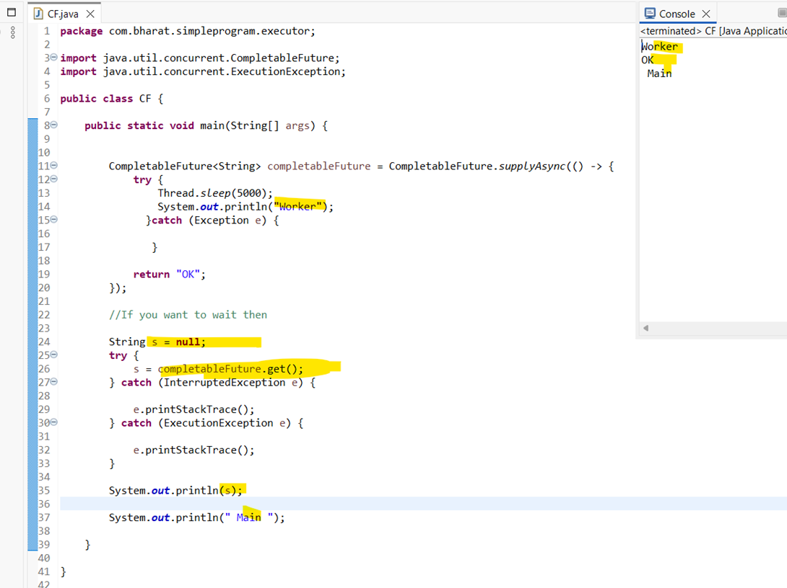
- Main thread waits here since completable future. get () method 
### Pgm
```java
package com.bharat.simpleprogram.executor;

import java.util.concurrent.CompletableFuture;
import java.util.concurrent.ExecutionException;

public class CF {

	public static void main(String[] args) {

		
		CompletableFuture<String> completableFuture = CompletableFuture.supplyAsync(() -> {
			try {
				Thread.sleep(5000);
				System.out.println("Worker"); 
			  }catch (Exception e) {

			   }
			
			return "OK";
		});
		
		String s = null;
		try {
			s = completableFuture.get();//If you want to wait then	
		} catch (InterruptedException e) {
			
			e.printStackTrace();
		} catch (ExecutionException e) {
			
			e.printStackTrace();
		} 
		
		System.out.println(s);
		
		System.out.println(" Main ");
		
	}

}
```
## Other methods in CF
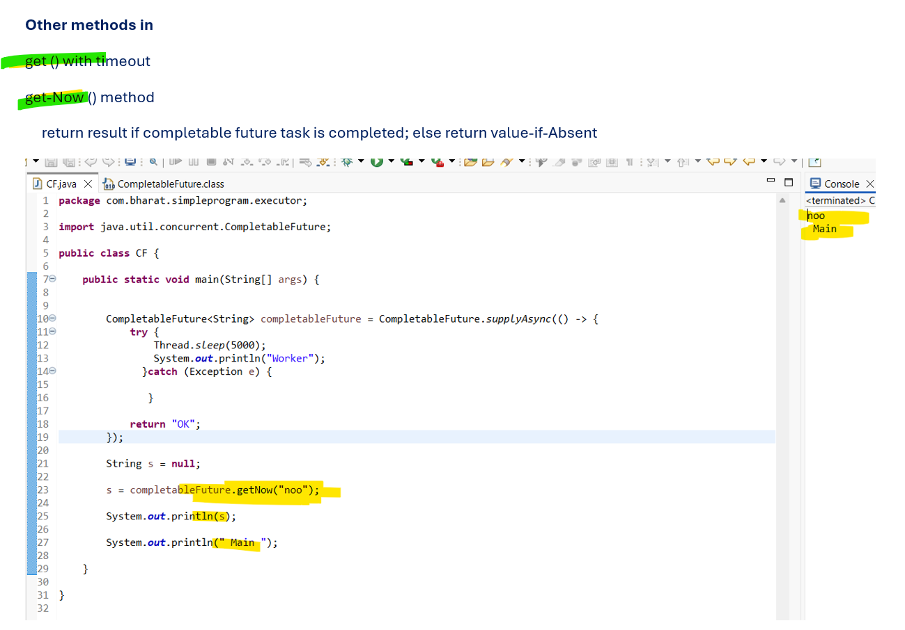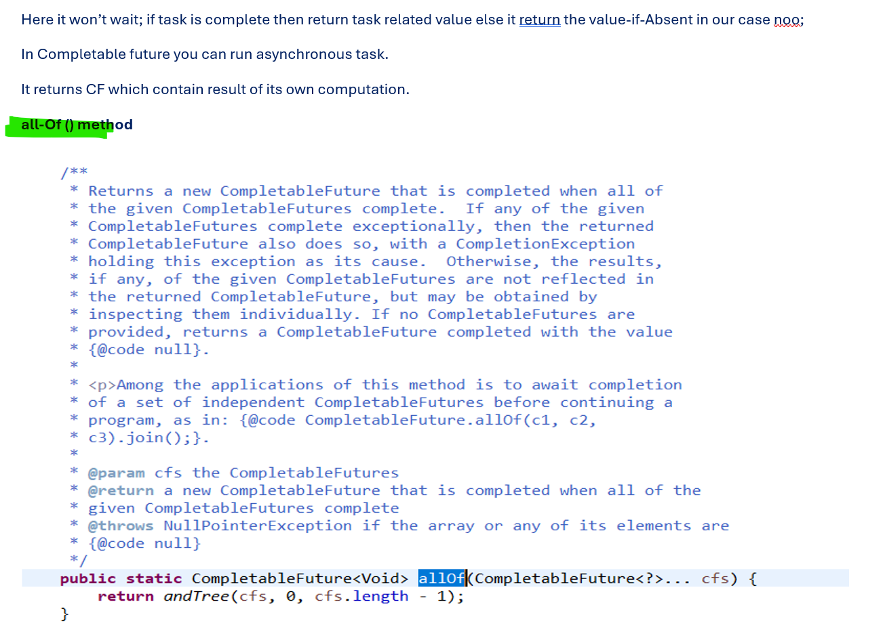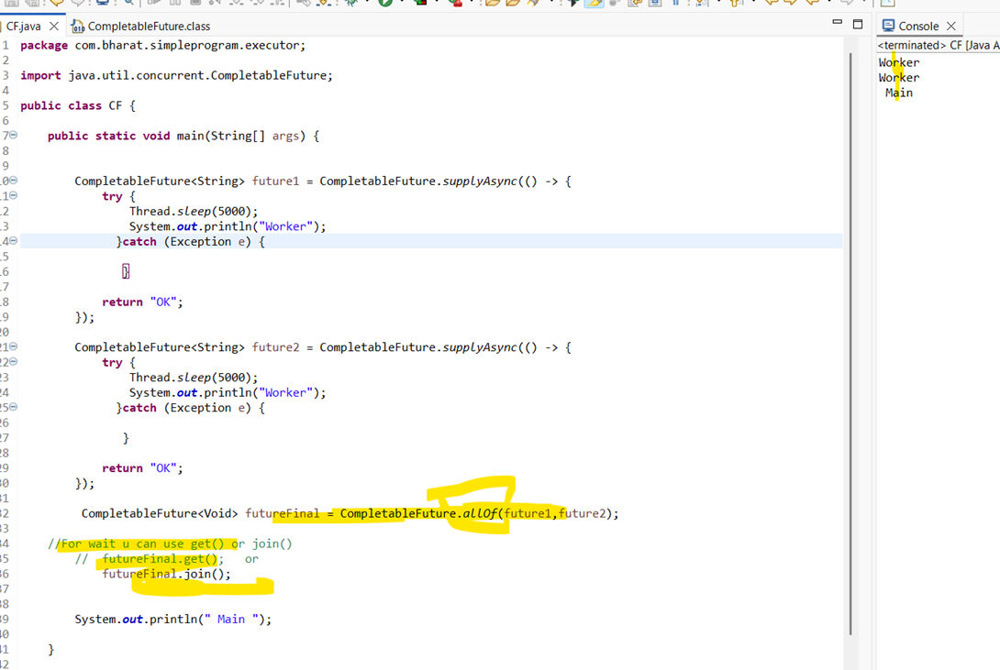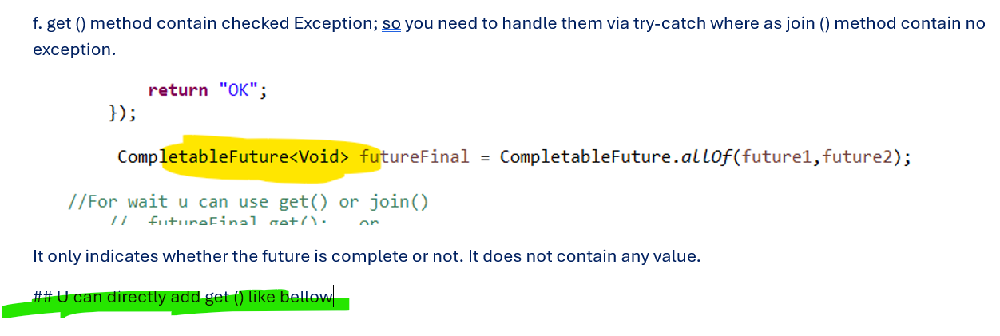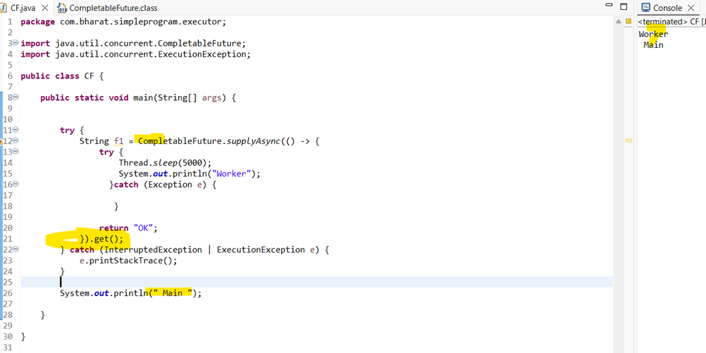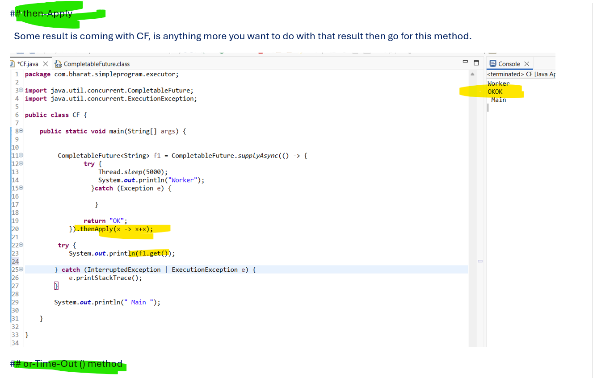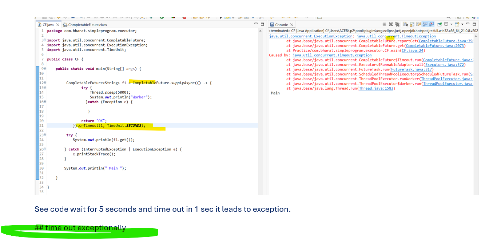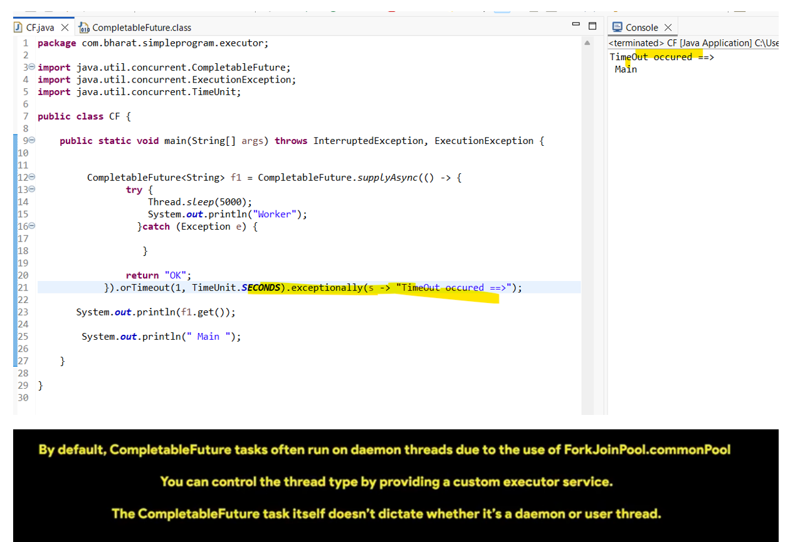
# 
# 22Mar2026