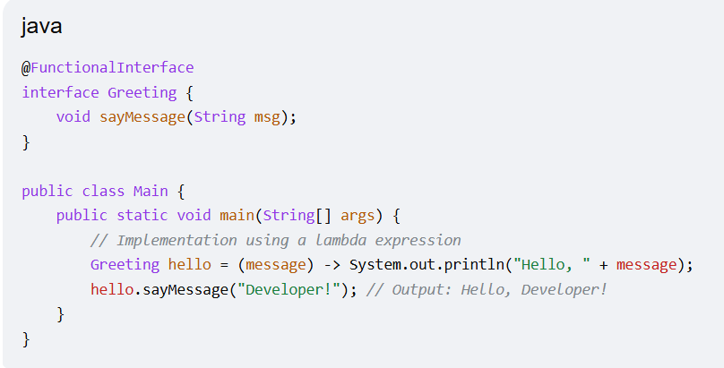

# What is Functional Interface?
- In Java, a Functional Interface is an interface that contains exactly one abstract method.
- Also known as a Single Abstract Method (SAM) interface
- it serves as the foundation for functional programming in Java by acting as the target type for lambda expressions and method references. 
## Key Characteristics
### Single Abstract Method:
- It must have exactly one unimplemented method.
### Default & Static Methods
-  It can contain any number of default or static methods, as these provide their own implementation.
### Object Class Methods
- It can overrride public method from object class.
### @FunctionalInterface Annotation: 
- It instructs the compiler to verify that the interface meets functional requirements, throwing an error if a second abstract method is added. 

# Build in Functional Interface
##  Predicate: 
- Takes one argument and returns a boolean (used for filtering).
## Function<T, R>:
- Takes one argument and returns a result of type R (used for mapping/transformation).
## Consumer:
- Takes one argument and returns no result (used for actions like printing or logging).
## Supplier: 
- Takes no arguments and returns a result (used for lazy generation of values).
## Eg

