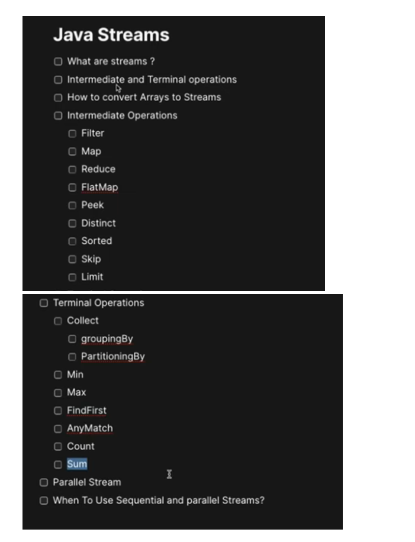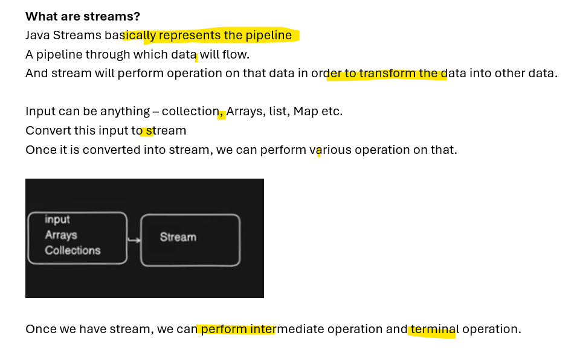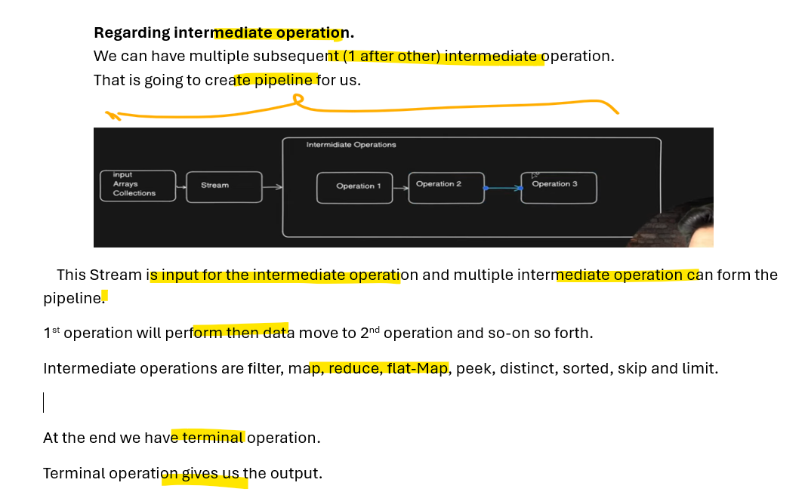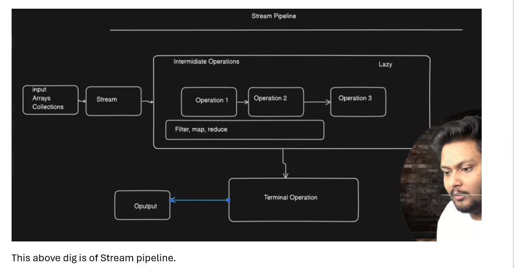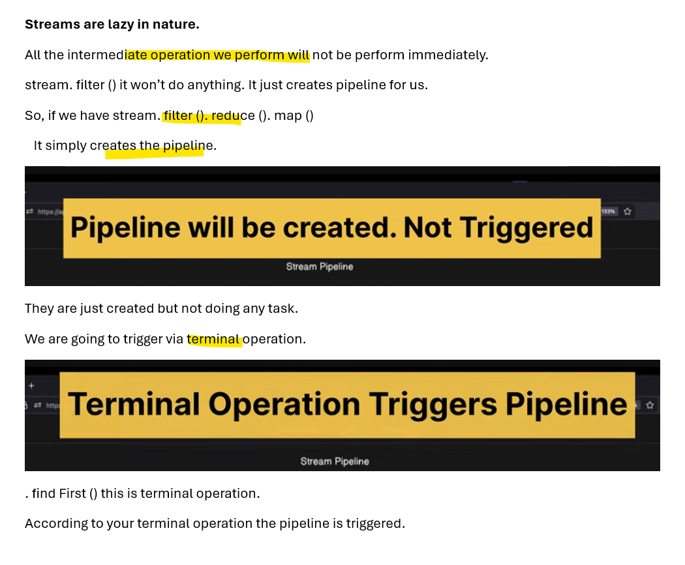
# Create stream from primitive array
```java
package com.example.stream;

import java.util.Arrays;
import java.util.stream.IntStream;

public class CreateStream {

	public static void main(String arg[]) {

		//WE have arrays of primitive integer
		int[] primitiveArrays = {1,2,3};
		
		IntStream intStream = Arrays.stream(primitiveArrays);
		
		//print it
		intStream.forEach(System.out::println); //1 2 3 
	}
}
```
# Create stream from array of Wrapper class
```java
package com.example.stream;

import java.util.stream.Stream;

public class CreateStream {

	public static void main(String arg[]) {

		//Arrays of object
		Integer[] objectArrays = {1,2,3};
		
		/* This Integer is Wrapper class
		 *  so you cannot convert it into Arrays.stream(arr)
		 *  
		 *  U need Stream.of() method for that
		 * */
		
		Stream<Integer> integerStream = Stream.of(objectArrays);
		
		integerStream.forEach(System.out::println); //1 2 3
	}
}
```
# Convert Any Collection to Stream
```java
package com.example.stream;

import java.util.Arrays;
import java.util.List;

public class CreateStream {

	public static void main(String arg[]) {

		//List of any Collection
		List<Integer> integerList = Arrays.asList(1,2,3,4);
		
		//Convert List/Collection into Stream via stream()
		integerList.stream()
			.forEach(System.out::println); //1 2 3 4 
	}
}
```
# Perform Intermediate operation on Stream
## 1) Filter Operation
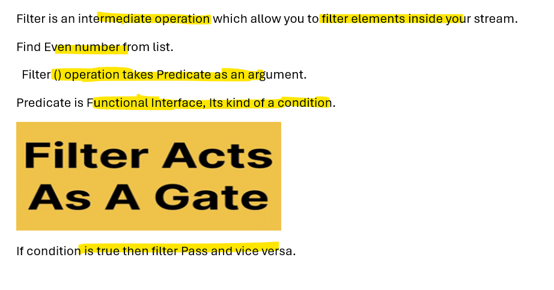
# Find Even number from list.
```java
package com.example.stream;

import java.util.Arrays;
import java.util.List;

public class CreateStream {

	public static void main(String arg[]) {

		List<Integer> numbers = Arrays.asList(1,2,3,4,5,6);
		
		//Find even number from the given list
		numbers.stream()
		.filter(num -> num%2==0)
		.forEach(System.out::println); //2 4 6 
	}
}
```
# 2) Map Operation
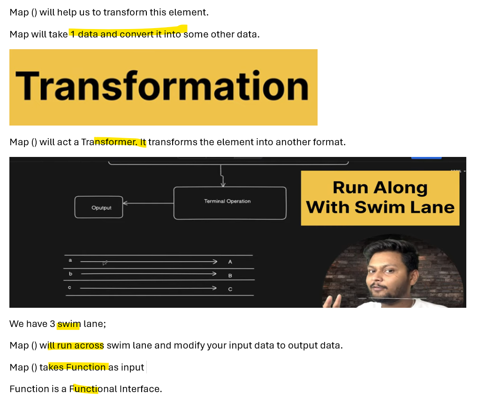
# Convert the given list in uppercase.
```java
package com.example.stream;

import java.util.Arrays;
import java.util.List;

public class CreateStream {

	public static void main(String arg[]) {

		List<String> names = Arrays.asList("alice","bob","charlie");
		
		names.stream()
		.map(name -> name.toUpperCase())
		.forEach(System.out::println);
	}
}
```
# Conver the given list in uppercase- slight diff code
```java
package com.example.stream;

import java.util.Arrays;
import java.util.List;

public class CreateStream {

	public static void main(String arg[]) {

		List<String> names = Arrays.asList("alice","bob","charlie");
		
		//Convert list in upperCase
		names.stream()
		.map(String::toUpperCase)  //Also use predefined method in string
		.forEach(System.out::println);
	}
}
```
# 3) Reduce operation 
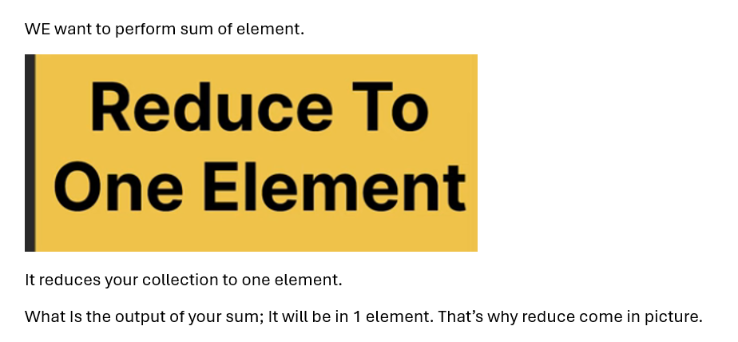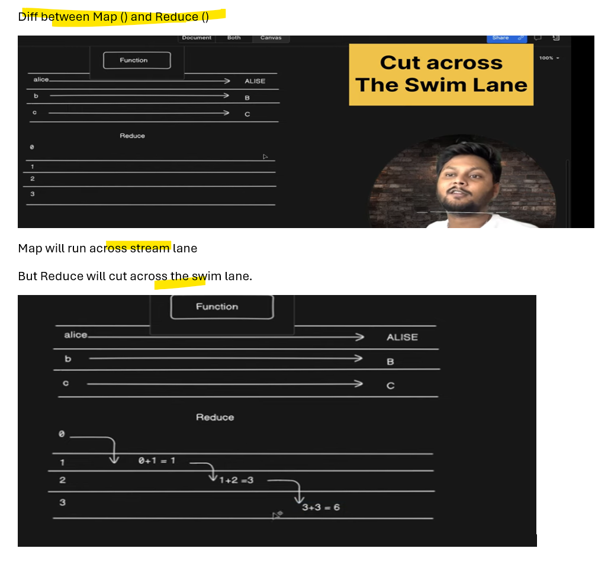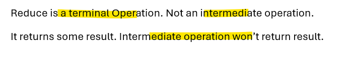
```java
package com.example.stream;

import java.util.Arrays;
import java.util.List;

public class CreateStream {

	public static void main(String arg[]) {

		 List<Integer> list = Arrays.asList(1,2,3,4,5);
		
		 //reduce() method take 2 argument
		
		 // 1st argument - identity(What element it is going to start performing operation)
		                         //1st argument - 0 it start with 0
		 
		 //2 argument - suggest operation 
		         //(a,b) for 2 element a and b -> (a+b) let's perform addition operation.
		  
		Integer sum = list.stream()
		.reduce(0,(a,b)->a+b);
		
		System.out.println(sum); //15
	
	}
}
```
# 4) FlatMap Operation
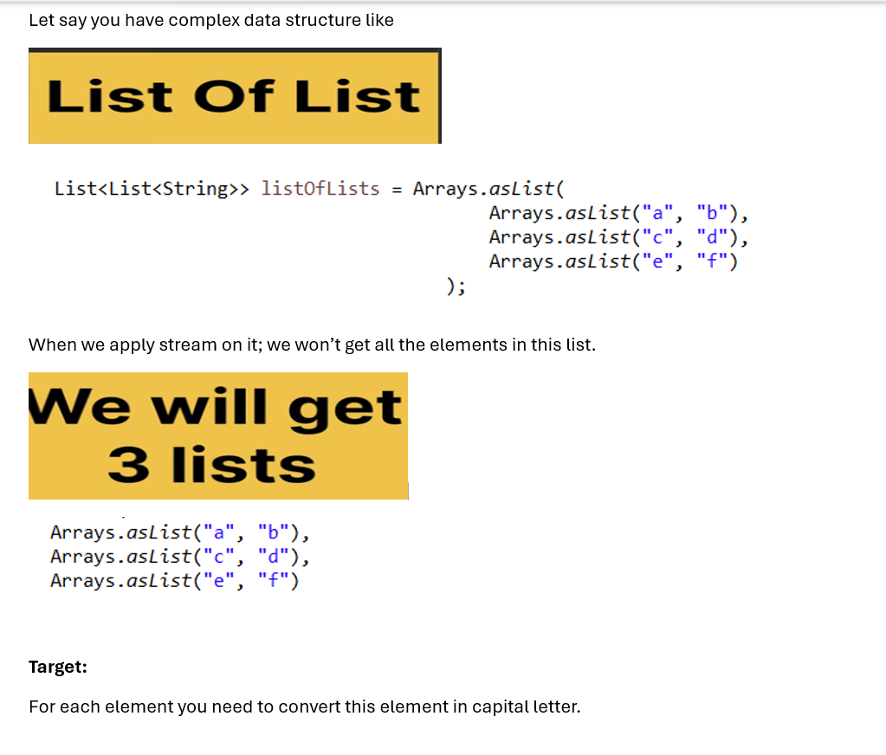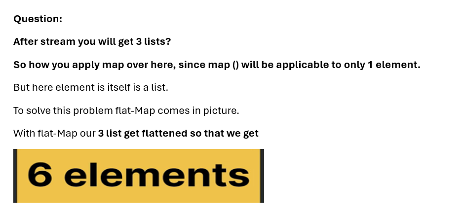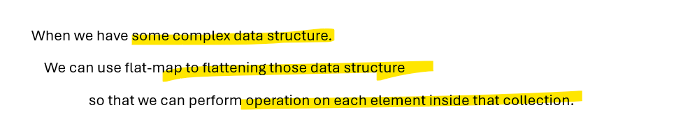
```java
package com.example.stream;

import java.util.Arrays;
import java.util.Collection;
import java.util.List;

public class CreateStream {

	public static void main(String arg[]) {

		List<List<String>> listOfLists = Arrays.asList(
												Arrays.asList("a", "b"), 
												Arrays.asList("c", "d"),
												Arrays.asList("e", "f")
											);
		
		listOfLists.stream()
		 .flatMap(Collection::stream)
		 .map(String::toUpperCase)
		 .forEach(System.out::println); //A B C D E F 

	}
}
```
# Same target via lambda
```java
package com.example.stream;

import java.util.Arrays;
import java.util.List;

public class CreateStream {

	public static void main(String arg[]) {

		List<List<String>> listOfLists = Arrays.asList(
												Arrays.asList("a", "b"), 
												Arrays.asList("c", "d"),
												Arrays.asList("e", "f")
											);
		
		listOfLists.stream()
		 .flatMap(list -> list.stream()) //via lambda
		 .map(String::toUpperCase)
		 .forEach(System.out::println); //A B C D E F 

	}
}
```
# 5) Peek Operation
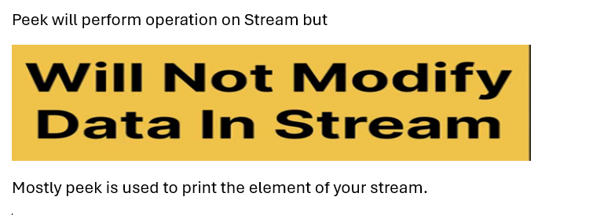
```java
package com.example.stream;

import java.util.Arrays;
import java.util.List;
import java.util.stream.Collectors;

public class CreateStream {

	public static void main(String arg[]) {

		 List<Integer> numbers = Arrays.asList(1,2,3,4,5);
		
		
		 
		 
		 List<Integer> squaredList = numbers.stream()
				 					//Here i want to see the element at this point
				                    .peek(System.out::println)				 	 // 1 2 3 4 5					
				                              //map each element into square of list}
				                    .map(n -> n*n)  //for each element in stream --> I want square of that   
				                    
				                    .peek(System.out::println)	 // 1 4 9 16 25 	
				                    .collect(Collectors.toList());  //i want to collect it into list
	}
}
```
# 6) Distinct Operation

```java
package com.example.stream;

import java.util.Arrays;
import java.util.List;

public class CreateStream {

	public static void main(String arg[]) {

		 List<Integer> numbers = Arrays.asList(1,2,2,3,4,4,5);
		
		 //Distinct will filter out duplicate element
		 
		 numbers.stream()
		 	.distinct()
		 	.forEach(System.out::println); // 1 2 3 4 5 
		 
	}
}
```
# 7) Sorted Operation
## It will sort the element.
## By default, it will sort in ascending order (natuarl order).
```java
package com.example.stream;

import java.util.Arrays;
import java.util.List;

public class CreateStream {

	public static void main(String arg[]) {

		 List<Integer> numbers = Arrays.asList(5,3,1,4,2);
		
		
		 numbers.stream()
		   .sorted()
		   .forEach(System.out::println); // 1 2 3 4 5
	}
}
```
## Sort in descending order
```java
package com.example.stream;

import java.util.Arrays;
import java.util.Comparator;
import java.util.List;

public class CreateStream {

	public static void main(String arg[]) {

		 List<Integer> numbers = Arrays.asList(5,3,1,4,2);
		
		//For descending order use comparator
		 numbers.stream()
		   .sorted(Comparator.reverseOrder())
		   .forEach(System.out::println); // 5  4  3  2  1 
	}
}
```
## List of String and sort them based on there size of element. (ascending order)
```java
package com.example.stream;

import java.util.Arrays;
import java.util.Comparator;
import java.util.List;

public class CreateStream {

	public static void main(String arg[]) {

	 List<String> words = Arrays.asList("apple","banana","kivi","cherry");
		
	 //Sort based on Size of words
	   // comparingInt() Accepts a function that extracts an int sort key from a type 
       //and returns a Comparator that compares by that sort key.	   
	 
	 //This comparator allow sort this function based on length of String
	 List<String> sortedWords = words.stream()
			 				.sorted(Comparator.comparingInt(String::length))
			 				.toList();
	 
		sortedWords.forEach(System.out::println); // kivi apple  cherry banana
	}
}
```
## List of String and sort them based on there size of element in descending order
```java
package com.example.stream;

import java.util.Arrays;
import java.util.Comparator;
import java.util.List;

public class CreateStream {

	public static void main(String arg[]) {

	 List<String> words = Arrays.asList("apple","banana","kivi","cherry");
		
	
	 List<String> sortedWords = words.stream()
			 				.sorted(Comparator.comparingInt(String::length).reversed())
			 				.toList();
	 
		sortedWords.forEach(System.out::println); // banana cherry apple kivi
	}
}
```
# 8) Skip operation
```java
package com.example.stream;

import java.util.Arrays;
import java.util.List;
import java.util.stream.Collectors;

public class CreateStream {

	public static void main(String arg[]) {

	  List<Integer> numbers = Arrays.asList(1,2,3,4,5);
		
	  
	  List<Integer> listAfterSkip = numbers.stream()
	  										.skip(2)  //it will skip first n element in the stream
	  									.collect(Collectors.toList());
	  
	  listAfterSkip.forEach(System.out::println); //3 4 5
	}	
}
```
# 9) limit operation

```java
package com.example.stream;

import java.util.Arrays;
import java.util.List;

public class CreateStream {

	public static void main(String arg[]) {

	  List<Integer> numbers = Arrays.asList(1,2,3,4,5);
		
	  numbers.stream()
	  	.limit(3)
	  	.forEach(System.out::println); // 1 2 3 -- It will limit to n element and block rest of the element
	}	
}
```
# Terminal Operation
# Collect- normal
```java
package com.example.stream;

import java.util.Arrays;
import java.util.List;
import java.util.stream.Collectors;

public class CreateStream {

	public static void main(String arg[]) {

	  List<Integer> numbers = Arrays.asList(1,2,3,4,5,6,7);
	
	  //perform the square of even element and print it
	  
	  List<Integer> evenSquareList = numbers.stream()
	  .filter(num -> num%2 == 0) // filter even element
	  .map(num -> num *num)  //perform square of element
	  .collect(Collectors.toList());  //U want to create another list out of it
	  
	  System.out.println(evenSquareList); //[4, 16, 36]
	}	
}
```
# Collect - groupingBy

```java
package com.example.stream;

public class Employee {

	private String name;
	private String department;
	private Integer salary;

	public Employee(String name, String department, Integer salary) {
		super();
		this.name = name;
		this.department = department;
		this.salary = salary;
	}

	public String getName() {
		return name;
	}

	public void setName(String name) {
		this.name = name;
	}

	public String getDepartment() {
		return department;
	}

	public void setDepartment(String department) {
		this.department = department;
	}

	public Integer getSalary() {
		return salary;
	}

	public void setSalary(Integer salary) {
		this.salary = salary;
	}

	@Override
	public String toString() {
		return "Employee [name=" + name + ", department=" + department + ", salary=" + salary + "]";
	}

}
```
## Java Code
```java
package com.example.stream;

import java.util.Arrays;
import java.util.List;
import java.util.Map;
import java.util.stream.Collectors;

public class CreateStream {

	public static void main(String arg[]) {

		List<Employee> employees = Arrays.asList(
				 new Employee("Alice", "HR", 3000),
				 new Employee("Bob", "IT", 4000),
				 new Employee("Charlie", "HR", 3500),
				 new Employee("Dave", "IT", 4500),
				 new Employee("Eve", "Finance", 5000)
				);
		
		//Group employees by department
		Map<String, List<Employee>> empByDept = employees.stream()
		 .collect(Collectors.groupingBy(Employee::getDepartment));
		
		empByDept.forEach((dept,empList) ->{
			  System.out.println("Department: "+dept);
			  empList.forEach(System.out::println);
				}		  
		 );
	}	
}
```

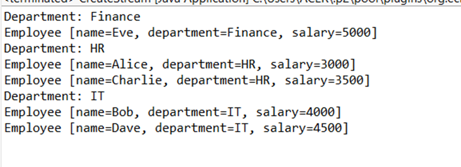
# Collect - paritionBy
## We want to segregate employee whose salary is 

```java
package com.example.stream;

import java.util.Arrays;
import java.util.List;
import java.util.Map;
import java.util.stream.Collectors;

public class CreateStream {

	public static void main(String arg[]) {

		List<Employee> employees = Arrays.asList(
				 new Employee("Alice", "HR", 30000),
				 new Employee("Bob", "IT", 40000),
				 new Employee("Charlie", "HR", 35000),
				 new Employee("Dave", "IT", 65000),
				 new Employee("Eve", "Finance", 80000)
				);
		
		/*
		 * if this (emp -> emp.getSalary()>50000) condition is true
		 *   it return true and list of employee whose salary is greater than 50000
		 *   
		 *   and in false part we have salary of employee less than 50000
		 * */
		Map<Boolean, List<Employee>> partitingBySal = employees.stream()
		                    .collect(Collectors.partitioningBy(emp -> emp.getSalary()>50000));
		
		
		System.out.println("Employee with Salary > 50000");
		partitingBySal.get(true).forEach(System.out::println);
		
		System.out.println();
		System.out.println("       ------------           ");
		System.out.println();
		
		System.out.println("Employee with Salary < 50000");
		partitingBySal.get(false).forEach(System.out::println);
	}	
}
```
## Output
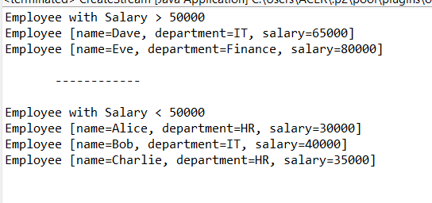
# min
```java
package com.example.stream;

import java.util.Arrays;
import java.util.Comparator;
import java.util.List;
import java.util.Optional;

public class CreateStream {

	public static void main(String arg[]) {

		List<Integer> numbers = Arrays.asList(1,2,3,4,5);
		
		Optional<Integer> min = numbers.stream()
			.min(Comparator.naturalOrder());
		
		System.out.println(min.get()); //1
		
	}	
}
```
# max
```java
package com.example.stream;

import java.util.Arrays;
import java.util.Comparator;
import java.util.List;
import java.util.Optional;

public class CreateStream {

	public static void main(String arg[]) {

		List<Integer> numbers = Arrays.asList(1,2,3,4,5);
		
		Optional<Integer> max = numbers.stream()
			.max(Comparator.naturalOrder());
		
		System.out.println(max.get()); //5
		
	}	
}
```
# Find First
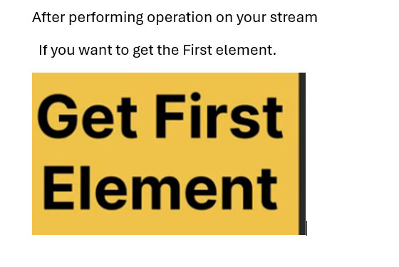
```java
package com.example.stream;

import java.util.Arrays;
import java.util.List;
import java.util.Optional;

public class CreateStream {

	public static void main(String arg[]) {

		List<Integer> numbers = Arrays.asList(1,2,3,4,5);
		
		Optional<Integer> first = numbers.stream()
									.filter(n -> n%2 == 0)
									.findFirst();
		
		System.out.println(first.get()); // 2
	}	
}
```
# anyMatch
```java
package com.example.stream;

import java.util.Arrays;
import java.util.List;

public class CreateStream {

	public static void main(String arg[]) {

		List<Integer> numbers = Arrays.asList(1,2,3,4,5);
		
		/*
		 * any-Match take condition as an argument 
		 *  It checks if this condition is true for any element inside your collection
		 * */
		 boolean anyMatch = numbers.stream()
		  .anyMatch(n -> n%2 == 0);
		 
		 System.out.println(anyMatch); //true
		 
		 //It will given true since in list even values are present.
	}	
}
```
## Remove even element in anyMatch
```java
package com.example.stream;

import java.util.Arrays;
import java.util.List;

public class CreateStream {

	public static void main(String arg[]) {

		List<Integer> numbers = Arrays.asList(1,3,5);
		
		 boolean anyMatch = numbers.stream()
		  .anyMatch(n -> n%2 == 0);
		 
		 System.out.println(anyMatch); //false
	}	
}
```
# Count
```java
package com.example.stream;

import java.util.Arrays;
import java.util.List;

public class CreateStream {

	public static void main(String arg[]) {

		List<Integer> numbers = Arrays.asList(1,2,3,4,5);
		
		//count number of element inside your stream
		long count = numbers.stream()
			.count();
		
		System.out.println(count); // 5
	}	
}
```
# sum
```java
package com.example.stream;

import java.util.Arrays;
import java.util.List;

public class CreateStream {

	public static void main(String arg[]) {

		List<Integer> numbers = Arrays.asList(1,2,3,4,5);
		
		//Directly perform sum operation on your stream
		 /*
		  *  Remember: Sum function you can only apply to IntStream
		  *  
	   mapToInt return IntStream
	     Convert particular stream into Intstream and then apply sum function
		  * */
		int sum = numbers.stream()
			.mapToInt(Integer::intValue)
			.sum();
		
		System.out.println(sum); // 15
	}	
}
```
# Parallel Stream
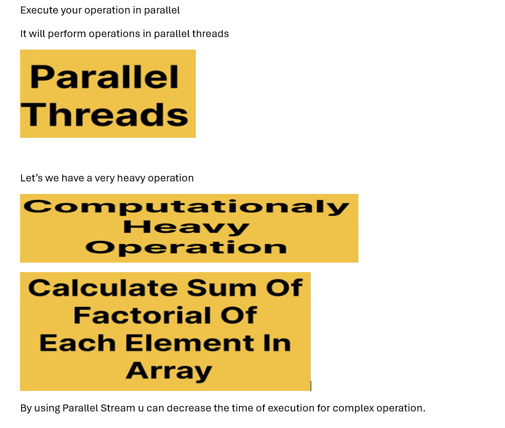
```java
package com.example.stream;

import java.util.Arrays;
import java.util.stream.LongStream;

public class CreateStream {

	public static void main(String arg[]) {

		long[] longArray = new long[20000]; // We have a very big long array- size is 20K

		// adding element inside this
		for (int i = 0; i < longArray.length; i++) {
			longArray[i] = i + 1;
		}

		// Calculate sum of factorial using sequential Stream
		long startTime = System.currentTimeMillis();

		long sequentialSum = Arrays.stream(longArray).map(CreateStream::factorial).sum();

		long endTime = System.currentTimeMillis();

		System.out.println("Sequential Sum of factorial: " + sequentialSum);
		System.out.println("Time taken by Sequential Stream:" +(endTime - startTime) + " ms");
		System.out.println();
		System.out.println("--------");

		 startTime = System.currentTimeMillis();

		long parallelSum = Arrays.stream(longArray)
							.parallel()
						    .map(CreateStream::factorial).sum();

		 endTime = System.currentTimeMillis();

		System.out.println("Parallel Sum of factorial: " + parallelSum);
		System.out.println("Time taken by Parallel Stream:" +(endTime - startTime) + " ms");
	}

	public static long factorial(long number) {
		/*
		 * LongStream - A sequence of primitive long-valued elements supporting
		 * sequential and parallel aggregate operations rangeClosed(long startInclusive,
		 * final long endInclusive)- Returns a sequential ordered reduce() Performs a
		 * reduction on the elements of this stream, using the provided identity value
		 * and an associative accumulation function, and returns the reduced value.
		 */
		return LongStream.rangeClosed(1, number).reduce(1, (long a, long b) -> a * b);
	}
}
```
## Output
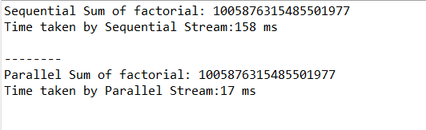
# Remember:
## Don't use parallel Stream for simple operation
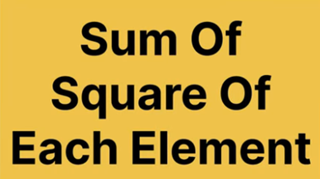
```java
package com.example.stream;

import java.util.Arrays;

public class CreateStream {

	public static void main(String arg[]) {

		int[] IntArray = new int[1000000]; // We have int Array of 10Lakh
		
		Arrays.fill(IntArray, 2); //Filling the array with value 2
		
		long startTime = System.currentTimeMillis();

		//Sum of square of each element
		int sequentialSum = Arrays.stream(IntArray)
			.map(n -> n*n)
			.sum();
		
		long endTime = System.currentTimeMillis();
		
		System.out.println("Sequential Sum: "+sequentialSum);
		System.out.println("Time taken by Sequential Stream: "+(endTime -startTime) + " ms");
		System.out.println();
		
		 startTime = System.currentTimeMillis();

		//Sum of square of each element
		int paralleSum = Arrays.stream(IntArray)
				.parallel()
			.map(n -> n*n)
			.sum();
		
		 endTime = System.currentTimeMillis();
		
		System.out.println("Parallel Sum: "+paralleSum);
		System.out.println("Time taken by Parallel Stream: "+(endTime -startTime) + " ms");
	}

}
```
## Output
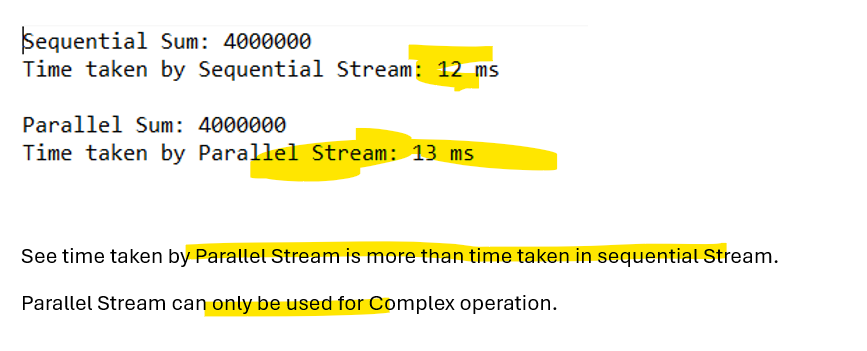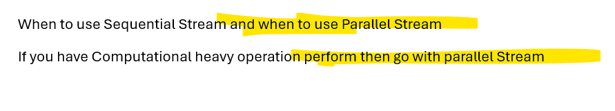


